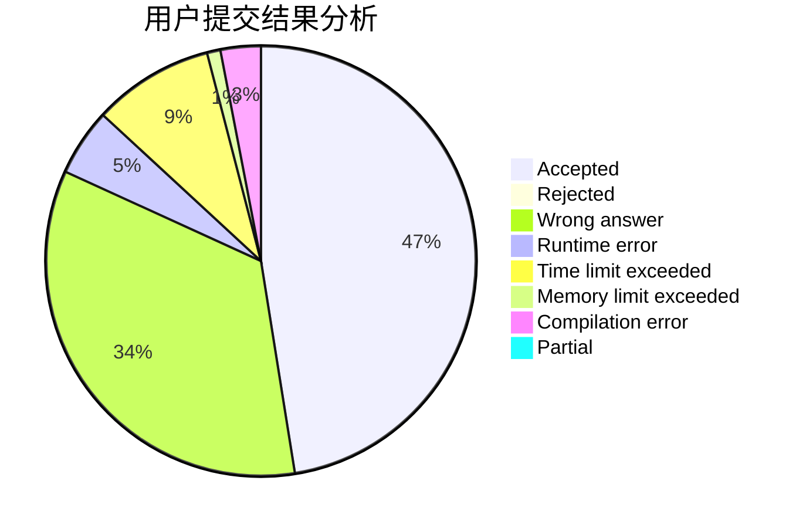
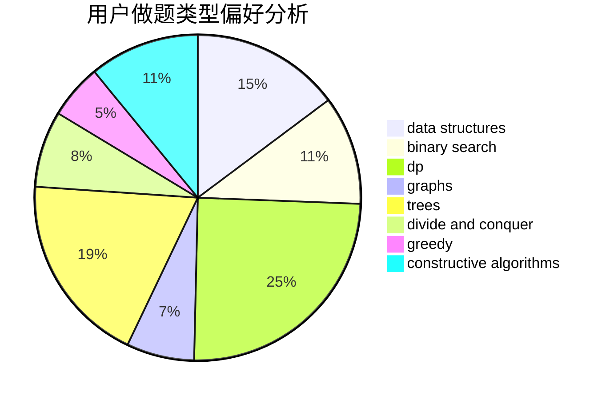
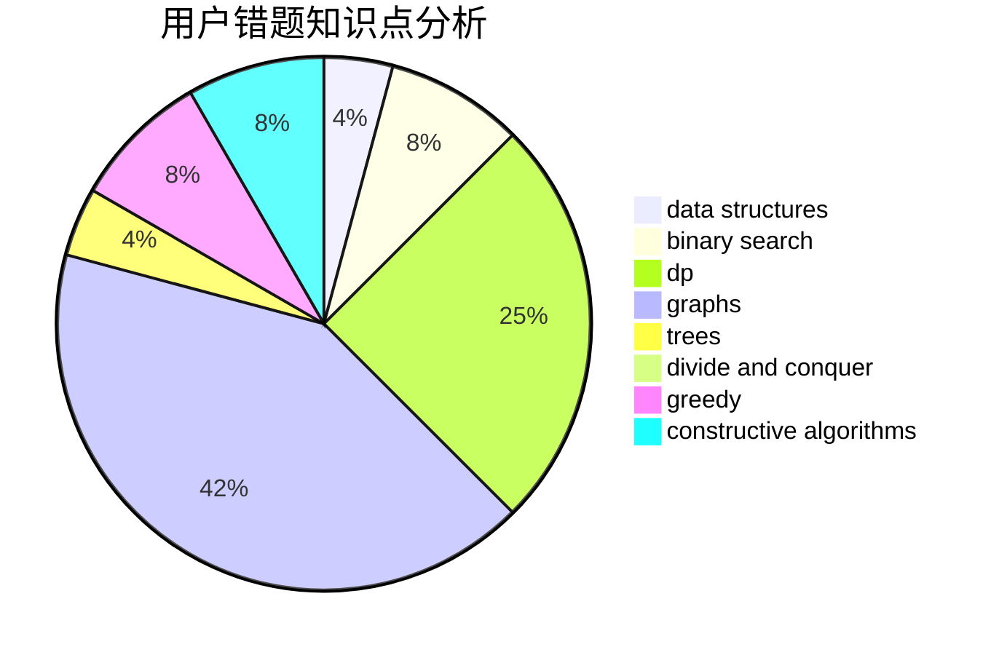

# SSerxhs

<!-- tabs:start -->

#### **用户提交结果分析**

#### **用户做题类型偏好分析**

#### **用户错题知识点分析**

<!-- tabs:end -->
# 推荐题目
[1025G](https://codeforces.com/contest/1025/problem/G)		constructive algorithms,
                        math		  
[1228C](https://codeforces.com/contest/1228/problem/C)		math,
                        number theory		  
[1344A](https://codeforces.com/contest/1344/problem/A)		math,
                        number theory,
                        sortings		  
[1145B](https://codeforces.com/contest/1145/problem/B)		brute force		  
[1059C](https://codeforces.com/contest/1059/problem/C)		constructive algorithms,
                        math		  
[1059B](https://codeforces.com/contest/1059/problem/B)		implementation		  
[883I](https://codeforces.com/contest/883/problem/I)		binary search,
                        dp		  
[816D](https://codeforces.com/contest/816/problem/D)		dsu,graphs,sortings,trees		  
[676D](https://codeforces.com/contest/676/problem/D)		graphs,
                        implementation,
                        shortest paths		  
[1093B](https://codeforces.com/contest/1093/problem/B)		constructive algorithms,
                        greedy,
                        sortings,
                        strings		  
