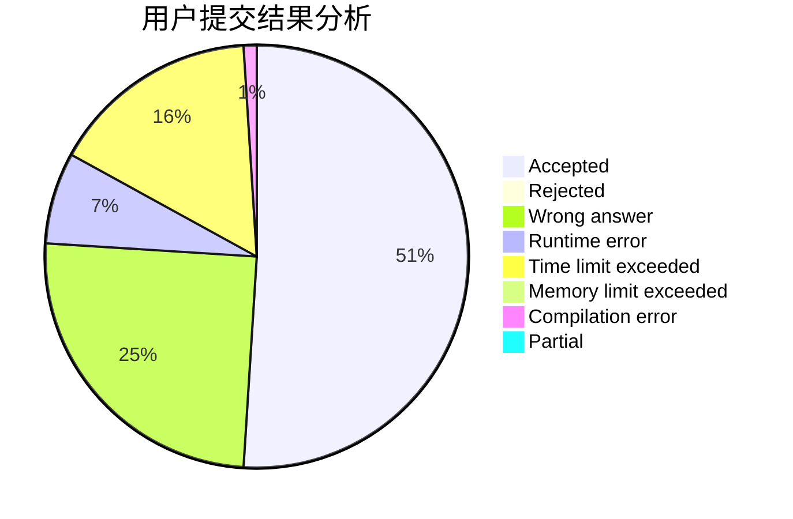
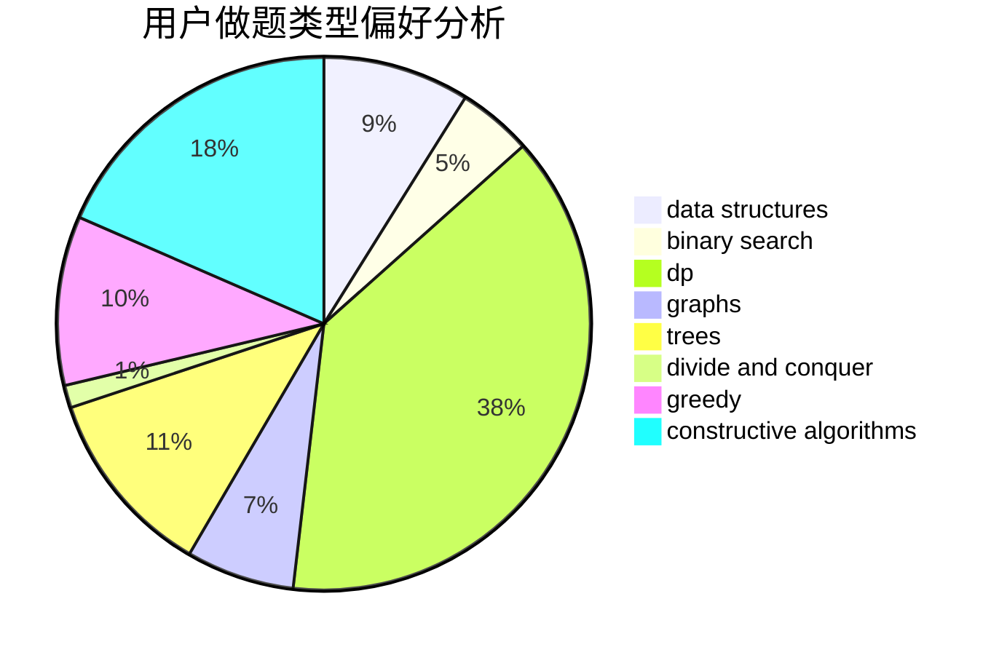
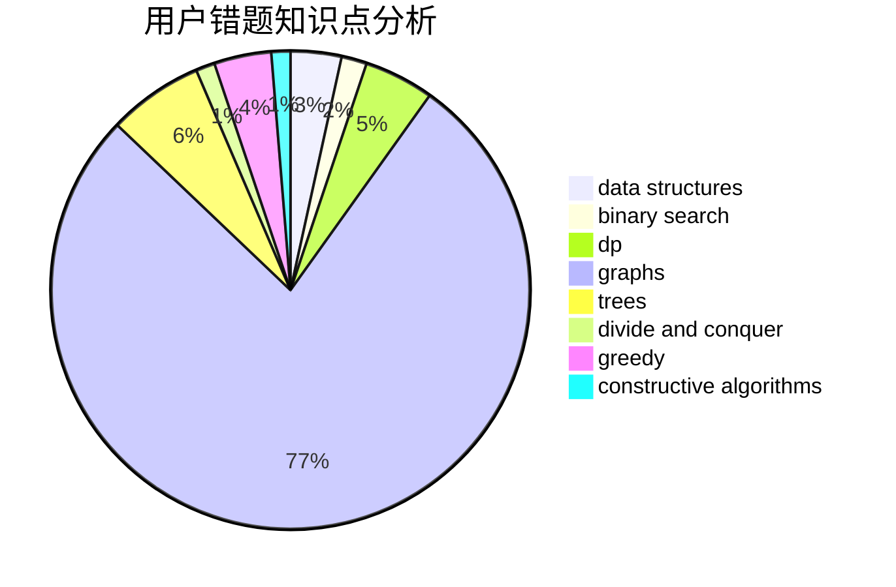

# STDquantum

<!-- tabs:start -->

#### **用户提交结果分析**

#### **用户做题类型偏好分析**

#### **用户错题知识点分析**

<!-- tabs:end -->
# 推荐题目
[1110A](https://codeforces.com/contest/1110/problem/A)		math		  
[477D](https://codeforces.com/contest/477/problem/D)		dp,
                        strings		  
[1215A](https://codeforces.com/contest/1215/problem/A)		greedy,
                        implementation,
                        math		  
[264E](https://codeforces.com/contest/264/problem/E)		data structures,
                        dp		  
[22A](https://codeforces.com/contest/22/problem/A)		brute force		  
[677C](https://codeforces.com/contest/677/problem/C)		bitmasks,
                        combinatorics,
                        implementation,
                        strings		  
[734A](https://codeforces.com/contest/734/problem/A)		implementation,
                        strings		  
[1099F](https://codeforces.com/contest/1099/problem/F)		binary search,
                        data structures,
                        dfs and similar,
                        dp,
                        games,
                        trees		  
[351B](https://codeforces.com/contest/351/problem/B)		combinatorics,
                        dp,
                        probabilities		  
[215D](https://codeforces.com/contest/215/problem/D)		greedy		  
