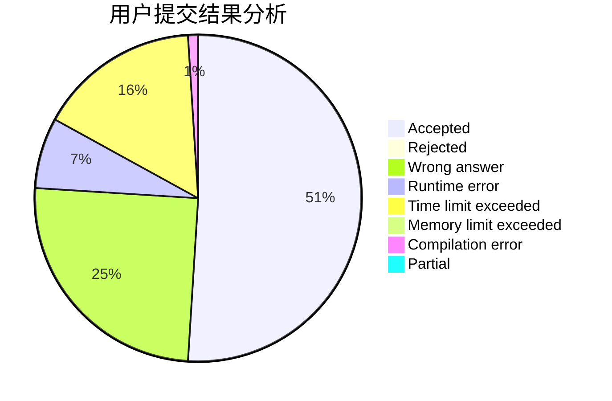
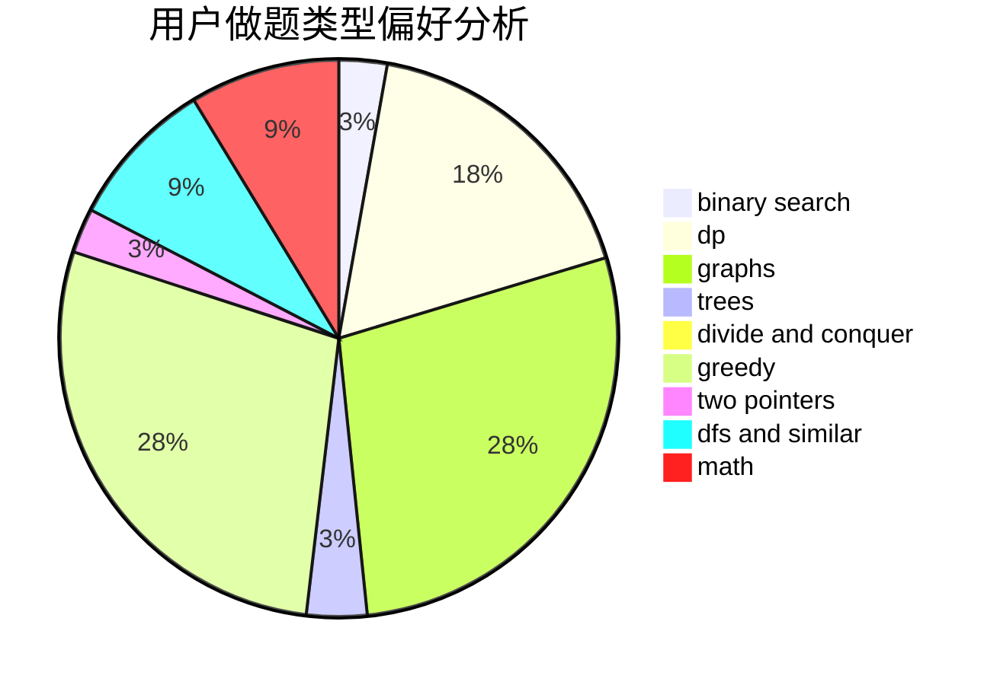

# STDquantum

<!-- tabs:start -->

#### **用户提交结果分析**

#### **用户做题类型偏好分析**

<!-- tabs:end -->
# 推荐题目
[1110D](https://codeforces.com/contest/1110/problem/D)
[497D](https://codeforces.com/contest/497/problem/D)
[1220E](https://codeforces.com/contest/1220/problem/E)
[280E](https://codeforces.com/contest/280/problem/E)
[24D](https://codeforces.com/contest/24/problem/D)
[701C](https://codeforces.com/contest/701/problem/C)
[754C](https://codeforces.com/contest/754/problem/C)
[10B](https://codeforces.com/contest/10/problem/B)
[377D](https://codeforces.com/contest/377/problem/D)
[235A](https://codeforces.com/contest/235/problem/A)
