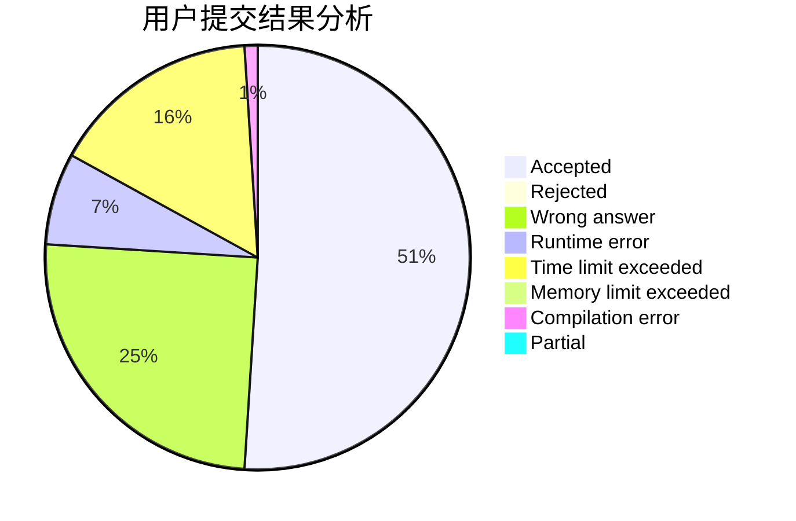
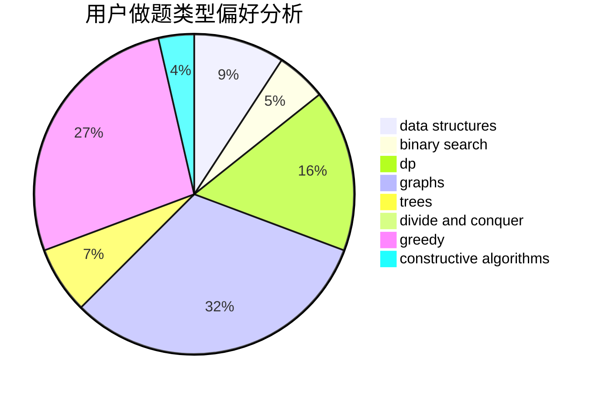
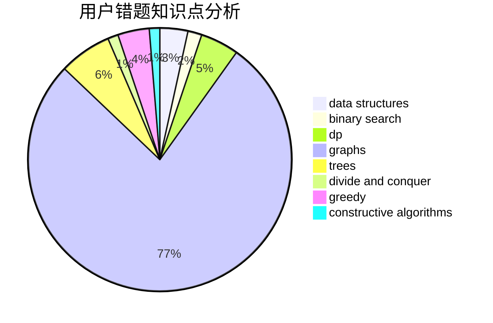

# STDquantum

<!-- tabs:start -->

#### **用户提交结果分析**

#### **用户做题类型偏好分析**

#### **用户错题知识点分析**

<!-- tabs:end -->
# 推荐题目
[1110D](https://codeforces.com/contest/1110/problem/D)		dp		  
[497D](https://codeforces.com/contest/497/problem/D)		brute force,
                        geometry,
                        math		  
[1220E](https://codeforces.com/contest/1220/problem/E)		dfs and similar,
                        dp,
                        dsu,
                        graphs,
                        greedy,
                        trees		  
[280E](https://codeforces.com/contest/280/problem/E)		data structures,
                        dp,
                        implementation,
                        math		  
[24D](https://codeforces.com/contest/24/problem/D)		dp,
                        math,
                        probabilities		  
[701C](https://codeforces.com/contest/701/problem/C)		binary search,
                        strings,
                        two pointers		  
[754C](https://codeforces.com/contest/754/problem/C)		brute force,
                        constructive algorithms,
                        dp,
                        implementation,
                        strings		  
[10B](https://codeforces.com/contest/10/problem/B)		dp,
                        implementation		  
[377D](https://codeforces.com/contest/377/problem/D)		data structures		  
[235A](https://codeforces.com/contest/235/problem/A)		number theory		  
