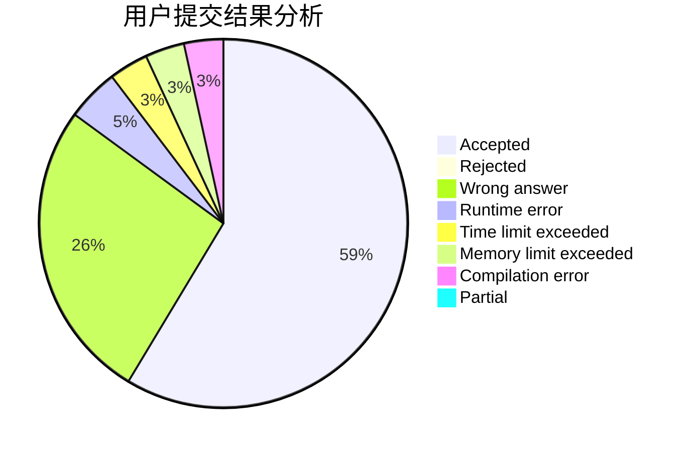
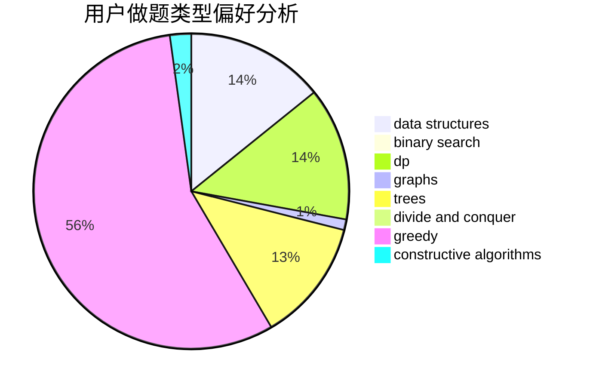
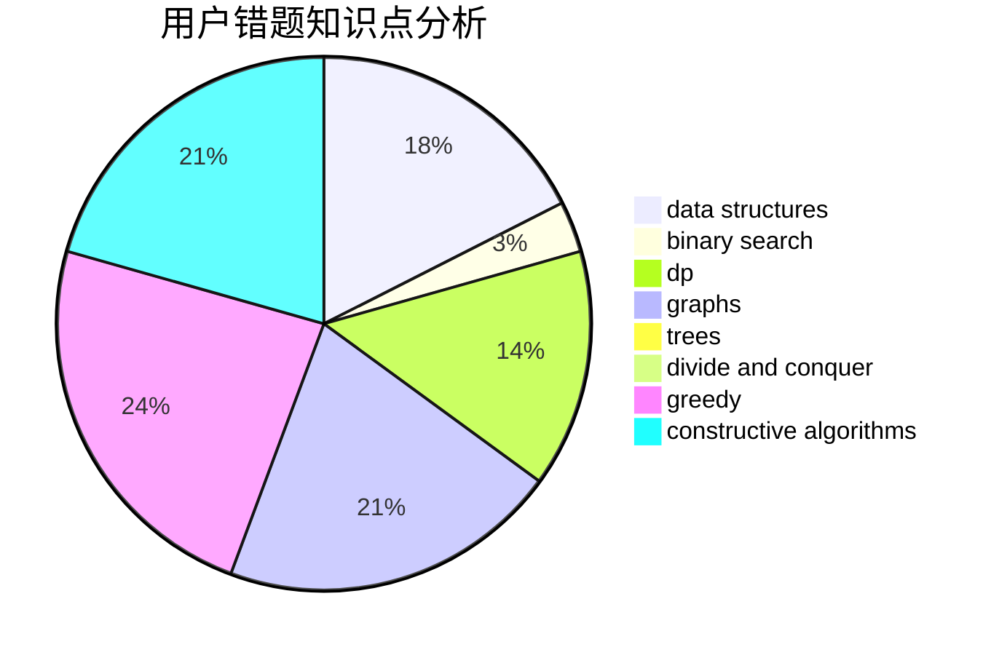

# STUPID_JUSTIN

<!-- tabs:start -->

#### **用户提交结果分析**

#### **用户做题类型偏好分析**

#### **用户错题知识点分析**

<!-- tabs:end -->
# 推荐题目
[1348C](https://codeforces.com/contest/1348/problem/C)		constructive algorithms,
                        greedy,
                        sortings,
                        strings		  
[1092E](https://codeforces.com/contest/1092/problem/E)		constructive algorithms,
                        dfs and similar,
                        greedy,
                        trees		  
[392B](https://codeforces.com/contest/392/problem/B)		dp		  
[1357B1](https://codeforces.com/contest/1357B/problem/1)		nan		  
[1294A](https://codeforces.com/contest/1294/problem/A)		math		  
[53E](https://codeforces.com/contest/53/problem/E)		bitmasks,
                        dp		  
[1271D](https://codeforces.com/contest/1271/problem/D)		data structures,
                        dp,
                        greedy,
                        implementation,
                        sortings		  
[193A](https://codeforces.com/contest/193/problem/A)		constructive algorithms,
                        graphs,
                        trees		  
[1299D](https://codeforces.com/contest/1299/problem/D)		bitmasks,
                        combinatorics,
                        dfs and similar,
                        dp,
                        graphs,
                        graphs,
                        math,
                        trees		  
[1288F](https://codeforces.com/contest/1288/problem/F)		constructive algorithms,
                        flows		  
