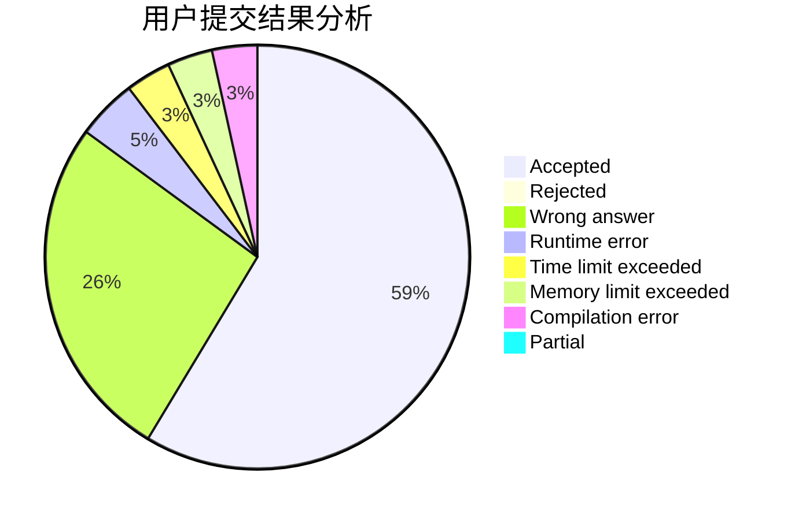
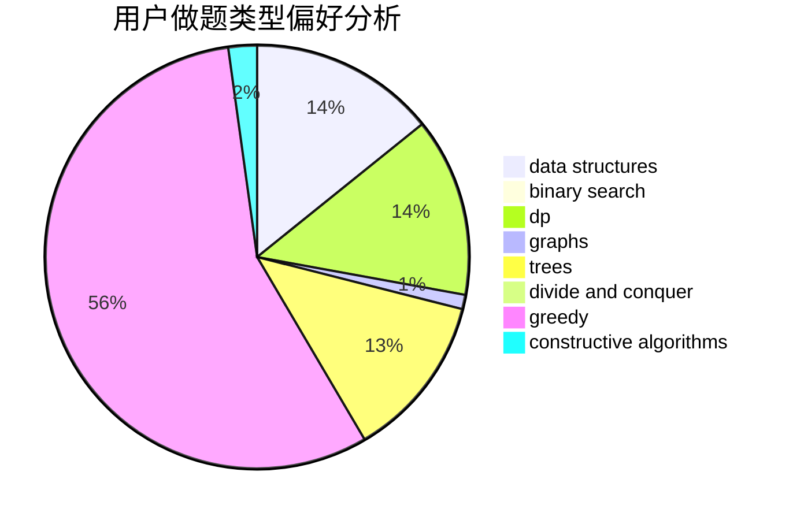
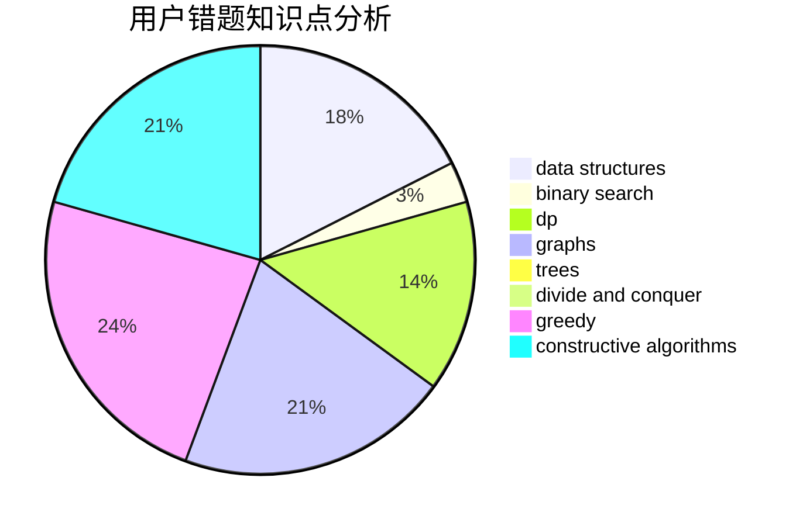

# STUPID_JUSTIN
<!-- tabs:start -->
#### **用户提交结果分析**

#### **用户做题类型偏好分析**

#### **用户错题知识点分析**

<!-- tabs:end -->
# 推荐题目
[Collecting Coins](http://codeforces.com/problemset/problem/1294/A)		math		  
[Dead Ends](http://codeforces.com/problemset/problem/53/E)		bitmasks,
                        dp		  
["Is the bit string balanced?" oracle](http://codeforces.com/problemset/problem/1357/B1)		nan		  
[Tower of Hanoi](http://codeforces.com/problemset/problem/392/B)		dp		  
[Portals](http://codeforces.com/problemset/problem/1271/D)		data structures,
                        dp,
                        greedy,
                        implementation,
                        sortings		  
[Minimal Diameter Forest](http://codeforces.com/problemset/problem/1092/E)		constructive algorithms,
                        dfs and similar,
                        greedy,
                        trees		  
[Phoenix and Distribution](http://codeforces.com/problemset/problem/1348/C)		constructive algorithms,
                        greedy,
                        sortings,
                        strings		  
[New Year Table](http://codeforces.com/problemset/problem/140/A)		geometry,
                        math		  
[Cutting Figure](http://codeforces.com/problemset/problem/193/A)		constructive algorithms,
                        graphs,
                        trees		  
[Chamber of Secrets](http://codeforces.com/problemset/problem/173/B)		dfs and similar,
                        shortest paths		  
<!-- tabs:start -->
#### **data structures**
[Collecting Coins](http://codeforces.com/problemset/problem/1271/D)		data structures,
                        dp,
                        greedy,
                        implementation,
                        sortings		  
[Dead Ends](http://codeforces.com/problemset/problem/961/E)		data structures		  
["Is the bit string balanced?" oracle](http://codeforces.com/problemset/problem/1492/C)		binary search,
                        data structures,
                        dp,
                        greedy,
                        two pointers		  
[Tower of Hanoi](http://codeforces.com/problemset/problem/1490/G)		binary search,
                        data structures,
                        math		  
[Portals](http://codeforces.com/problemset/problem/1479/D)		binary search,
                        bitmasks,
                        brute force,
                        data structures,
                        probabilities,
                        trees		  
[Minimal Diameter Forest](http://codeforces.com/problemset/problem/1497/A)		brute force,
                        data structures,
                        greedy,
                        sortings		  
[Phoenix and Distribution](http://codeforces.com/problemset/problem/1491/C)		brute force,
                        data structures,
                        dp,
                        greedy,
                        implementation		  
[New Year Table](http://codeforces.com/problemset/problem/1492/B)		data structures,
                        greedy,
                        math		  
[Cutting Figure](http://codeforces.com/problemset/problem/1436/E)		binary search,
                        data structures,
                        two pointers		  
[Chamber of Secrets](http://codeforces.com/problemset/problem/1461/D)		binary search,
                        brute force,
                        data structures,
                        divide and conquer,
                        implementation,
                        sortings		  
#### **binary search**
[Collecting Coins](http://codeforces.com/problemset/problem/1492/C)		binary search,
                        data structures,
                        dp,
                        greedy,
                        two pointers		  
[Dead Ends](http://codeforces.com/problemset/problem/1463/D)		binary search,
                        constructive algorithms,
                        greedy,
                        two pointers		  
["Is the bit string balanced?" oracle](http://codeforces.com/problemset/problem/1490/G)		binary search,
                        data structures,
                        math		  
[Tower of Hanoi](http://codeforces.com/problemset/problem/1479/D)		binary search,
                        bitmasks,
                        brute force,
                        data structures,
                        probabilities,
                        trees		  
[Portals](http://codeforces.com/problemset/problem/1436/E)		binary search,
                        data structures,
                        two pointers		  
[Minimal Diameter Forest](http://codeforces.com/problemset/problem/1461/D)		binary search,
                        brute force,
                        data structures,
                        divide and conquer,
                        implementation,
                        sortings		  
[Phoenix and Distribution](http://codeforces.com/problemset/problem/1493/C)		binary search,
                        brute force,
                        constructive algorithms,
                        greedy,
                        strings		  
[New Year Table](http://codeforces.com/problemset/problem/1487/D)		binary search,
                        brute force,
                        math,
                        number theory		  
[Cutting Figure](http://codeforces.com/problemset/problem/1486/B)		binary search,
                        geometry,
                        shortest paths,
                        sortings		  
[Chamber of Secrets](http://codeforces.com/problemset/problem/1486/C1)		binary search,
                        interactive		  
#### **dp**
[Collecting Coins](http://codeforces.com/problemset/problem/53/E)		bitmasks,
                        dp		  
[Dead Ends](http://codeforces.com/problemset/problem/392/B)		dp		  
["Is the bit string balanced?" oracle](http://codeforces.com/problemset/problem/1271/D)		data structures,
                        dp,
                        greedy,
                        implementation,
                        sortings		  
[Tower of Hanoi](http://codeforces.com/problemset/problem/1299/D)		bitmasks,
                        combinatorics,
                        dfs and similar,
                        dp,
                        graphs,
                        graphs,
                        math,
                        trees		  
[Portals](http://codeforces.com/problemset/problem/1492/C)		binary search,
                        data structures,
                        dp,
                        greedy,
                        two pointers		  
[Minimal Diameter Forest](https://codeforces.com/contest/1457/problem/C)		brute force,
                        dp,
                        implementation		  
[Phoenix and Distribution](http://codeforces.com/problemset/problem/1491/C)		brute force,
                        data structures,
                        dp,
                        greedy,
                        implementation		  
[New Year Table](http://codeforces.com/problemset/problem/1437/C)		dp,
                        flows,
                        graph matchings,
                        greedy,
                        math,
                        sortings		  
[Cutting Figure](http://codeforces.com/problemset/problem/1499/B)		brute force,
                        dp,
                        greedy,
                        implementation		  
[Chamber of Secrets](http://codeforces.com/problemset/problem/1491/D)		bitmasks,
                        constructive algorithms,
                        dp,
                        greedy,
                        math		  
#### **graph**
[Collecting Coins](http://codeforces.com/problemset/problem/193/A)		constructive algorithms,
                        graphs,
                        trees		  
[Dead Ends](https://codeforces.com/contest/602/problem/C)		graphs,
                        shortest paths		  
["Is the bit string balanced?" oracle](http://codeforces.com/problemset/problem/506/D)		brute force,
                        dfs and similar,
                        dsu,
                        graphs		  
[Tower of Hanoi](http://codeforces.com/problemset/problem/1299/D)		bitmasks,
                        combinatorics,
                        dfs and similar,
                        dp,
                        graphs,
                        graphs,
                        math,
                        trees		  
[Portals](http://codeforces.com/problemset/problem/1487/C)		brute force,
                        constructive algorithms,
                        dfs and similar,
                        graphs,
                        greedy,
                        implementation,
                        math		  
[Minimal Diameter Forest](http://codeforces.com/problemset/problem/1437/C)		dp,
                        flows,
                        graph matchings,
                        greedy,
                        math,
                        sortings		  
[Phoenix and Distribution](http://codeforces.com/problemset/problem/1470/D)		constructive algorithms,
                        dfs and similar,
                        graph matchings,
                        graphs,
                        greedy		  
[New Year Table](http://codeforces.com/problemset/problem/1476/C)		dp,
                        graphs,
                        greedy		  
[Cutting Figure](http://codeforces.com/problemset/problem/1304/D)		constructive algorithms,
                        graphs,
                        greedy,
                        two pointers		  
[Chamber of Secrets](http://codeforces.com/problemset/problem/1475/C)		combinatorics,
                        graphs,
                        math		  
#### **trees**
[Collecting Coins](http://codeforces.com/problemset/problem/1092/E)		constructive algorithms,
                        dfs and similar,
                        greedy,
                        trees		  
[Dead Ends](http://codeforces.com/problemset/problem/193/A)		constructive algorithms,
                        graphs,
                        trees		  
["Is the bit string balanced?" oracle](http://codeforces.com/problemset/problem/1299/D)		bitmasks,
                        combinatorics,
                        dfs and similar,
                        dp,
                        graphs,
                        graphs,
                        math,
                        trees		  
[Tower of Hanoi](http://codeforces.com/problemset/problem/1479/D)		binary search,
                        bitmasks,
                        brute force,
                        data structures,
                        probabilities,
                        trees		  
[Portals](http://codeforces.com/problemset/problem/1511/C)		brute force,
                        data structures,
                        implementation,
                        trees		  
[Minimal Diameter Forest](http://codeforces.com/problemset/problem/1499/F)		combinatorics,
                        dfs and similar,
                        dp,
                        trees		  
[Phoenix and Distribution](http://codeforces.com/problemset/problem/1491/E)		brute force,
                        dfs and similar,
                        divide and conquer,
                        number theory,
                        trees		  
[New Year Table](http://codeforces.com/problemset/problem/1466/D)		data structures,
                        greedy,
                        sortings,
                        trees		  
[Cutting Figure](http://codeforces.com/problemset/problem/1495/D)		combinatorics,
                        dfs and similar,
                        graphs,
                        math,
                        shortest paths,
                        trees		  
[Chamber of Secrets](http://codeforces.com/problemset/problem/1303/G)		data structures,
                        divide and conquer,
                        geometry,
                        trees		  
#### **divide and conquer**
[Collecting Coins](http://codeforces.com/problemset/problem/1461/D)		binary search,
                        brute force,
                        data structures,
                        divide and conquer,
                        implementation,
                        sortings		  
[Dead Ends](http://codeforces.com/problemset/problem/1466/G)		combinatorics,
                        divide and conquer,
                        hashing,
                        math,
                        string suffix structures,
                        strings		  
["Is the bit string balanced?" oracle](http://codeforces.com/problemset/problem/1490/D)		dfs and similar,
                        divide and conquer,
                        implementation		  
[Tower of Hanoi](https://codeforces.com/contest/1483/problem/C)		data structures,
                        divide and conquer,
                        dp		  
[Portals](http://codeforces.com/problemset/problem/1491/E)		brute force,
                        dfs and similar,
                        divide and conquer,
                        number theory,
                        trees		  
[Minimal Diameter Forest](http://codeforces.com/problemset/problem/1303/G)		data structures,
                        divide and conquer,
                        geometry,
                        trees		  
[Phoenix and Distribution](http://codeforces.com/problemset/problem/1494/D)		constructive algorithms,
                        data structures,
                        dfs and similar,
                        divide and conquer,
                        dsu,
                        greedy,
                        sortings,
                        trees		  
[New Year Table](http://codeforces.com/problemset/problem/1482/E)		data structures,
                        divide and conquer,
                        dp		  
[Cutting Figure](http://codeforces.com/problemset/problem/566/C)		dfs and similar,
                        divide and conquer,
                        trees		  
[Chamber of Secrets](http://codeforces.com/problemset/problem/1428/F)		binary search,
                        data structures,
                        divide and conquer,
                        dp,
                        two pointers		  
#### **greedy**
[Collecting Coins](http://codeforces.com/problemset/problem/1271/D)		data structures,
                        dp,
                        greedy,
                        implementation,
                        sortings		  
[Dead Ends](http://codeforces.com/problemset/problem/1092/E)		constructive algorithms,
                        dfs and similar,
                        greedy,
                        trees		  
["Is the bit string balanced?" oracle](http://codeforces.com/problemset/problem/1348/C)		constructive algorithms,
                        greedy,
                        sortings,
                        strings		  
[Tower of Hanoi](http://codeforces.com/problemset/problem/1204/D1)		brute force,
                        greedy,
                        strings		  
[Portals](http://codeforces.com/problemset/problem/1504/B)		constructive algorithms,
                        greedy,
                        implementation,
                        math		  
[Minimal Diameter Forest](http://codeforces.com/problemset/problem/1477/C)		constructive algorithms,
                        geometry,
                        greedy,
                        math,
                        sortings		  
[Phoenix and Distribution](http://codeforces.com/problemset/problem/1492/C)		binary search,
                        data structures,
                        dp,
                        greedy,
                        two pointers		  
[New Year Table](https://codeforces.com/contest/1496/problem/C)		geometry,
                        greedy,
                        math,
                        sortings		  
[Cutting Figure](http://codeforces.com/problemset/problem/1493/A)		constructive algorithms,
                        greedy		  
[Chamber of Secrets](http://codeforces.com/problemset/problem/1463/D)		binary search,
                        constructive algorithms,
                        greedy,
                        two pointers		  
#### **constructive algorithms**
[Collecting Coins](http://codeforces.com/problemset/problem/1092/E)		constructive algorithms,
                        dfs and similar,
                        greedy,
                        trees		  
[Dead Ends](http://codeforces.com/problemset/problem/1348/C)		constructive algorithms,
                        greedy,
                        sortings,
                        strings		  
["Is the bit string balanced?" oracle](http://codeforces.com/problemset/problem/193/A)		constructive algorithms,
                        graphs,
                        trees		  
[Tower of Hanoi](http://codeforces.com/problemset/problem/1288/F)		constructive algorithms,
                        flows		  
[Portals](http://codeforces.com/problemset/problem/1504/B)		constructive algorithms,
                        greedy,
                        implementation,
                        math		  
[Minimal Diameter Forest](http://codeforces.com/problemset/problem/1477/C)		constructive algorithms,
                        geometry,
                        greedy,
                        math,
                        sortings		  
[Phoenix and Distribution](http://codeforces.com/problemset/problem/1493/A)		constructive algorithms,
                        greedy		  
[New Year Table](http://codeforces.com/problemset/problem/1463/D)		binary search,
                        constructive algorithms,
                        greedy,
                        two pointers		  
[Cutting Figure](https://codeforces.com/contest/1456/problem/B)		bitmasks,
                        brute force,
                        constructive algorithms		  
[Chamber of Secrets](http://codeforces.com/problemset/problem/1492/D)		bitmasks,
                        constructive algorithms,
                        greedy,
                        math		  
#### **sortings**
[Collecting Coins](http://codeforces.com/problemset/problem/1271/D)		data structures,
                        dp,
                        greedy,
                        implementation,
                        sortings		  
[Dead Ends](http://codeforces.com/problemset/problem/1348/C)		constructive algorithms,
                        greedy,
                        sortings,
                        strings		  
["Is the bit string balanced?" oracle](http://codeforces.com/problemset/problem/581/C)		implementation,
                        math,
                        sortings		  
[Tower of Hanoi](http://codeforces.com/problemset/problem/1477/C)		constructive algorithms,
                        geometry,
                        greedy,
                        math,
                        sortings		  
[Portals](https://codeforces.com/contest/1496/problem/C)		geometry,
                        greedy,
                        math,
                        sortings		  
[Minimal Diameter Forest](http://codeforces.com/problemset/problem/1495/A)		geometry,
                        greedy,
                        math,
                        sortings		  
[Phoenix and Distribution](http://codeforces.com/problemset/problem/1497/A)		brute force,
                        data structures,
                        greedy,
                        sortings		  
[New Year Table](http://codeforces.com/problemset/problem/1427/A)		math,
                        sortings		  
[Cutting Figure](http://codeforces.com/problemset/problem/1461/D)		binary search,
                        brute force,
                        data structures,
                        divide and conquer,
                        implementation,
                        sortings		  
[Chamber of Secrets](http://codeforces.com/problemset/problem/1437/C)		dp,
                        flows,
                        graph matchings,
                        greedy,
                        math,
                        sortings		  
<!-- tabs:end -->
