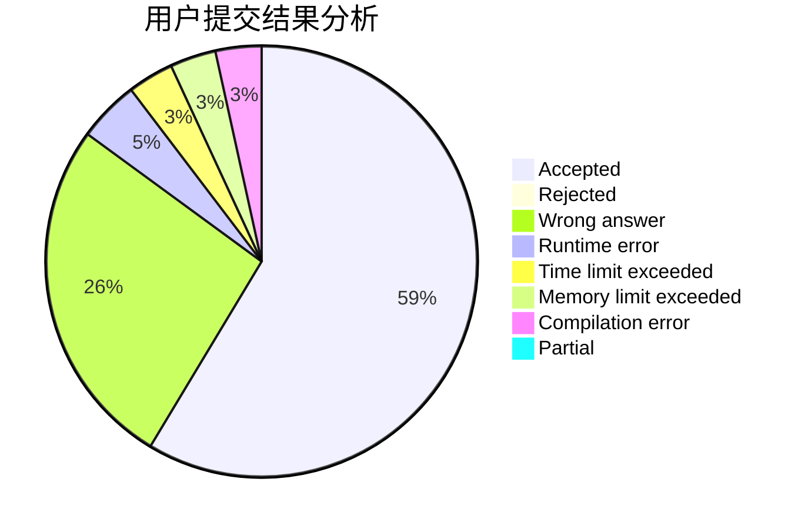
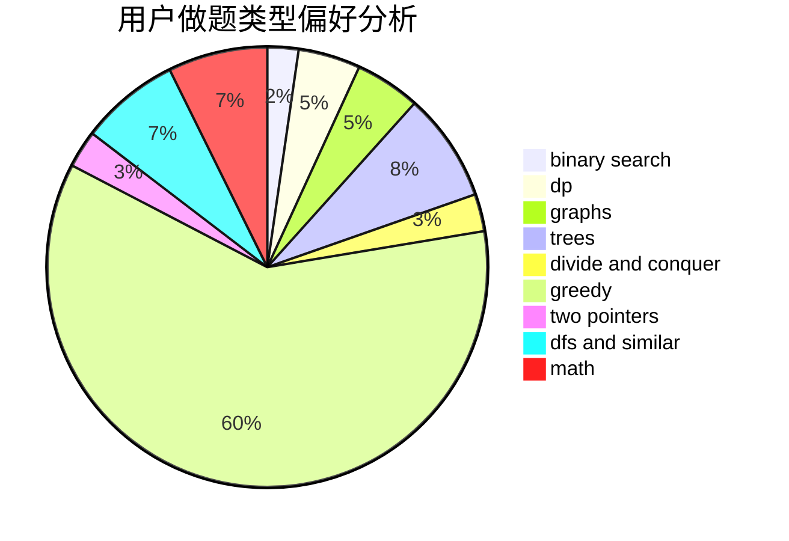

# STUPID_JUSTIN

<!-- tabs:start -->

#### **用户提交结果分析**

#### **用户做题类型偏好分析**

<!-- tabs:end -->
# 推荐题目
[1355A](https://codeforces.com/contest/1355/problem/A)
[1093B](https://codeforces.com/contest/1093/problem/B)
[421A](https://codeforces.com/contest/421/problem/A)
[1364D](https://codeforces.com/contest/1364/problem/D)
[1300C](https://codeforces.com/contest/1300/problem/C)
[560E](https://codeforces.com/contest/560/problem/E)
[1280F](https://codeforces.com/contest/1280/problem/F)
[216B](https://codeforces.com/contest/216/problem/B)
[1305H](https://codeforces.com/contest/1305/problem/H)
[12962](https://codeforces.com/contest/1296/problem/2)
