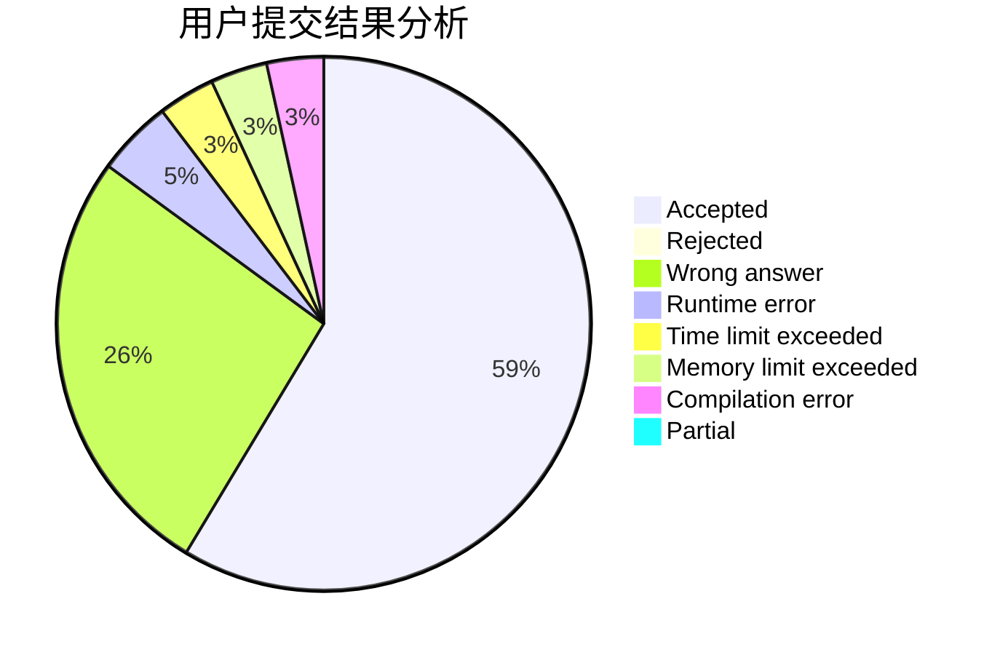
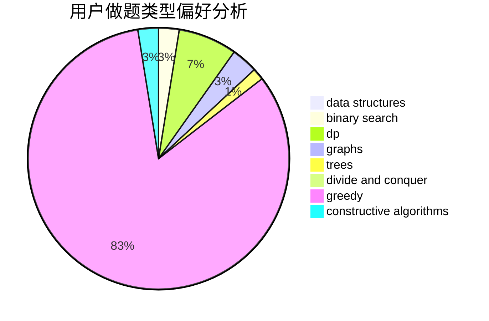
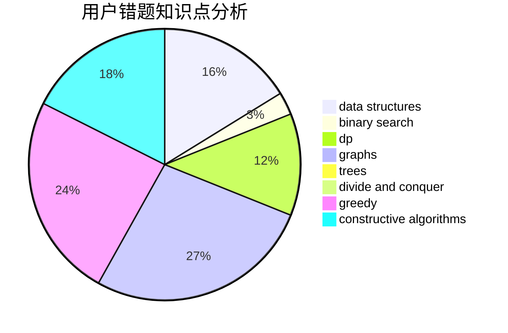

# STUPID_JUSTIN

<!-- tabs:start -->

#### **用户提交结果分析**

#### **用户做题类型偏好分析**

#### **用户错题知识点分析**

<!-- tabs:end -->
# 推荐题目
[1355A](https://codeforces.com/contest/1355/problem/A)		brute force,
                        implementation,
                        math		  
[1093B](https://codeforces.com/contest/1093/problem/B)		constructive algorithms,
                        greedy,
                        sortings,
                        strings		  
[421A](https://codeforces.com/contest/421/problem/A)		constructive algorithms,
                        implementation		  
[1364D](https://codeforces.com/contest/1364/problem/D)		constructive algorithms,
                        dfs and similar,
                        graphs,
                        greedy,
                        implementation,
                        trees		  
[1300C](https://codeforces.com/contest/1300/problem/C)		dsu,graphs,sortings,trees		  
[560E](https://codeforces.com/contest/560/problem/E)		dsu,graphs,sortings,trees		  
[1280F](https://codeforces.com/contest/1280/problem/F)		combinatorics,
                        constructive algorithms,
                        math		  
[216B](https://codeforces.com/contest/216/problem/B)		dfs and similar,
                        implementation		  
[1305H](https://codeforces.com/contest/1305/problem/H)		binary search,
                        greedy		  
[12962](https://codeforces.com/contest/1296/problem/2)		dsu,graphs,sortings,trees		  
