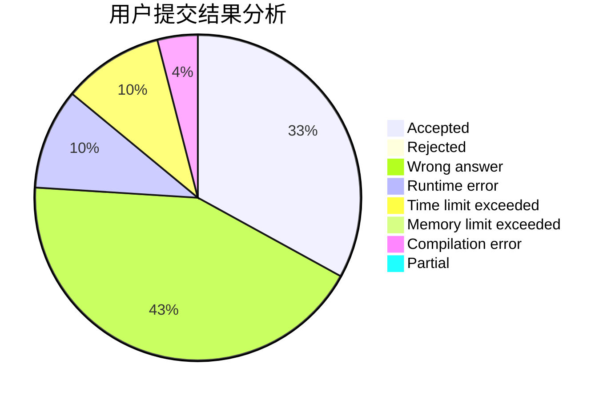
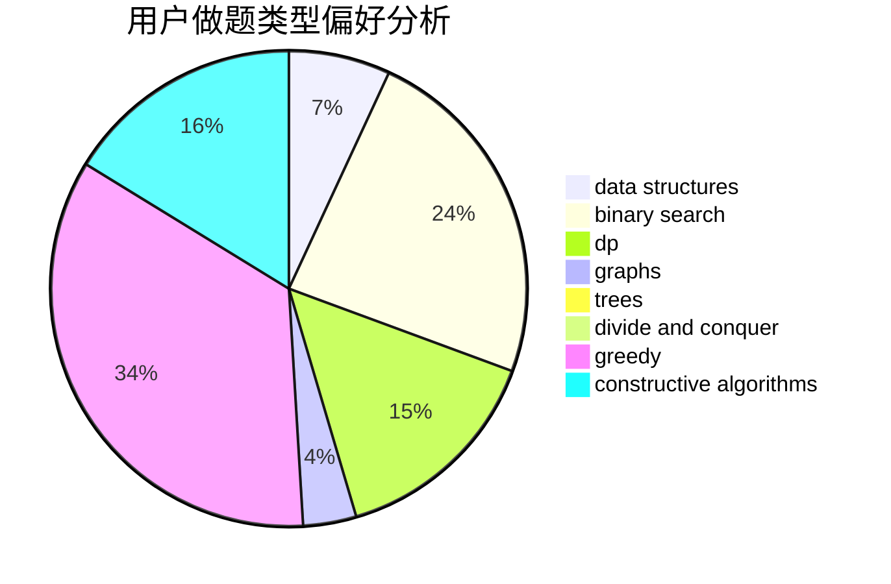
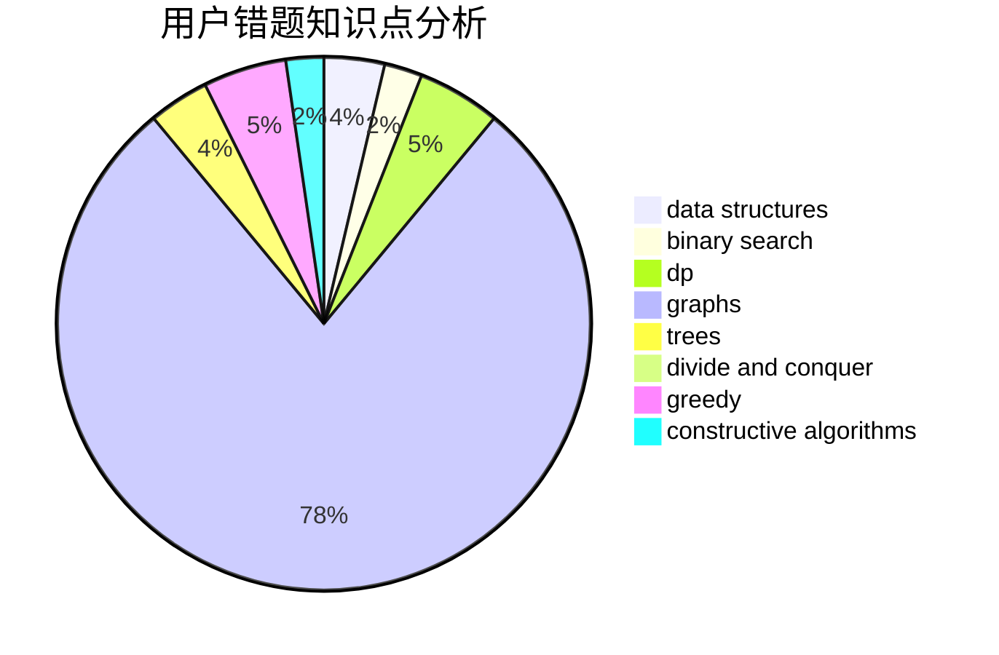

# ST_Reborn

<!-- tabs:start -->

#### **用户提交结果分析**

#### **用户做题类型偏好分析**

#### **用户错题知识点分析**

<!-- tabs:end -->
# 推荐题目
[1504A](https://codeforces.com/contest/1504/problem/A)		constructive algorithms,
                        strings		  
[1237C2](https://codeforces.com/contest/1237C/problem/2)		binary search,
                        constructive algorithms,
                        divide and conquer,
                        greedy,
                        implementation,
                        sortings		  
[1337D](https://codeforces.com/contest/1337/problem/D)		dsu,graphs,sortings,trees		  
[1129E](https://codeforces.com/contest/1129/problem/E)		binary search,
                        interactive,
                        trees		  
[265D](https://codeforces.com/contest/265/problem/D)		dsu,graphs,sortings,trees		  
[543B](https://codeforces.com/contest/543/problem/B)		constructive algorithms,
                        graphs,
                        shortest paths		  
[845G](https://codeforces.com/contest/845/problem/G)		dfs and similar,
                        graphs,
                        math		  
[883F](https://codeforces.com/contest/883/problem/F)		implementation		  
[814C](https://codeforces.com/contest/814/problem/C)		brute force,
                        dp,
                        strings,
                        two pointers		  
[598C](https://codeforces.com/contest/598/problem/C)		geometry,
                        sortings		  
