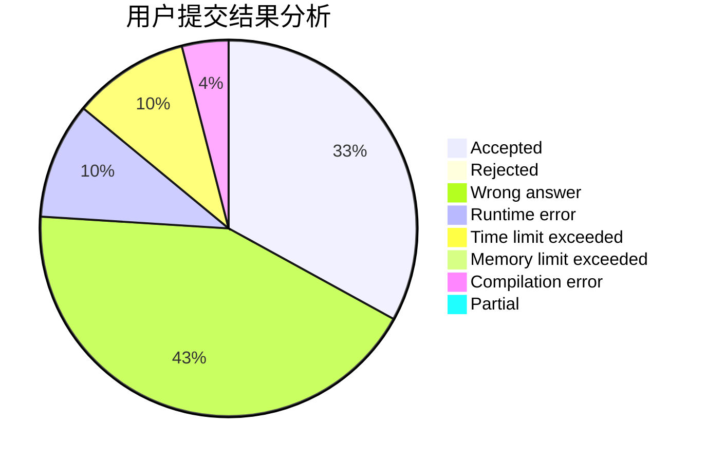
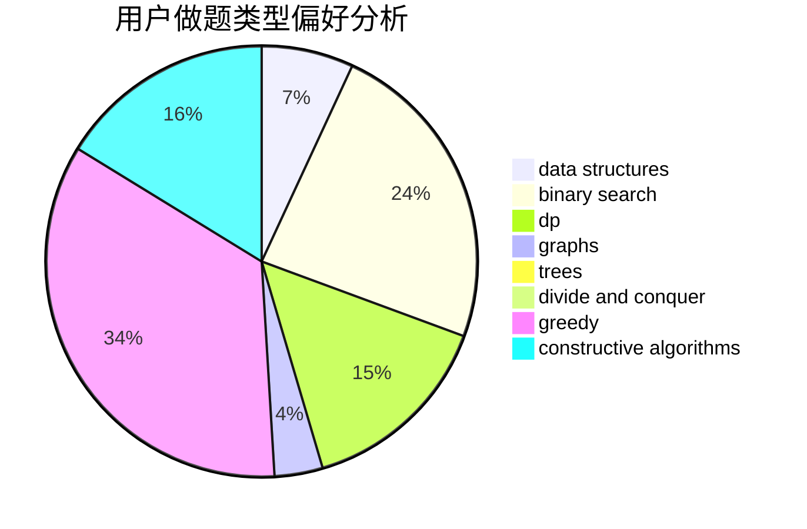
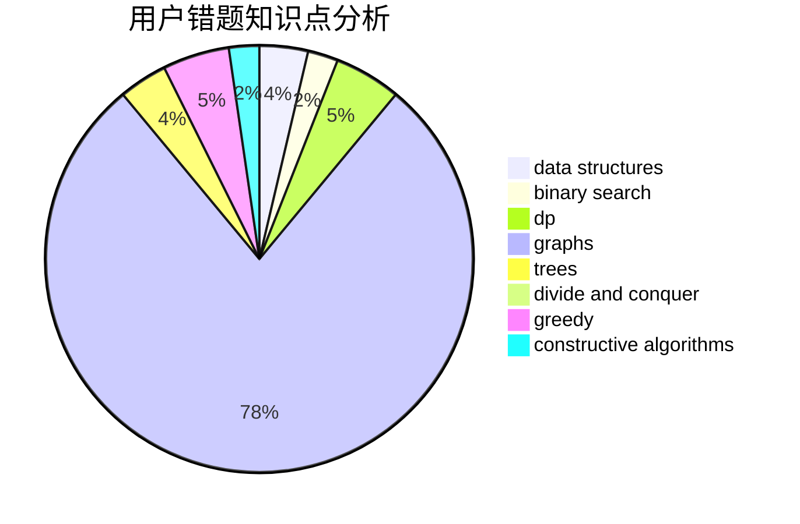

# ST_Reborn
<!-- tabs:start -->
#### **用户提交结果分析**

#### **用户做题类型偏好分析**

#### **用户错题知识点分析**

<!-- tabs:end -->
# 推荐题目
[Xenia and Colorful Gems](https://codeforces.com/contest/1337/problem/D)		binary search,
                        greedy,
                        math,
                        sortings,
                        two pointers		  
[Dreamoon and Sums](http://codeforces.com/problemset/problem/476/C)		math		  
[Makes And The Product](http://codeforces.com/problemset/problem/817/B)		combinatorics,
                        implementation,
                        math,
                        sortings		  
[Good Sequences](https://codeforces.com/contest/265/problem/D)		dp,
                        number theory		  
[Destroying Roads](http://codeforces.com/problemset/problem/543/B)		constructive algorithms,
                        graphs,
                        shortest paths		  
[New Reform](http://codeforces.com/problemset/problem/659/E)		data structures,
                        dfs and similar,
                        dsu,
                        graphs,
                        greedy		  
[Roma and Poker](http://codeforces.com/problemset/problem/803/E)		dp,
                        graphs		  
[An impassioned circulation of affection](http://codeforces.com/problemset/problem/814/C)		brute force,
                        dp,
                        strings,
                        two pointers		  
[Greg and Friends](http://codeforces.com/problemset/problem/295/C)		combinatorics,
                        dp,
                        graphs,
                        shortest paths		  
[Really Big Numbers](http://codeforces.com/problemset/problem/817/C)		binary search,
                        brute force,
                        dp,
                        math		  
<!-- tabs:start -->
#### **data structures**
[Xenia and Colorful Gems](http://codeforces.com/problemset/problem/659/E)		data structures,
                        dfs and similar,
                        dsu,
                        graphs,
                        greedy		  
[Dreamoon and Sums](http://codeforces.com/problemset/problem/1270/H)		data structures		  
[Makes And The Product](http://codeforces.com/problemset/problem/165/D)		data structures,
                        dsu,
                        trees		  
[Good Sequences](https://codeforces.com/contest/1008/problem/C)		combinatorics,
                        data structures,
                        math,
                        sortings,
                        two pointers		  
[Destroying Roads](http://codeforces.com/problemset/problem/845/E)		binary search,
                        data structures		  
[New Reform](http://codeforces.com/problemset/problem/817/E)		bitmasks,
                        data structures,
                        trees		  
[Roma and Poker](http://codeforces.com/problemset/problem/1492/C)		binary search,
                        data structures,
                        dp,
                        greedy,
                        two pointers		  
[An impassioned circulation of affection](http://codeforces.com/problemset/problem/1490/G)		binary search,
                        data structures,
                        math		  
[Greg and Friends](http://codeforces.com/problemset/problem/1479/D)		binary search,
                        bitmasks,
                        brute force,
                        data structures,
                        probabilities,
                        trees		  
[Really Big Numbers](http://codeforces.com/problemset/problem/1497/A)		brute force,
                        data structures,
                        greedy,
                        sortings		  
#### **binary search**
[Xenia and Colorful Gems](https://codeforces.com/contest/1337/problem/D)		binary search,
                        greedy,
                        math,
                        sortings,
                        two pointers		  
[Dreamoon and Sums](http://codeforces.com/problemset/problem/817/C)		binary search,
                        brute force,
                        dp,
                        math		  
[Makes And The Product](http://codeforces.com/problemset/problem/518/F)		binary search,
                        brute force,
                        combinatorics,
                        dp,
                        implementation		  
[Good Sequences](http://codeforces.com/problemset/problem/750/C)		binary search,
                        greedy,
                        math		  
[Destroying Roads](http://codeforces.com/problemset/problem/845/E)		binary search,
                        data structures		  
[New Reform](http://codeforces.com/problemset/problem/1129/E)		binary search,
                        interactive,
                        trees		  
[Roma and Poker](http://codeforces.com/problemset/problem/1237/C2)		binary search,
                        constructive algorithms,
                        divide and conquer,
                        greedy,
                        implementation,
                        sortings		  
[An impassioned circulation of affection](http://codeforces.com/problemset/problem/1098/C)		binary search,
                        constructive algorithms,
                        dfs and similar,
                        graphs,
                        greedy,
                        trees		  
[Greg and Friends](http://codeforces.com/problemset/problem/1492/C)		binary search,
                        data structures,
                        dp,
                        greedy,
                        two pointers		  
[Really Big Numbers](http://codeforces.com/problemset/problem/1463/D)		binary search,
                        constructive algorithms,
                        greedy,
                        two pointers		  
#### **dp**
[Xenia and Colorful Gems](https://codeforces.com/contest/265/problem/D)		dp,
                        number theory		  
[Dreamoon and Sums](http://codeforces.com/problemset/problem/803/E)		dp,
                        graphs		  
[Makes And The Product](http://codeforces.com/problemset/problem/814/C)		brute force,
                        dp,
                        strings,
                        two pointers		  
[Good Sequences](http://codeforces.com/problemset/problem/295/C)		combinatorics,
                        dp,
                        graphs,
                        shortest paths		  
[Destroying Roads](http://codeforces.com/problemset/problem/817/C)		binary search,
                        brute force,
                        dp,
                        math		  
[New Reform](http://codeforces.com/problemset/problem/514/E)		dp,
                        matrices		  
[Roma and Poker](http://codeforces.com/problemset/problem/518/F)		binary search,
                        brute force,
                        combinatorics,
                        dp,
                        implementation		  
[An impassioned circulation of affection](http://codeforces.com/problemset/problem/1420/C1)		constructive algorithms,
                        dp,
                        greedy		  
[Greg and Friends](http://codeforces.com/problemset/problem/1446/B)		dp,
                        strings		  
[Really Big Numbers](http://codeforces.com/problemset/problem/1492/C)		binary search,
                        data structures,
                        dp,
                        greedy,
                        two pointers		  
#### **graph**
[Xenia and Colorful Gems](http://codeforces.com/problemset/problem/543/B)		constructive algorithms,
                        graphs,
                        shortest paths		  
[Dreamoon and Sums](http://codeforces.com/problemset/problem/659/E)		data structures,
                        dfs and similar,
                        dsu,
                        graphs,
                        greedy		  
[Makes And The Product](http://codeforces.com/problemset/problem/803/E)		dp,
                        graphs		  
[Good Sequences](http://codeforces.com/problemset/problem/295/C)		combinatorics,
                        dp,
                        graphs,
                        shortest paths		  
[Destroying Roads](http://codeforces.com/problemset/problem/254/D)		brute force,
                        dfs and similar,
                        graphs,
                        implementation,
                        shortest paths		  
[New Reform](http://codeforces.com/problemset/problem/788/C)		dfs and similar,
                        graphs,
                        shortest paths		  
[Roma and Poker](http://codeforces.com/problemset/problem/25/C)		graphs,
                        shortest paths		  
[An impassioned circulation of affection](http://codeforces.com/problemset/problem/1098/C)		binary search,
                        constructive algorithms,
                        dfs and similar,
                        graphs,
                        greedy,
                        trees		  
[Greg and Friends](http://codeforces.com/problemset/problem/845/G)		dfs and similar,
                        graphs,
                        math		  
[Really Big Numbers](http://codeforces.com/problemset/problem/1487/C)		brute force,
                        constructive algorithms,
                        dfs and similar,
                        graphs,
                        greedy,
                        implementation,
                        math		  
#### **trees**
[Xenia and Colorful Gems](http://codeforces.com/problemset/problem/165/D)		data structures,
                        dsu,
                        trees		  
[Dreamoon and Sums](http://codeforces.com/problemset/problem/1129/E)		binary search,
                        interactive,
                        trees		  
[Makes And The Product](http://codeforces.com/problemset/problem/1098/C)		binary search,
                        constructive algorithms,
                        dfs and similar,
                        graphs,
                        greedy,
                        trees		  
[Good Sequences](http://codeforces.com/problemset/problem/817/E)		bitmasks,
                        data structures,
                        trees		  
[Destroying Roads](http://codeforces.com/problemset/problem/1479/D)		binary search,
                        bitmasks,
                        brute force,
                        data structures,
                        probabilities,
                        trees		  
[New Reform](http://codeforces.com/problemset/problem/1511/C)		brute force,
                        data structures,
                        implementation,
                        trees		  
[Roma and Poker](http://codeforces.com/problemset/problem/1499/F)		combinatorics,
                        dfs and similar,
                        dp,
                        trees		  
[An impassioned circulation of affection](http://codeforces.com/problemset/problem/1491/E)		brute force,
                        dfs and similar,
                        divide and conquer,
                        number theory,
                        trees		  
[Greg and Friends](http://codeforces.com/problemset/problem/1466/D)		data structures,
                        greedy,
                        sortings,
                        trees		  
[Really Big Numbers](http://codeforces.com/problemset/problem/1495/D)		combinatorics,
                        dfs and similar,
                        graphs,
                        math,
                        shortest paths,
                        trees		  
#### **divide and conquer**
[Xenia and Colorful Gems](http://codeforces.com/problemset/problem/1237/C2)		binary search,
                        constructive algorithms,
                        divide and conquer,
                        greedy,
                        implementation,
                        sortings		  
[Dreamoon and Sums](http://codeforces.com/problemset/problem/1461/D)		binary search,
                        brute force,
                        data structures,
                        divide and conquer,
                        implementation,
                        sortings		  
[Makes And The Product](http://codeforces.com/problemset/problem/1466/G)		combinatorics,
                        divide and conquer,
                        hashing,
                        math,
                        string suffix structures,
                        strings		  
[Good Sequences](http://codeforces.com/problemset/problem/1490/D)		dfs and similar,
                        divide and conquer,
                        implementation		  
[Destroying Roads](https://codeforces.com/contest/1483/problem/C)		data structures,
                        divide and conquer,
                        dp		  
[New Reform](http://codeforces.com/problemset/problem/1491/E)		brute force,
                        dfs and similar,
                        divide and conquer,
                        number theory,
                        trees		  
[Roma and Poker](http://codeforces.com/problemset/problem/1303/G)		data structures,
                        divide and conquer,
                        geometry,
                        trees		  
[An impassioned circulation of affection](http://codeforces.com/problemset/problem/1494/D)		constructive algorithms,
                        data structures,
                        dfs and similar,
                        divide and conquer,
                        dsu,
                        greedy,
                        sortings,
                        trees		  
[Greg and Friends](http://codeforces.com/problemset/problem/1482/E)		data structures,
                        divide and conquer,
                        dp		  
[Really Big Numbers](http://codeforces.com/problemset/problem/566/C)		dfs and similar,
                        divide and conquer,
                        trees		  
#### **greedy**
[Xenia and Colorful Gems](https://codeforces.com/contest/1337/problem/D)		binary search,
                        greedy,
                        math,
                        sortings,
                        two pointers		  
[Dreamoon and Sums](http://codeforces.com/problemset/problem/659/E)		data structures,
                        dfs and similar,
                        dsu,
                        graphs,
                        greedy		  
[Makes And The Product](https://codeforces.com/contest/1478/problem/F)		constructive algorithms,
                        geometry,
                        greedy,
                        math,
                        sortings		  
[Good Sequences](http://codeforces.com/problemset/problem/701/A)		greedy,
                        implementation		  
[Destroying Roads](http://codeforces.com/problemset/problem/750/C)		binary search,
                        greedy,
                        math		  
[New Reform](http://codeforces.com/problemset/problem/1420/C1)		constructive algorithms,
                        dp,
                        greedy		  
[Roma and Poker](http://codeforces.com/problemset/problem/1110/B)		greedy,
                        sortings		  
[An impassioned circulation of affection](http://codeforces.com/problemset/problem/1237/C2)		binary search,
                        constructive algorithms,
                        divide and conquer,
                        greedy,
                        implementation,
                        sortings		  
[Greg and Friends](http://codeforces.com/problemset/problem/1098/C)		binary search,
                        constructive algorithms,
                        dfs and similar,
                        graphs,
                        greedy,
                        trees		  
[Really Big Numbers](http://codeforces.com/problemset/problem/864/D)		greedy,
                        implementation,
                        math		  
#### **constructive algorithms**
[Xenia and Colorful Gems](http://codeforces.com/problemset/problem/543/B)		constructive algorithms,
                        graphs,
                        shortest paths		  
[Dreamoon and Sums](http://codeforces.com/problemset/problem/1267/C)		constructive algorithms		  
[Makes And The Product](https://codeforces.com/contest/1478/problem/F)		constructive algorithms,
                        geometry,
                        greedy,
                        math,
                        sortings		  
[Good Sequences](http://codeforces.com/problemset/problem/1451/E1)		bitmasks,
                        constructive algorithms,
                        interactive,
                        math		  
[Destroying Roads](http://codeforces.com/problemset/problem/1420/C1)		constructive algorithms,
                        dp,
                        greedy		  
[New Reform](http://codeforces.com/problemset/problem/1237/C2)		binary search,
                        constructive algorithms,
                        divide and conquer,
                        greedy,
                        implementation,
                        sortings		  
[Roma and Poker](http://codeforces.com/problemset/problem/1098/C)		binary search,
                        constructive algorithms,
                        dfs and similar,
                        graphs,
                        greedy,
                        trees		  
[An impassioned circulation of affection](http://codeforces.com/problemset/problem/1504/A)		constructive algorithms,
                        strings		  
[Greg and Friends](http://codeforces.com/problemset/problem/1493/A)		constructive algorithms,
                        greedy		  
[Really Big Numbers](http://codeforces.com/problemset/problem/1463/D)		binary search,
                        constructive algorithms,
                        greedy,
                        two pointers		  
#### **sortings**
[Xenia and Colorful Gems](https://codeforces.com/contest/1337/problem/D)		binary search,
                        greedy,
                        math,
                        sortings,
                        two pointers		  
[Dreamoon and Sums](http://codeforces.com/problemset/problem/817/B)		combinatorics,
                        implementation,
                        math,
                        sortings		  
[Makes And The Product](https://codeforces.com/contest/1008/problem/C)		combinatorics,
                        data structures,
                        math,
                        sortings,
                        two pointers		  
[Good Sequences](https://codeforces.com/contest/1478/problem/F)		constructive algorithms,
                        geometry,
                        greedy,
                        math,
                        sortings		  
[Destroying Roads](http://codeforces.com/problemset/problem/598/C)		geometry,
                        sortings		  
[New Reform](http://codeforces.com/problemset/problem/1110/B)		greedy,
                        sortings		  
[Roma and Poker](http://codeforces.com/problemset/problem/1237/C2)		binary search,
                        constructive algorithms,
                        divide and conquer,
                        greedy,
                        implementation,
                        sortings		  
[An impassioned circulation of affection](https://codeforces.com/contest/1496/problem/C)		geometry,
                        greedy,
                        math,
                        sortings		  
[Greg and Friends](http://codeforces.com/problemset/problem/1495/A)		geometry,
                        greedy,
                        math,
                        sortings		  
[Really Big Numbers](http://codeforces.com/problemset/problem/1497/A)		brute force,
                        data structures,
                        greedy,
                        sortings		  
<!-- tabs:end -->
