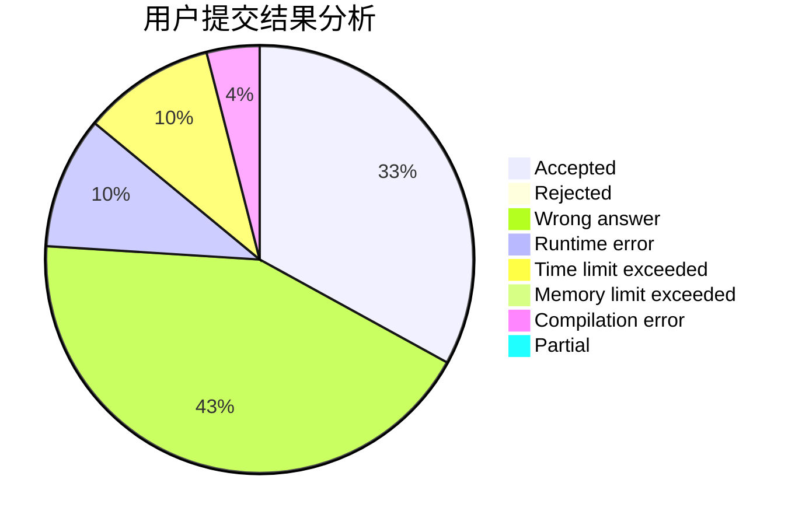
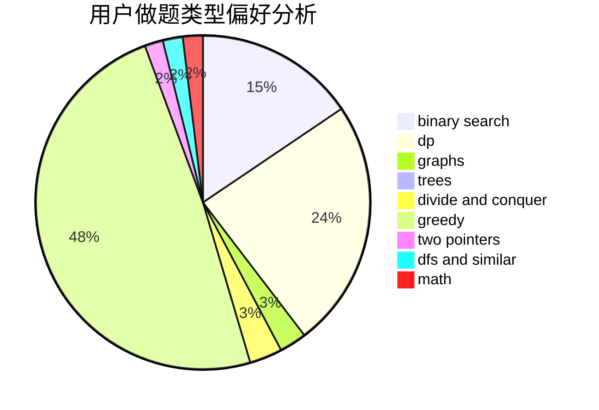

# ST_Reborn

<!-- tabs:start -->

#### **用户提交结果分析**

#### **用户做题类型偏好分析**

<!-- tabs:end -->
# 推荐题目
[1512G](https://codeforces.com/contest/1512/problem/G)
[1242A](https://codeforces.com/contest/1242/problem/A)
[1344F](https://codeforces.com/contest/1344/problem/F)
[1131E](https://codeforces.com/contest/1131/problem/E)
[281A](https://codeforces.com/contest/281/problem/A)
[567D](https://codeforces.com/contest/567/problem/D)
[864B](https://codeforces.com/contest/864/problem/B)
[900E](https://codeforces.com/contest/900/problem/E)
[833A](https://codeforces.com/contest/833/problem/A)
[616B](https://codeforces.com/contest/616/problem/B)
