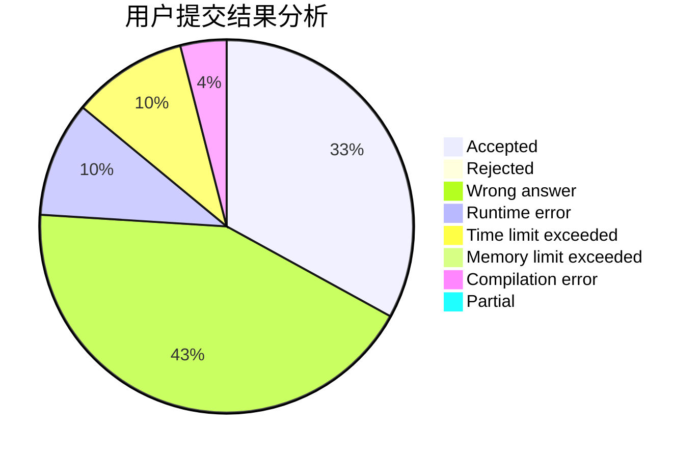
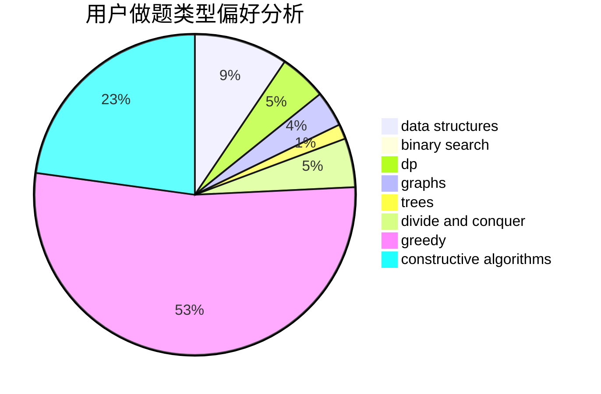
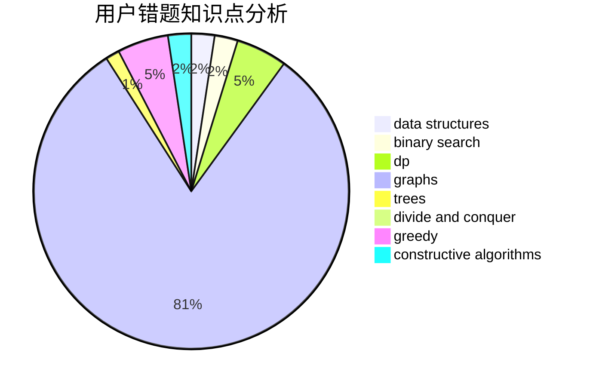

# ST_Reborn

<!-- tabs:start -->

#### **用户提交结果分析**

#### **用户做题类型偏好分析**

#### **用户错题知识点分析**

<!-- tabs:end -->
# 推荐题目
[1512G](https://codeforces.com/contest/1512/problem/G)		brute force,
                        dp,
                        math,
                        number theory		  
[1242A](https://codeforces.com/contest/1242/problem/A)		constructive algorithms,
                        math,
                        number theory		  
[1344F](https://codeforces.com/contest/1344/problem/F)		matrices		  
[1131E](https://codeforces.com/contest/1131/problem/E)		dp,
                        greedy,
                        strings		  
[281A](https://codeforces.com/contest/281/problem/A)		implementation,
                        strings		  
[567D](https://codeforces.com/contest/567/problem/D)		binary search,
                        data structures,
                        greedy,
                        sortings		  
[864B](https://codeforces.com/contest/864/problem/B)		brute force,
                        implementation,
                        strings		  
[900E](https://codeforces.com/contest/900/problem/E)		data structures,
                        dp,
                        strings		  
[833A](https://codeforces.com/contest/833/problem/A)		math,
                        number theory		  
[616B](https://codeforces.com/contest/616/problem/B)		games,
                        greedy		  
