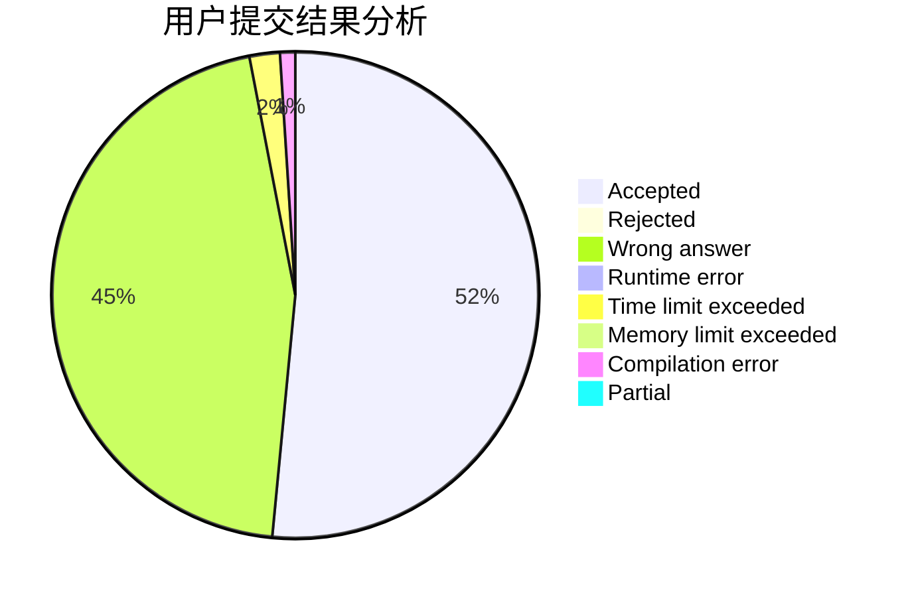
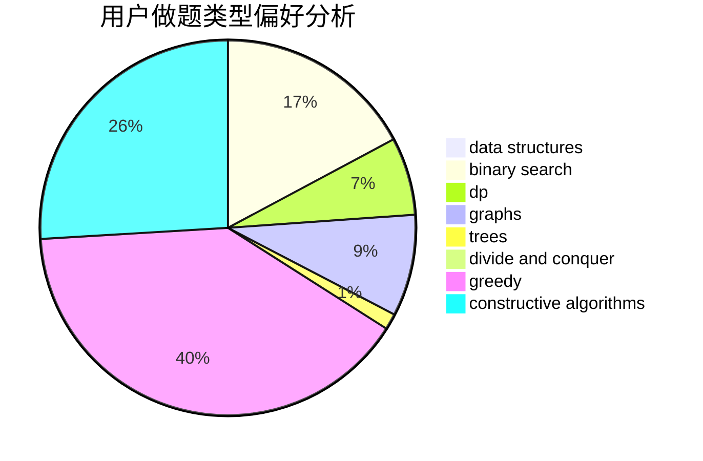
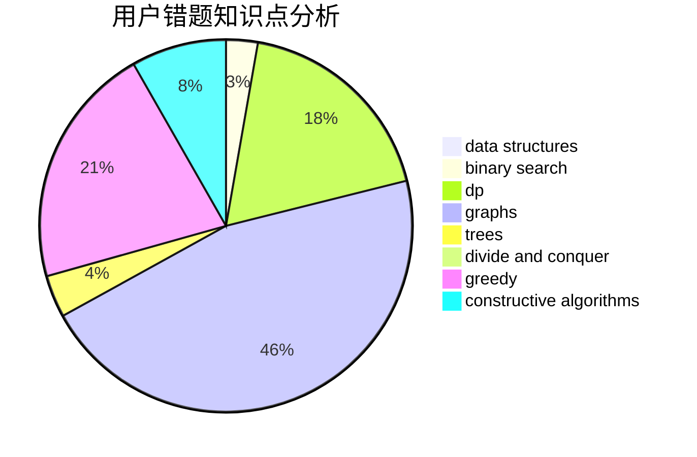

# SUNNG

<!-- tabs:start -->

#### **用户提交结果分析**

#### **用户做题类型偏好分析**

#### **用户错题知识点分析**

<!-- tabs:end -->
# 推荐题目
[898D](https://codeforces.com/contest/898/problem/D)		greedy		  
[875F](https://codeforces.com/contest/875/problem/F)		dsu,
                        graphs,
                        greedy		  
[1377A1](https://codeforces.com/contest/1377A/problem/1)		dsu,graphs,sortings,trees		  
[43A](https://codeforces.com/contest/43/problem/A)		strings		  
[254D](https://codeforces.com/contest/254/problem/D)		brute force,
                        dfs and similar,
                        graphs,
                        implementation,
                        shortest paths		  
[526B](https://codeforces.com/contest/526/problem/B)		dfs and similar,
                        greedy,
                        implementation		  
[1155A](https://codeforces.com/contest/1155/problem/A)		implementation,
                        sortings,
                        strings		  
[843D](https://codeforces.com/contest/843/problem/D)		graphs,
                        shortest paths		  
[643F](https://codeforces.com/contest/643/problem/F)		dp,
                        math,
                        meet-in-the-middle		  
[1432E](https://codeforces.com/contest/1432/problem/E)		dsu,graphs,sortings,trees		  
