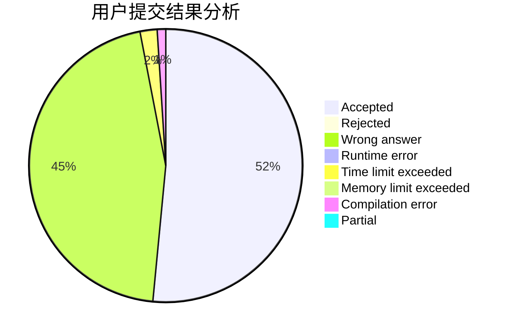
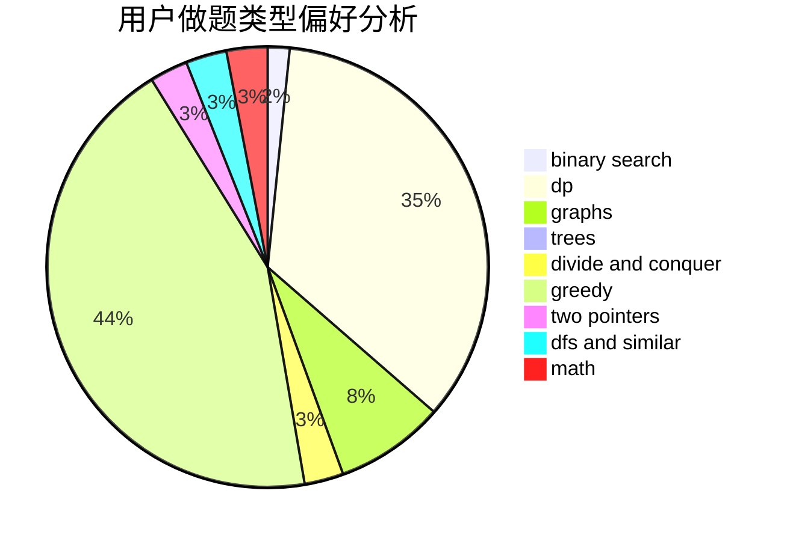

# SUNNG

<!-- tabs:start -->

#### **用户提交结果分析**

#### **用户做题类型偏好分析**

<!-- tabs:end -->
# 推荐题目
[914F](https://codeforces.com/contest/914/problem/F)
[896A](https://codeforces.com/contest/896/problem/A)
[1386B](https://codeforces.com/contest/1386/problem/B)
[461B](https://codeforces.com/contest/461/problem/B)
[273D](https://codeforces.com/contest/273/problem/D)
[550B](https://codeforces.com/contest/550/problem/B)
[11571](https://codeforces.com/contest/1157/problem/1)
[862E](https://codeforces.com/contest/862/problem/E)
[670F](https://codeforces.com/contest/670/problem/F)
[1442D](https://codeforces.com/contest/1442/problem/D)
