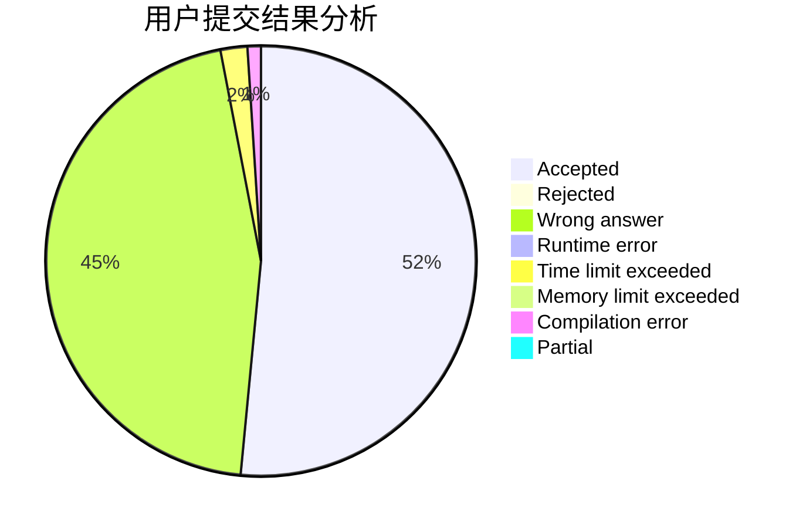
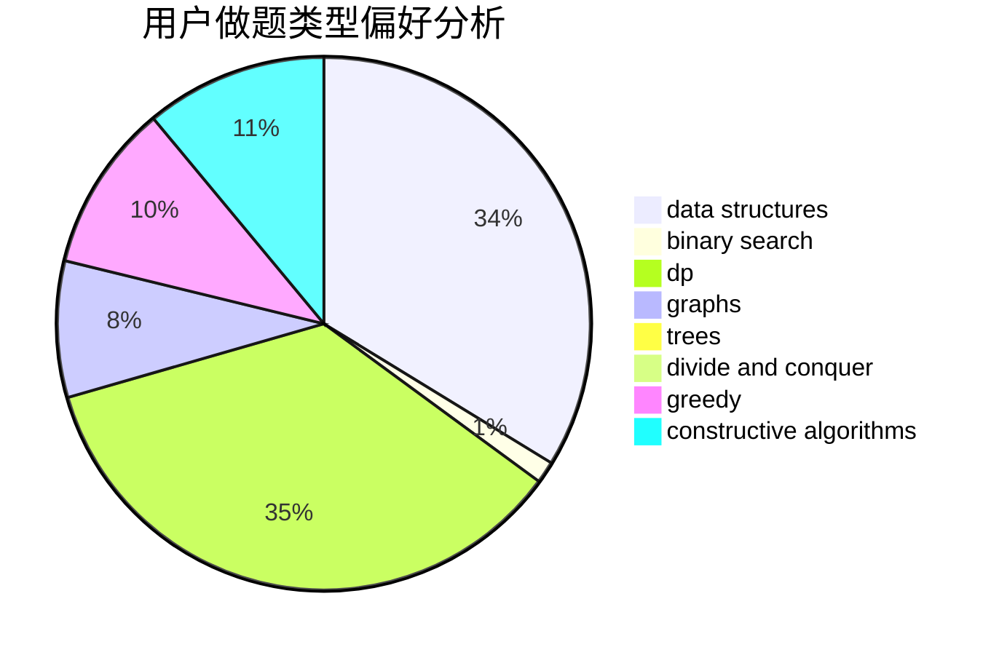
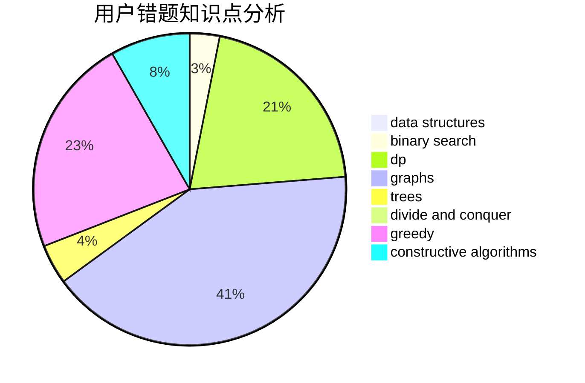

# SUNNG

<!-- tabs:start -->

#### **用户提交结果分析**

#### **用户做题类型偏好分析**

#### **用户错题知识点分析**

<!-- tabs:end -->
# 推荐题目
[914F](https://codeforces.com/contest/914/problem/F)		bitmasks,
                        brute force,
                        data structures,
                        string suffix structures,
                        strings		  
[896A](https://codeforces.com/contest/896/problem/A)		binary search,
                        dfs and similar		  
[1386B](https://codeforces.com/contest/1386/problem/B)		*special problem,
                        data structures,
                        geometry,
                        math,
                        sortings		  
[461B](https://codeforces.com/contest/461/problem/B)		dfs and similar,
                        dp,
                        trees		  
[273D](https://codeforces.com/contest/273/problem/D)		dp		  
[550B](https://codeforces.com/contest/550/problem/B)		bitmasks,
                        brute force		  
[11571](https://codeforces.com/contest/1157/problem/1)		dsu,graphs,sortings,trees		  
[862E](https://codeforces.com/contest/862/problem/E)		binary search,
                        data structures,
                        sortings		  
[670F](https://codeforces.com/contest/670/problem/F)		brute force,
                        constructive algorithms,
                        strings		  
[1442D](https://codeforces.com/contest/1442/problem/D)		data structures,
                        divide and conquer,
                        dp,
                        greedy		  
