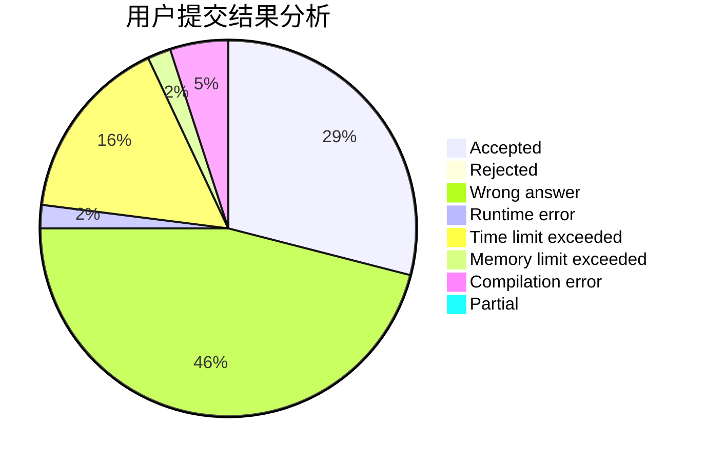
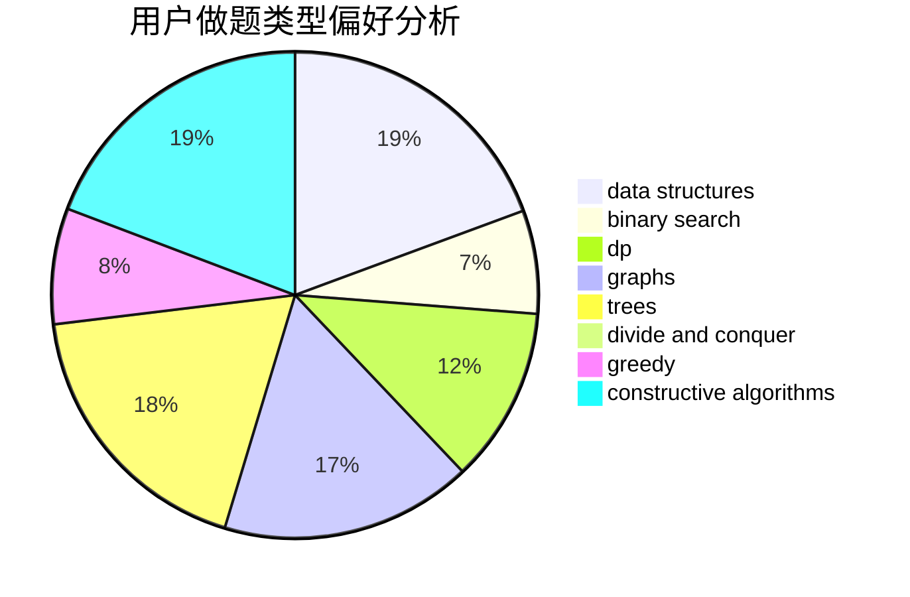
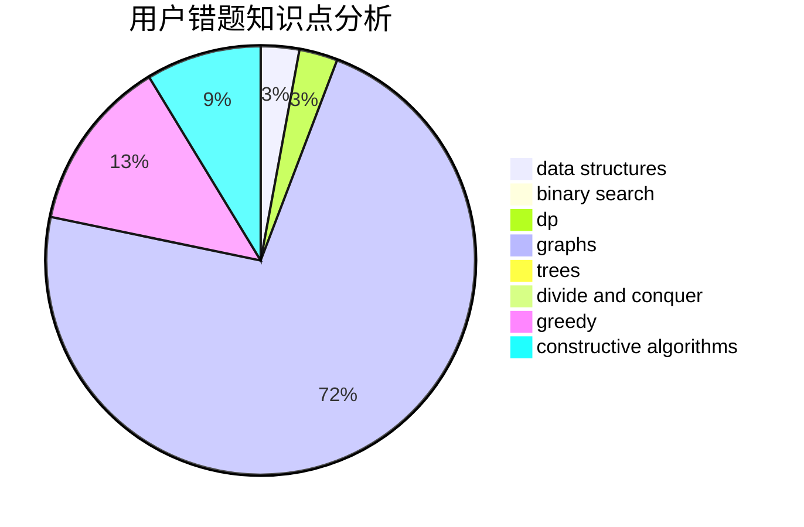

# SW2000

<!-- tabs:start -->

#### **用户提交结果分析**

#### **用户做题类型偏好分析**

#### **用户错题知识点分析**

<!-- tabs:end -->
# 推荐题目
[899F](https://codeforces.com/contest/899/problem/F)		data structures,
                        strings		  
[418B](https://codeforces.com/contest/418/problem/B)		dsu,graphs,sortings,trees		  
[1107F](https://codeforces.com/contest/1107/problem/F)		dp,
                        flows,
                        graph matchings,
                        graphs,
                        sortings		  
[1324C](https://codeforces.com/contest/1324/problem/C)		binary search,
                        data structures,
                        dfs and similar,
                        greedy,
                        implementation		  
[317D](https://codeforces.com/contest/317/problem/D)		dp,
                        games		  
[1437C](https://codeforces.com/contest/1437/problem/C)		dp,
                        flows,
                        graph matchings,
                        greedy,
                        math,
                        sortings		  
[1043B](https://codeforces.com/contest/1043/problem/B)		implementation		  
[1323A](https://codeforces.com/contest/1323/problem/A)		brute force,
                        dp,
                        greedy,
                        implementation		  
[477E](https://codeforces.com/contest/477/problem/E)		data structures		  
[1132A](https://codeforces.com/contest/1132/problem/A)		greedy,
                        implementation		  
