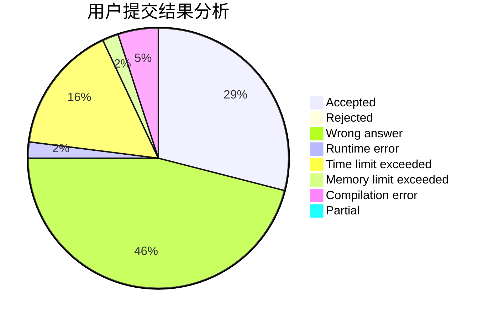
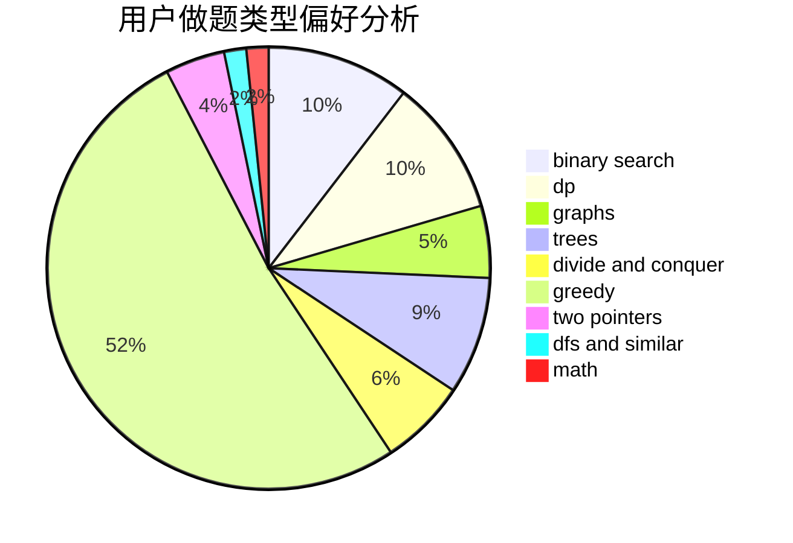

# SW2000

<!-- tabs:start -->

#### **用户提交结果分析**

#### **用户做题类型偏好分析**

<!-- tabs:end -->
# 推荐题目
[915F](https://codeforces.com/contest/915/problem/F)
[443A](https://codeforces.com/contest/443/problem/A)
[1108A](https://codeforces.com/contest/1108/problem/A)
[1331A](https://codeforces.com/contest/1331/problem/A)
[347A](https://codeforces.com/contest/347/problem/A)
[14472](https://codeforces.com/contest/1447/problem/2)
[1043E](https://codeforces.com/contest/1043/problem/E)
[132C](https://codeforces.com/contest/132/problem/C)
[497E](https://codeforces.com/contest/497/problem/E)
[1133E](https://codeforces.com/contest/1133/problem/E)
