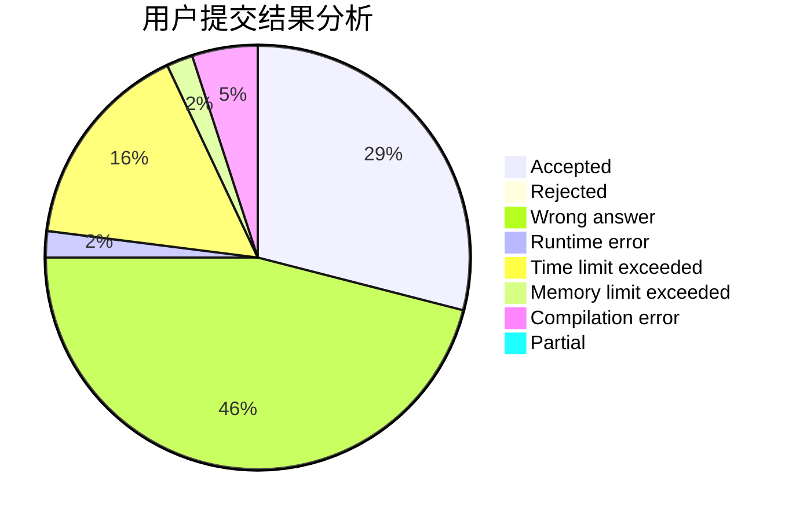
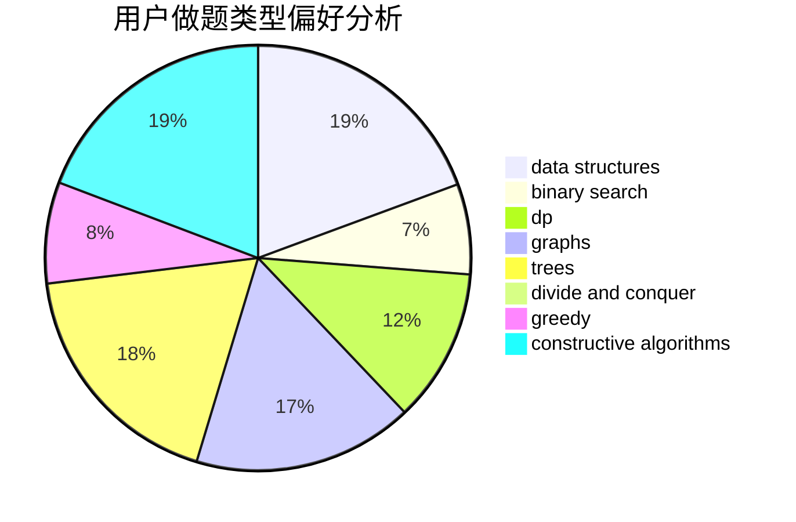
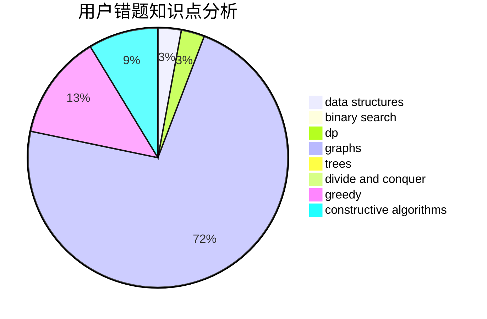

# SW2000
<!-- tabs:start -->
#### **用户提交结果分析**

#### **用户做题类型偏好分析**

#### **用户错题知识点分析**

<!-- tabs:end -->
# 推荐题目
[Matrix Game](http://codeforces.com/problemset/problem/1365/A)		games,
                        greedy,
                        implementation		  
[Regular Bracket Sequence](http://codeforces.com/problemset/problem/1132/A)		greedy,
                        implementation		  
[Letters Removing](http://codeforces.com/problemset/problem/899/F)		data structures,
                        strings		  
[Vasya and Endless Credits](http://codeforces.com/problemset/problem/1107/F)		dp,
                        flows,
                        graph matchings,
                        graphs,
                        sortings		  
[Borze](http://codeforces.com/problemset/problem/32/B)		expression parsing,
                        implementation		  
[Frog Jumps](http://codeforces.com/problemset/problem/1324/C)		binary search,
                        data structures,
                        dfs and similar,
                        greedy,
                        implementation		  
[Mateusz and Escape Room](https://codeforces.com/contest/1229/problem/F)		dp		  
[Vladik and flights](http://codeforces.com/problemset/problem/743/A)		constructive algorithms,
                        greedy,
                        implementation		  
[Taxi](http://codeforces.com/problemset/problem/158/B)		*special problem,
                        greedy,
                        implementation		  
[The Time](http://codeforces.com/problemset/problem/622/B)		implementation		  
<!-- tabs:start -->
#### **data structures**
[Matrix Game](http://codeforces.com/problemset/problem/899/F)		data structures,
                        strings		  
[Regular Bracket Sequence](http://codeforces.com/problemset/problem/1324/C)		binary search,
                        data structures,
                        dfs and similar,
                        greedy,
                        implementation		  
[Letters Removing](http://codeforces.com/problemset/problem/477/E)		data structures		  
[Vasya and Endless Credits](http://codeforces.com/problemset/problem/1023/G)		data structures,
                        flows,
                        trees		  
[Borze](http://codeforces.com/problemset/problem/1464/F)		data structures,
                        trees		  
[Frog Jumps](http://codeforces.com/problemset/problem/1513/F)		brute force,
                        constructive algorithms,
                        data structures,
                        sortings		  
[Mateusz and Escape Room](http://codeforces.com/problemset/problem/1379/F1)		binary search,
                        data structures		  
[Vladik and flights](http://codeforces.com/problemset/problem/1473/D)		data structures,
                        dp,
                        implementation,
                        strings		  
[Taxi](http://codeforces.com/problemset/problem/1492/C)		binary search,
                        data structures,
                        dp,
                        greedy,
                        two pointers		  
[The Time](http://codeforces.com/problemset/problem/1490/G)		binary search,
                        data structures,
                        math		  
#### **binary search**
[Matrix Game](http://codeforces.com/problemset/problem/1324/C)		binary search,
                        data structures,
                        dfs and similar,
                        greedy,
                        implementation		  
[Regular Bracket Sequence](http://codeforces.com/problemset/problem/1379/F1)		binary search,
                        data structures		  
[Letters Removing](http://codeforces.com/problemset/problem/1492/C)		binary search,
                        data structures,
                        dp,
                        greedy,
                        two pointers		  
[Vasya and Endless Credits](http://codeforces.com/problemset/problem/1463/D)		binary search,
                        constructive algorithms,
                        greedy,
                        two pointers		  
[Borze](http://codeforces.com/problemset/problem/1490/G)		binary search,
                        data structures,
                        math		  
[Frog Jumps](http://codeforces.com/problemset/problem/1479/D)		binary search,
                        bitmasks,
                        brute force,
                        data structures,
                        probabilities,
                        trees		  
[Mateusz and Escape Room](http://codeforces.com/problemset/problem/1436/E)		binary search,
                        data structures,
                        two pointers		  
[Vladik and flights](http://codeforces.com/problemset/problem/1461/D)		binary search,
                        brute force,
                        data structures,
                        divide and conquer,
                        implementation,
                        sortings		  
[Taxi](http://codeforces.com/problemset/problem/1493/C)		binary search,
                        brute force,
                        constructive algorithms,
                        greedy,
                        strings		  
[The Time](http://codeforces.com/problemset/problem/1487/D)		binary search,
                        brute force,
                        math,
                        number theory		  
#### **dp**
[Matrix Game](http://codeforces.com/problemset/problem/1107/F)		dp,
                        flows,
                        graph matchings,
                        graphs,
                        sortings		  
[Regular Bracket Sequence](https://codeforces.com/contest/1229/problem/F)		dp		  
[Letters Removing](http://codeforces.com/problemset/problem/317/D)		dp,
                        games		  
[Vasya and Endless Credits](http://codeforces.com/problemset/problem/1350/B)		dp,
                        math,
                        number theory		  
[Borze](http://codeforces.com/problemset/problem/474/D)		dp		  
[Frog Jumps](http://codeforces.com/problemset/problem/1323/A)		brute force,
                        dp,
                        greedy,
                        implementation		  
[Mateusz and Escape Room](https://codeforces.com/contest/418/problem/B)		bitmasks,
                        dp,
                        greedy,
                        sortings		  
[Vladik and flights](http://codeforces.com/problemset/problem/1437/C)		dp,
                        flows,
                        graph matchings,
                        greedy,
                        math,
                        sortings		  
[Taxi](http://codeforces.com/problemset/problem/1473/D)		data structures,
                        dp,
                        implementation,
                        strings		  
[The Time](http://codeforces.com/problemset/problem/1492/C)		binary search,
                        data structures,
                        dp,
                        greedy,
                        two pointers		  
#### **graph**
[Matrix Game](http://codeforces.com/problemset/problem/1107/F)		dp,
                        flows,
                        graph matchings,
                        graphs,
                        sortings		  
[Regular Bracket Sequence](https://codeforces.com/contest/1219/problem/B)		divide and conquer,
                        fft,
                        graphs		  
[Letters Removing](http://codeforces.com/problemset/problem/1176/E)		dfs and similar,
                        dsu,
                        graphs,
                        shortest paths,
                        trees		  
[Vasya and Endless Credits](http://codeforces.com/problemset/problem/739/D)		graph matchings		  
[Borze](http://codeforces.com/problemset/problem/1082/G)		flows,
                        graphs		  
[Frog Jumps](http://codeforces.com/problemset/problem/1437/C)		dp,
                        flows,
                        graph matchings,
                        greedy,
                        math,
                        sortings		  
[Mateusz and Escape Room](http://codeforces.com/problemset/problem/1133/F2)		constructive algorithms,
                        dfs and similar,
                        dsu,
                        graphs,
                        greedy		  
[Vladik and flights](http://codeforces.com/problemset/problem/1461/E)		brute force,
                        graphs,
                        greedy,
                        implementation,
                        math		  
[Taxi](http://codeforces.com/problemset/problem/1487/C)		brute force,
                        constructive algorithms,
                        dfs and similar,
                        graphs,
                        greedy,
                        implementation,
                        math		  
[The Time](http://codeforces.com/problemset/problem/1437/C)		dp,
                        flows,
                        graph matchings,
                        greedy,
                        math,
                        sortings		  
#### **trees**
[Matrix Game](http://codeforces.com/problemset/problem/1023/G)		data structures,
                        flows,
                        trees		  
[Regular Bracket Sequence](http://codeforces.com/problemset/problem/1325/C)		constructive algorithms,
                        dfs and similar,
                        greedy,
                        trees		  
[Letters Removing](http://codeforces.com/problemset/problem/1176/E)		dfs and similar,
                        dsu,
                        graphs,
                        shortest paths,
                        trees		  
[Vasya and Endless Credits](http://codeforces.com/problemset/problem/1464/F)		data structures,
                        trees		  
[Borze](http://codeforces.com/problemset/problem/1479/D)		binary search,
                        bitmasks,
                        brute force,
                        data structures,
                        probabilities,
                        trees		  
[Frog Jumps](http://codeforces.com/problemset/problem/1511/C)		brute force,
                        data structures,
                        implementation,
                        trees		  
[Mateusz and Escape Room](http://codeforces.com/problemset/problem/1499/F)		combinatorics,
                        dfs and similar,
                        dp,
                        trees		  
[Vladik and flights](http://codeforces.com/problemset/problem/1491/E)		brute force,
                        dfs and similar,
                        divide and conquer,
                        number theory,
                        trees		  
[Taxi](http://codeforces.com/problemset/problem/1466/D)		data structures,
                        greedy,
                        sortings,
                        trees		  
[The Time](http://codeforces.com/problemset/problem/1495/D)		combinatorics,
                        dfs and similar,
                        graphs,
                        math,
                        shortest paths,
                        trees		  
#### **divide and conquer**
[Matrix Game](https://codeforces.com/contest/1219/problem/B)		divide and conquer,
                        fft,
                        graphs		  
[Regular Bracket Sequence](http://codeforces.com/problemset/problem/1466/G)		combinatorics,
                        divide and conquer,
                        hashing,
                        math,
                        string suffix structures,
                        strings		  
[Letters Removing](http://codeforces.com/problemset/problem/1461/D)		binary search,
                        brute force,
                        data structures,
                        divide and conquer,
                        implementation,
                        sortings		  
[Vasya and Endless Credits](http://codeforces.com/problemset/problem/1466/G)		combinatorics,
                        divide and conquer,
                        hashing,
                        math,
                        string suffix structures,
                        strings		  
[Borze](http://codeforces.com/problemset/problem/1490/D)		dfs and similar,
                        divide and conquer,
                        implementation		  
[Frog Jumps](https://codeforces.com/contest/1483/problem/C)		data structures,
                        divide and conquer,
                        dp		  
[Mateusz and Escape Room](http://codeforces.com/problemset/problem/1491/E)		brute force,
                        dfs and similar,
                        divide and conquer,
                        number theory,
                        trees		  
[Vladik and flights](http://codeforces.com/problemset/problem/1303/G)		data structures,
                        divide and conquer,
                        geometry,
                        trees		  
[Taxi](http://codeforces.com/problemset/problem/1494/D)		constructive algorithms,
                        data structures,
                        dfs and similar,
                        divide and conquer,
                        dsu,
                        greedy,
                        sortings,
                        trees		  
[The Time](http://codeforces.com/problemset/problem/1482/E)		data structures,
                        divide and conquer,
                        dp		  
#### **greedy**
[Matrix Game](http://codeforces.com/problemset/problem/1365/A)		games,
                        greedy,
                        implementation		  
[Regular Bracket Sequence](http://codeforces.com/problemset/problem/1132/A)		greedy,
                        implementation		  
[Letters Removing](http://codeforces.com/problemset/problem/1324/C)		binary search,
                        data structures,
                        dfs and similar,
                        greedy,
                        implementation		  
[Vasya and Endless Credits](http://codeforces.com/problemset/problem/743/A)		constructive algorithms,
                        greedy,
                        implementation		  
[Borze](http://codeforces.com/problemset/problem/158/B)		*special problem,
                        greedy,
                        implementation		  
[Frog Jumps](http://codeforces.com/problemset/problem/526/B)		dfs and similar,
                        greedy,
                        implementation		  
[Mateusz and Escape Room](http://codeforces.com/problemset/problem/1325/C)		constructive algorithms,
                        dfs and similar,
                        greedy,
                        trees		  
[Vladik and flights](http://codeforces.com/problemset/problem/1203/B)		greedy,
                        math		  
[Taxi](http://codeforces.com/problemset/problem/1323/A)		brute force,
                        dp,
                        greedy,
                        implementation		  
[The Time](http://codeforces.com/problemset/problem/1181/B)		greedy,
                        implementation,
                        strings		  
#### **constructive algorithms**
[Matrix Game](http://codeforces.com/problemset/problem/743/A)		constructive algorithms,
                        greedy,
                        implementation		  
[Regular Bracket Sequence](http://codeforces.com/problemset/problem/85/A)		constructive algorithms,
                        implementation		  
[Letters Removing](http://codeforces.com/problemset/problem/756/A)		constructive algorithms,
                        dfs and similar		  
[Vasya and Endless Credits](http://codeforces.com/problemset/problem/1325/C)		constructive algorithms,
                        dfs and similar,
                        greedy,
                        trees		  
[Borze](http://codeforces.com/problemset/problem/1237/C1)		constructive algorithms,
                        geometry,
                        greedy		  
[Frog Jumps](http://codeforces.com/problemset/problem/1513/F)		brute force,
                        constructive algorithms,
                        data structures,
                        sortings		  
[Mateusz and Escape Room](http://codeforces.com/problemset/problem/1133/F2)		constructive algorithms,
                        dfs and similar,
                        dsu,
                        graphs,
                        greedy		  
[Vladik and flights](http://codeforces.com/problemset/problem/1493/A)		constructive algorithms,
                        greedy		  
[Taxi](http://codeforces.com/problemset/problem/1463/D)		binary search,
                        constructive algorithms,
                        greedy,
                        two pointers		  
[The Time](https://codeforces.com/contest/1456/problem/B)		bitmasks,
                        brute force,
                        constructive algorithms		  
#### **sortings**
[Matrix Game](http://codeforces.com/problemset/problem/1107/F)		dp,
                        flows,
                        graph matchings,
                        graphs,
                        sortings		  
[Regular Bracket Sequence](http://codeforces.com/problemset/problem/460/E)		brute force,
                        geometry,
                        math,
                        sortings		  
[Letters Removing](https://codeforces.com/contest/418/problem/B)		bitmasks,
                        dp,
                        greedy,
                        sortings		  
[Vasya and Endless Credits](http://codeforces.com/problemset/problem/1513/F)		brute force,
                        constructive algorithms,
                        data structures,
                        sortings		  
[Borze](http://codeforces.com/problemset/problem/1437/C)		dp,
                        flows,
                        graph matchings,
                        greedy,
                        math,
                        sortings		  
[Frog Jumps](https://codeforces.com/contest/1496/problem/C)		geometry,
                        greedy,
                        math,
                        sortings		  
[Mateusz and Escape Room](http://codeforces.com/problemset/problem/1495/A)		geometry,
                        greedy,
                        math,
                        sortings		  
[Vladik and flights](http://codeforces.com/problemset/problem/1497/A)		brute force,
                        data structures,
                        greedy,
                        sortings		  
[Taxi](http://codeforces.com/problemset/problem/1427/A)		math,
                        sortings		  
[The Time](http://codeforces.com/problemset/problem/1461/D)		binary search,
                        brute force,
                        data structures,
                        divide and conquer,
                        implementation,
                        sortings		  
<!-- tabs:end -->
