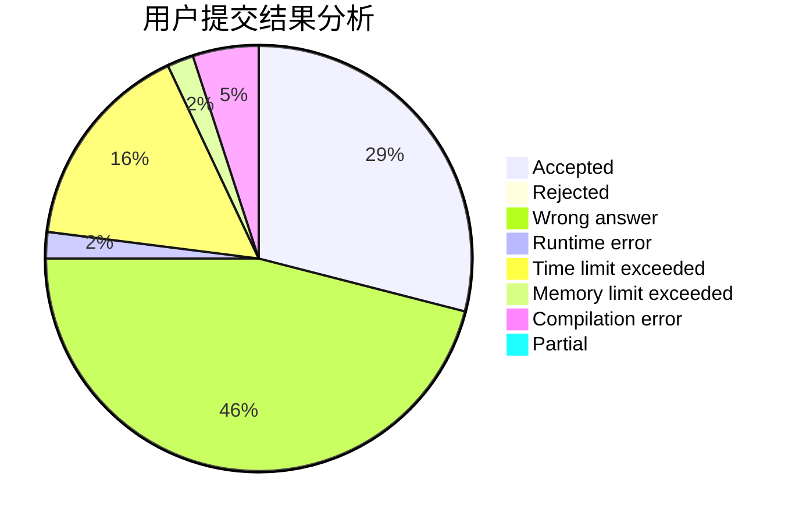
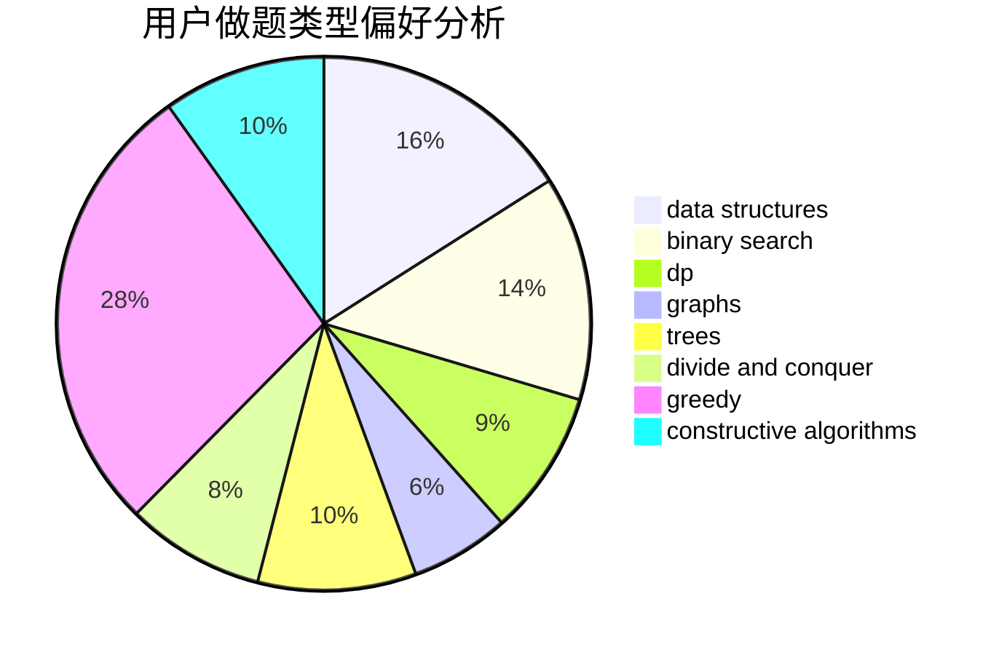
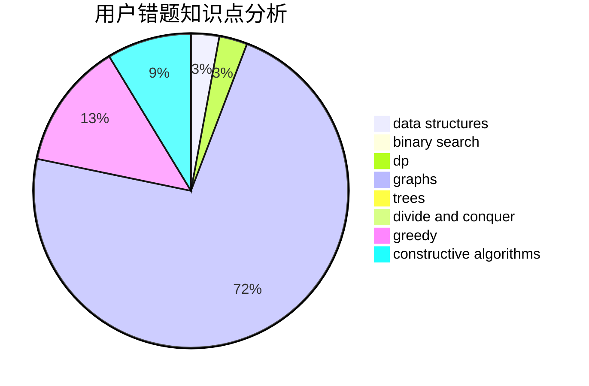

# SW2000

<!-- tabs:start -->

#### **用户提交结果分析**

#### **用户做题类型偏好分析**

#### **用户错题知识点分析**

<!-- tabs:end -->
# 推荐题目
[915F](https://codeforces.com/contest/915/problem/F)		data structures,
                        dsu,
                        graphs,
                        trees		  
[443A](https://codeforces.com/contest/443/problem/A)		constructive algorithms,
                        implementation		  
[1108A](https://codeforces.com/contest/1108/problem/A)		implementation		  
[1331A](https://codeforces.com/contest/1331/problem/A)		nan		  
[347A](https://codeforces.com/contest/347/problem/A)		constructive algorithms,
                        implementation,
                        sortings		  
[14472](https://codeforces.com/contest/1447/problem/2)		dsu,graphs,sortings,trees		  
[1043E](https://codeforces.com/contest/1043/problem/E)		constructive algorithms,
                        greedy,
                        math,
                        sortings		  
[132C](https://codeforces.com/contest/132/problem/C)		dp		  
[497E](https://codeforces.com/contest/497/problem/E)		dp,
                        matrices		  
[1133E](https://codeforces.com/contest/1133/problem/E)		dp,
                        sortings,
                        two pointers		  
