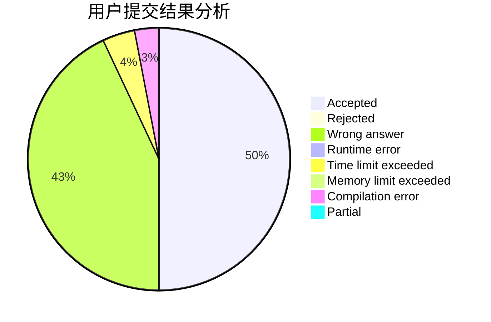
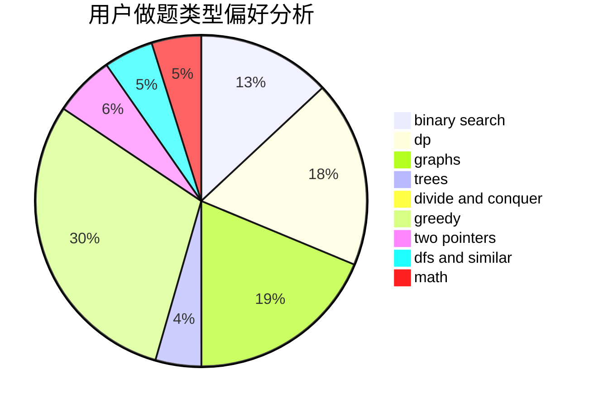

# ASTROBOYZZ

<!-- tabs:start -->

#### **用户提交结果分析**

#### **用户做题类型偏好分析**

<!-- tabs:end -->
# 推荐题目
[1148B](https://codeforces.com/contest/1148/problem/B)
[1065B](https://codeforces.com/contest/1065/problem/B)
[1510A](https://codeforces.com/contest/1510/problem/A)
[1509F](https://codeforces.com/contest/1509/problem/F)
[1055C](https://codeforces.com/contest/1055/problem/C)
[150A](https://codeforces.com/contest/150/problem/A)
[1037G](https://codeforces.com/contest/1037/problem/G)
[1283A](https://codeforces.com/contest/1283/problem/A)
[1053B](https://codeforces.com/contest/1053/problem/B)
[1239B](https://codeforces.com/contest/1239/problem/B)
