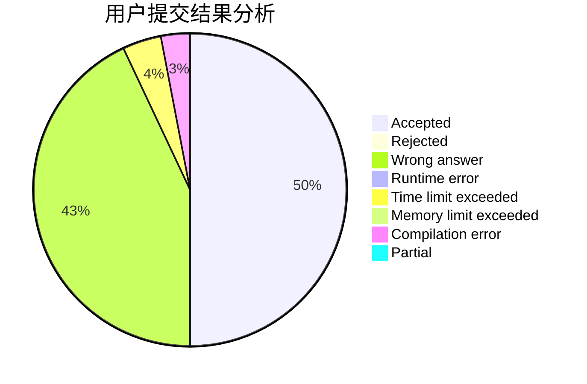
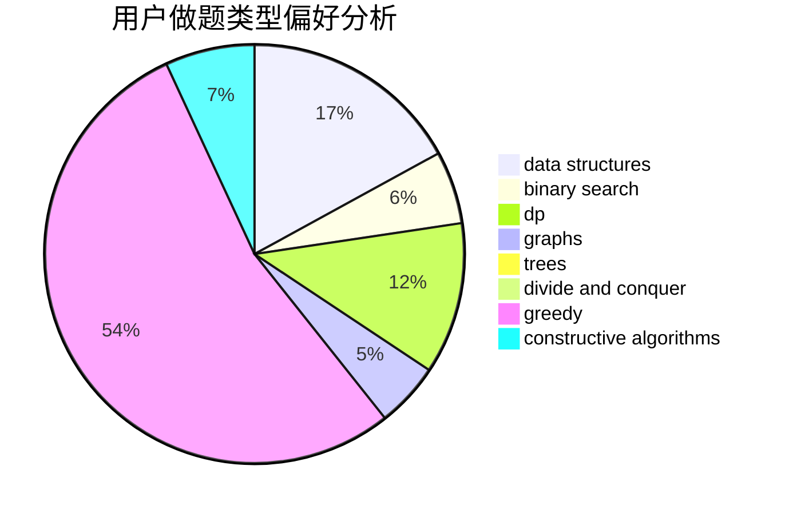
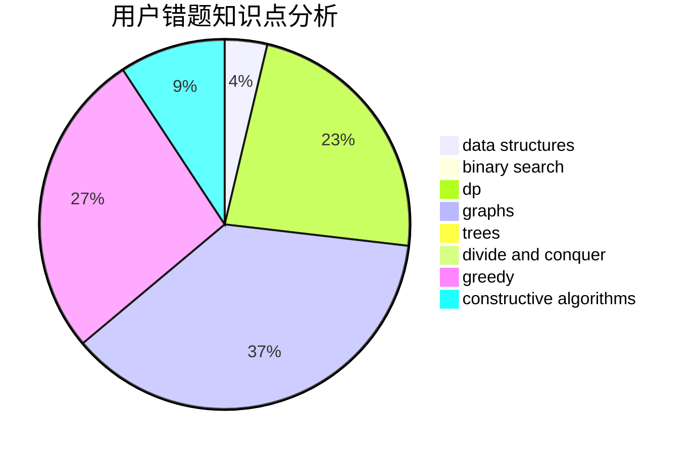

# ASTROBOYZZ

<!-- tabs:start -->

#### **用户提交结果分析**

#### **用户做题类型偏好分析**

#### **用户错题知识点分析**

<!-- tabs:end -->
# 推荐题目
[1146B](https://codeforces.com/contest/1146/problem/B)		implementation,
                        strings		  
[1064E](https://codeforces.com/contest/1064/problem/E)		dsu,graphs,sortings,trees		  
[149E](https://codeforces.com/contest/149/problem/E)		string suffix structures,
                        strings		  
[1499F](https://codeforces.com/contest/1499/problem/F)		combinatorics,
                        dfs and similar,
                        dp,
                        trees		  
[1054H](https://codeforces.com/contest/1054/problem/H)		chinese remainder theorem,
                        fft,
                        math,
                        number theory		  
[1499G](https://codeforces.com/contest/1499/problem/G)		data structures,
                        graphs,
                        interactive		  
[1037D](https://codeforces.com/contest/1037/problem/D)		dfs and similar,
                        graphs,
                        shortest paths,
                        trees		  
[1276E](https://codeforces.com/contest/1276/problem/E)		constructive algorithms		  
[1051F](https://codeforces.com/contest/1051/problem/F)		graphs,
                        shortest paths,
                        trees		  
[1230E](https://codeforces.com/contest/1230/problem/E)		dsu,graphs,sortings,trees		  
