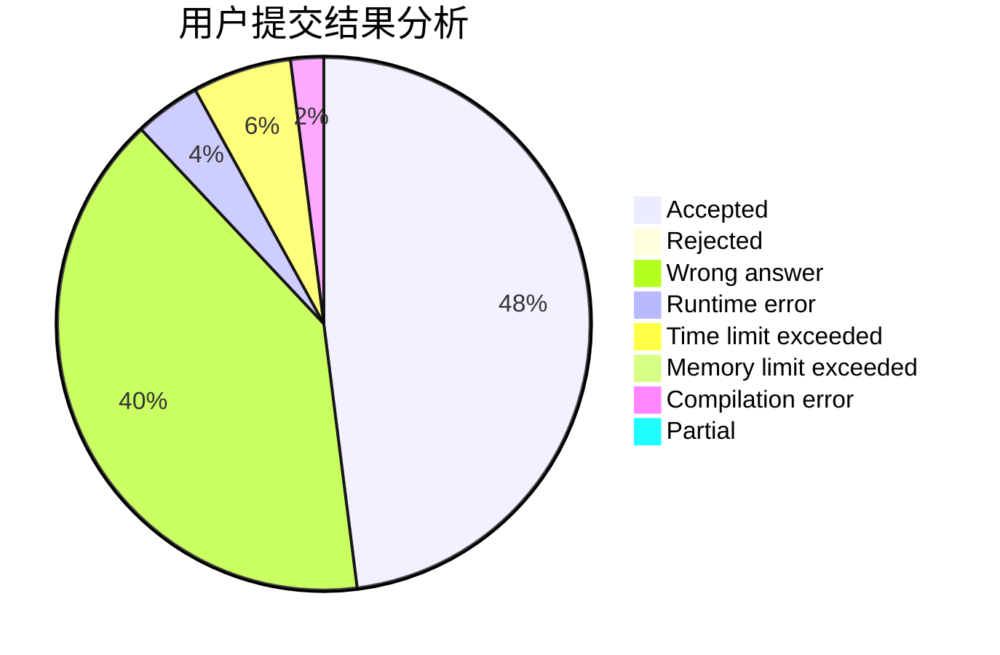
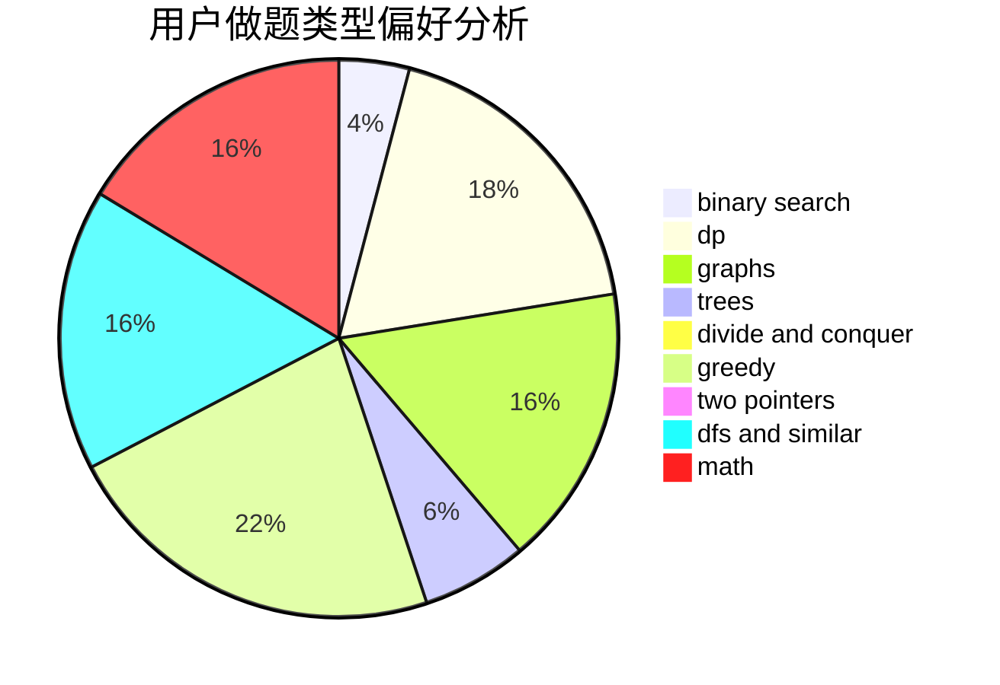

# SWKE

<!-- tabs:start -->

#### **用户提交结果分析**

#### **用户做题类型偏好分析**

<!-- tabs:end -->
# 推荐题目
[1015F](https://codeforces.com/contest/1015/problem/F)
[918C](https://codeforces.com/contest/918/problem/C)
[1501F](https://codeforces.com/contest/1501/problem/F)
[258E](https://codeforces.com/contest/258/problem/E)
[1348F](https://codeforces.com/contest/1348/problem/F)
[571E](https://codeforces.com/contest/571/problem/E)
[1490C](https://codeforces.com/contest/1490/problem/C)
[1497B](https://codeforces.com/contest/1497/problem/B)
[1491C](https://codeforces.com/contest/1491/problem/C)
[1484C](https://codeforces.com/contest/1484/problem/C)
