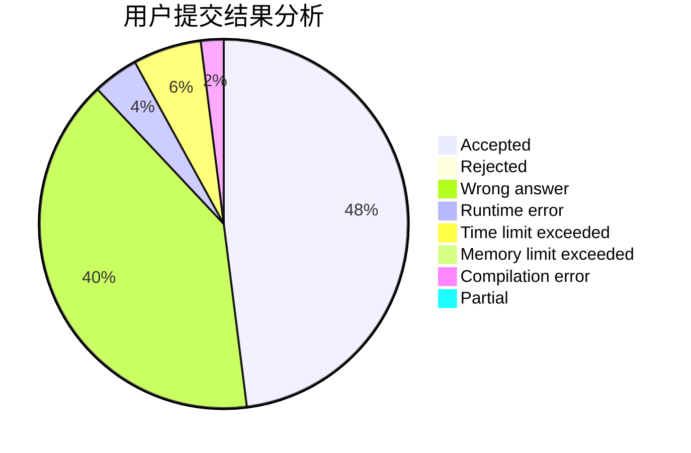
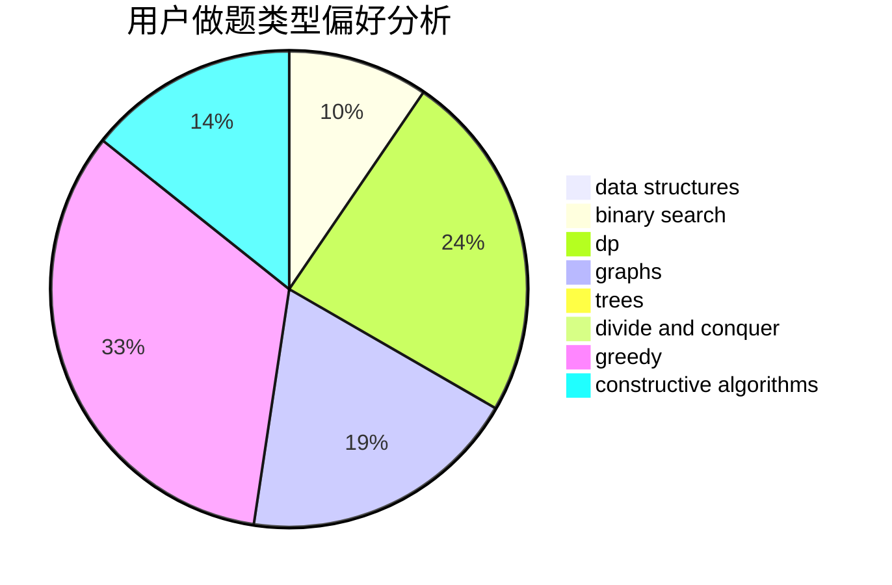

# SWKE

<!-- tabs:start -->

#### **用户提交结果分析**

#### **用户做题类型偏好分析**

#### **用户错题知识点分析**

<!-- tabs:end -->
# 推荐题目
[1015F](https://codeforces.com/contest/1015/problem/F)		dp,
                        strings		  
[918C](https://codeforces.com/contest/918/problem/C)		dsu,graphs,sortings,trees		  
[1501F](https://codeforces.com/contest/1501/problem/F)		dsu,graphs,sortings,trees		  
[258E](https://codeforces.com/contest/258/problem/E)		data structures,
                        dfs and similar,
                        trees		  
[1348F](https://codeforces.com/contest/1348/problem/F)		data structures,
                        dfs and similar,
                        graphs,
                        greedy		  
[571E](https://codeforces.com/contest/571/problem/E)		math		  
[1490C](https://codeforces.com/contest/1490/problem/C)		binary search,
                        brute force,
                        brute force,
                        math		  
[1497B](https://codeforces.com/contest/1497/problem/B)		constructive algorithms,
                        greedy,
                        math		  
[1491C](https://codeforces.com/contest/1491/problem/C)		brute force,
                        data structures,
                        dp,
                        greedy,
                        implementation		  
[1484C](https://codeforces.com/contest/1484/problem/C)		dsu,graphs,sortings,trees		  
