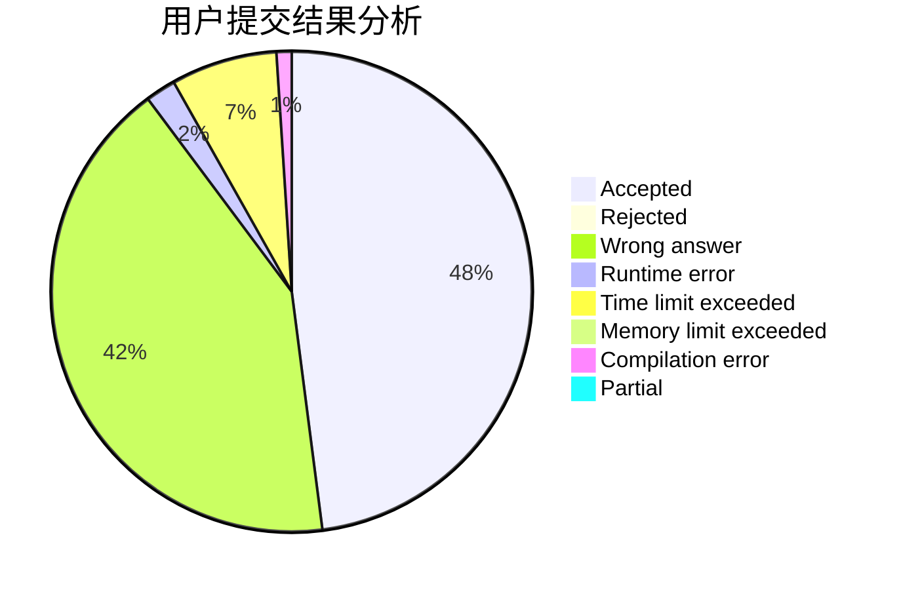
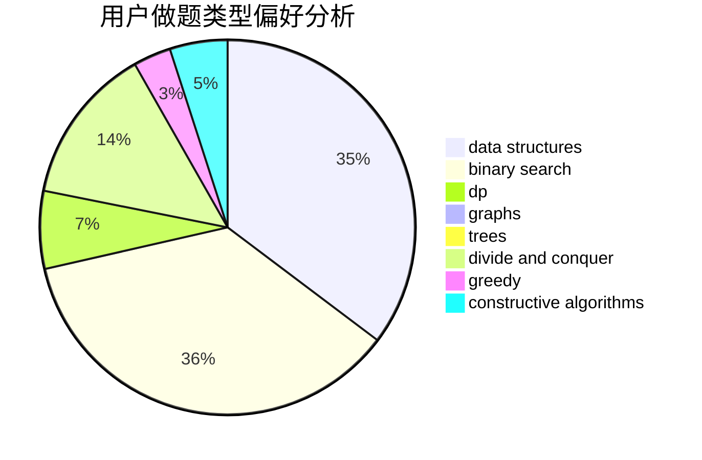
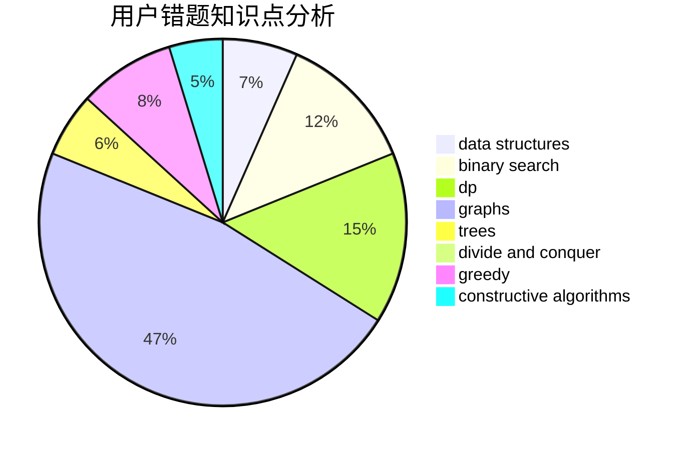

# SW_Wind

<!-- tabs:start -->

#### **用户提交结果分析**

#### **用户做题类型偏好分析**

#### **用户错题知识点分析**

<!-- tabs:end -->
# 推荐题目
[156C](https://codeforces.com/contest/156/problem/C)		combinatorics,
                        dp		  
[1144G](https://codeforces.com/contest/1144/problem/G)		dp,
                        greedy		  
[1165C](https://codeforces.com/contest/1165/problem/C)		greedy		  
[93A](https://codeforces.com/contest/93/problem/A)		implementation		  
[634A](https://codeforces.com/contest/634/problem/A)		constructive algorithms,
                        implementation		  
[538H](https://codeforces.com/contest/538/problem/H)		2-sat,
                        data structures,
                        dfs and similar,
                        greedy		  
[1145B](https://codeforces.com/contest/1145/problem/B)		brute force		  
[1398G](https://codeforces.com/contest/1398/problem/G)		bitmasks,
                        fft,
                        math,
                        number theory		  
[1005E1](https://codeforces.com/contest/1005E/problem/1)		sortings		  
[1499E](https://codeforces.com/contest/1499/problem/E)		combinatorics,
                        dp,
                        math,
                        strings		  
