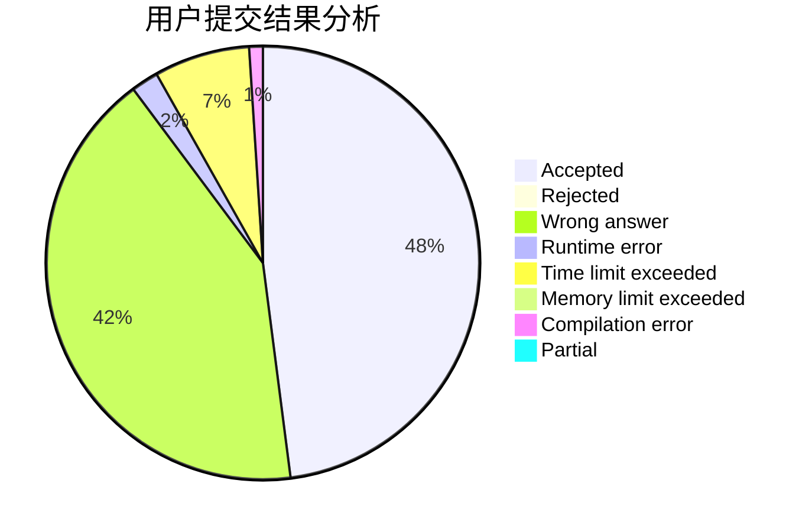
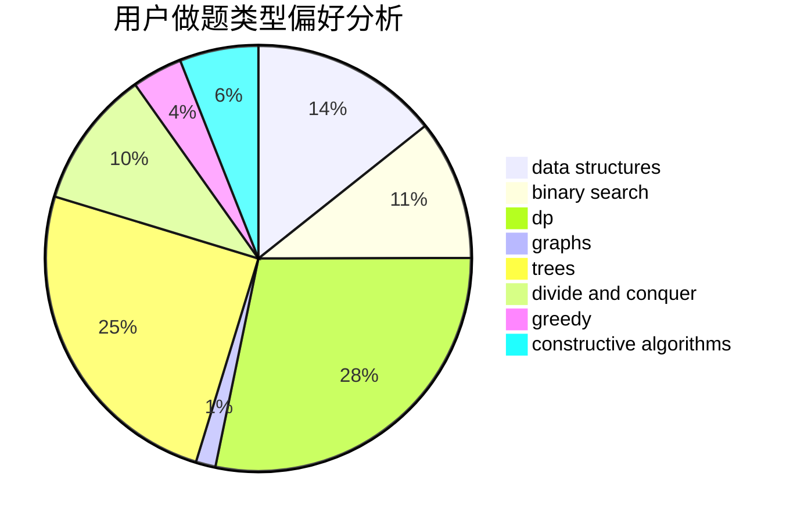
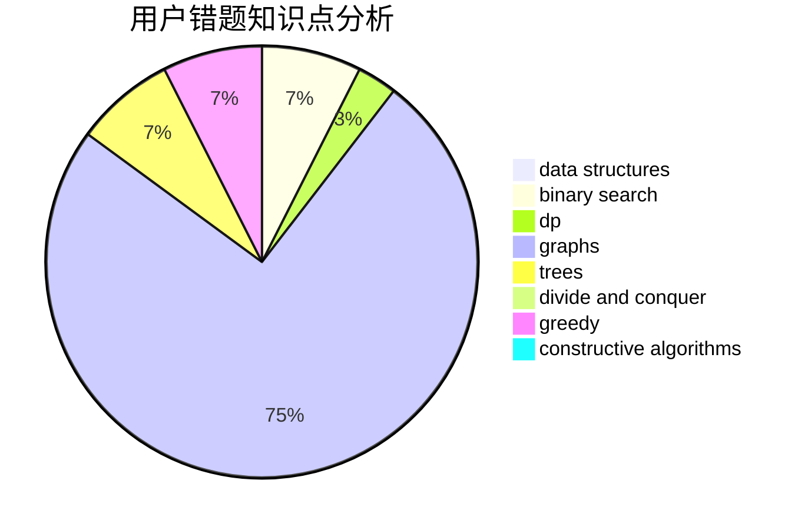

# SW_Wind

<!-- tabs:start -->

#### **用户提交结果分析**

#### **用户做题类型偏好分析**

#### **用户错题知识点分析**

<!-- tabs:end -->
# 推荐题目
[1771](https://codeforces.com/contest/177/problem/1)		dsu,graphs,sortings,trees		  
[1147A](https://codeforces.com/contest/1147/problem/A)		graphs		  
[1167E](https://codeforces.com/contest/1167/problem/E)		binary search,
                        combinatorics,
                        data structures,
                        two pointers		  
[961B](https://codeforces.com/contest/961/problem/B)		data structures,
                        dp,
                        implementation,
                        two pointers		  
[666D](https://codeforces.com/contest/666/problem/D)		brute force,
                        geometry		  
[55C](https://codeforces.com/contest/55/problem/C)		games		  
[1147C](https://codeforces.com/contest/1147/problem/C)		games		  
[1408A](https://codeforces.com/contest/1408/problem/A)		constructive algorithms		  
[1006A](https://codeforces.com/contest/1006/problem/A)		implementation		  
[1509E](https://codeforces.com/contest/1509/problem/E)		dsu,graphs,sortings,trees		  
