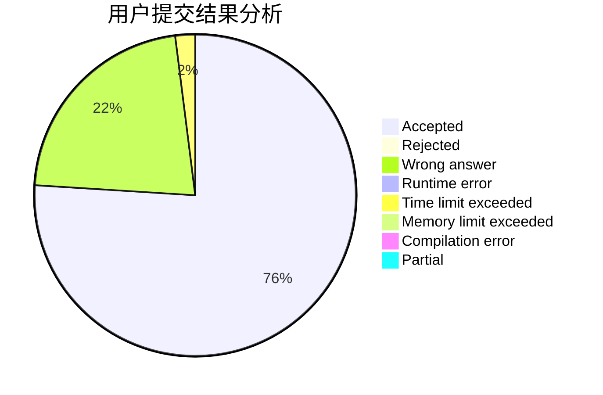
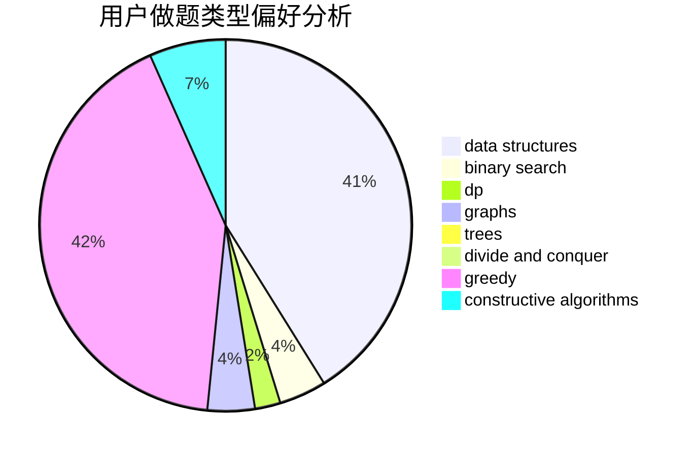
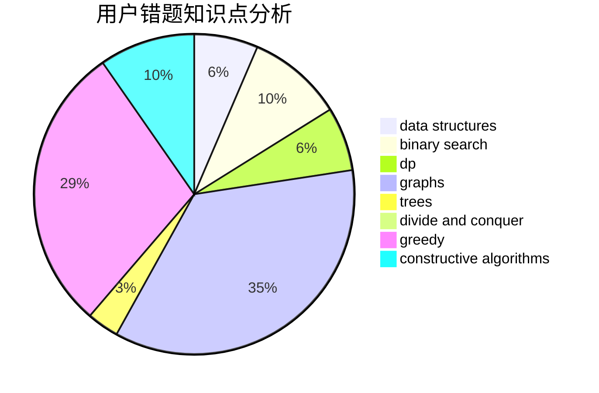

# S_test

<!-- tabs:start -->

#### **用户提交结果分析**

#### **用户做题类型偏好分析**

#### **用户错题知识点分析**

<!-- tabs:end -->
# 推荐题目
[1476E](https://codeforces.com/contest/1476/problem/E)		bitmasks,
                        data structures,
                        dfs and similar,
                        graphs,
                        hashing,
                        sortings,
                        strings		  
[1167A](https://codeforces.com/contest/1167/problem/A)		brute force,
                        greedy,
                        strings		  
[1436F](https://codeforces.com/contest/1436/problem/F)		combinatorics,
                        math,
                        number theory		  
[245A](https://codeforces.com/contest/245/problem/A)		implementation		  
[1288A](https://codeforces.com/contest/1288/problem/A)		binary search,
                        brute force,
                        math,
                        ternary search		  
[417C](https://codeforces.com/contest/417/problem/C)		constructive algorithms,
                        graphs,
                        implementation		  
[88A](https://codeforces.com/contest/88/problem/A)		brute force,
                        implementation		  
[1147F](https://codeforces.com/contest/1147/problem/F)		games,
                        interactive		  
[1354C2](https://codeforces.com/contest/1354C/problem/2)		binary search,
                        brute force,
                        geometry,
                        math		  
[1003E](https://codeforces.com/contest/1003/problem/E)		constructive algorithms,
                        graphs		  
