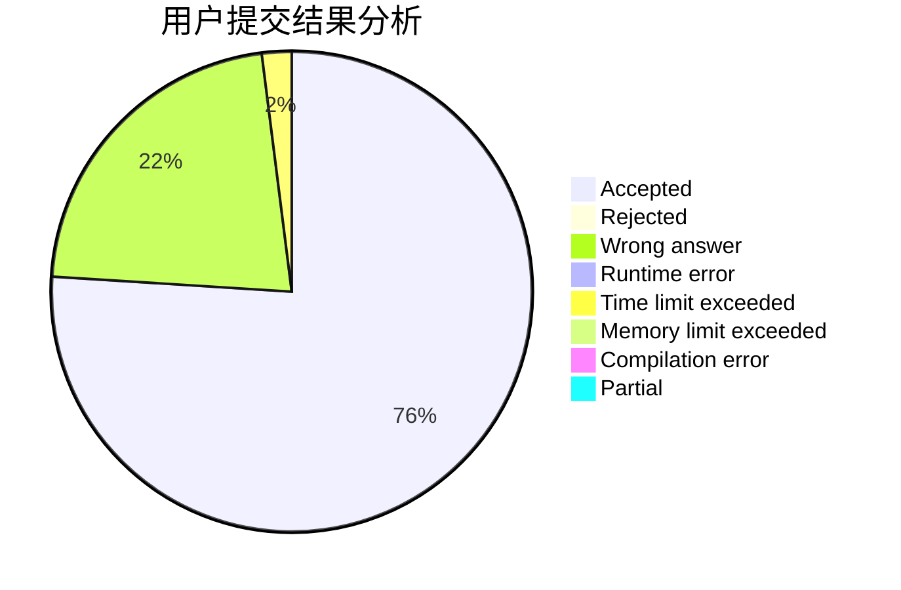
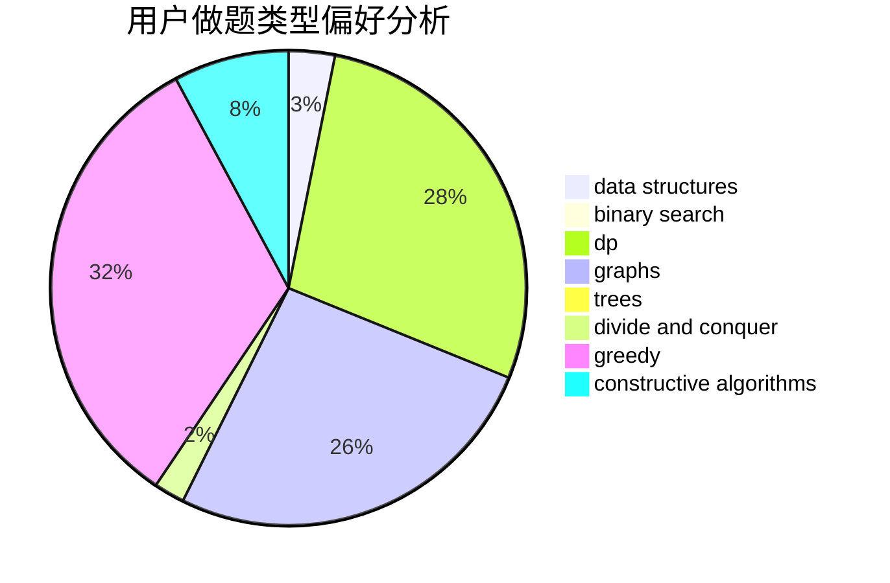
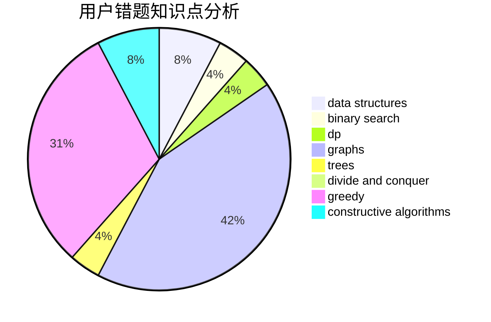

# S_test

<!-- tabs:start -->

#### **用户提交结果分析**

#### **用户做题类型偏好分析**

#### **用户错题知识点分析**

<!-- tabs:end -->
# 推荐题目
[1485C](https://codeforces.com/contest/1485/problem/C)		binary search,
                        brute force,
                        math,
                        number theory		  
[1170E](https://codeforces.com/contest/1170/problem/E)		*special problem,
                        binary search		  
[1446E](https://codeforces.com/contest/1446/problem/E)		constructive algorithms,
                        dfs and similar		  
[266A](https://codeforces.com/contest/266/problem/A)		implementation		  
[1295C](https://codeforces.com/contest/1295/problem/C)		dp,
                        greedy,
                        strings		  
[442B](https://codeforces.com/contest/442/problem/B)		greedy,
                        math,
                        probabilities		  
[909A](https://codeforces.com/contest/909/problem/A)		brute force,
                        greedy,
                        sortings		  
[1149E](https://codeforces.com/contest/1149/problem/E)		games,
                        graphs		  
[1360H](https://codeforces.com/contest/1360/problem/H)		binary search,
                        bitmasks,
                        brute force,
                        constructive algorithms		  
[1004B](https://codeforces.com/contest/1004/problem/B)		constructive algorithms,
                        greedy,
                        implementation,
                        math		  
