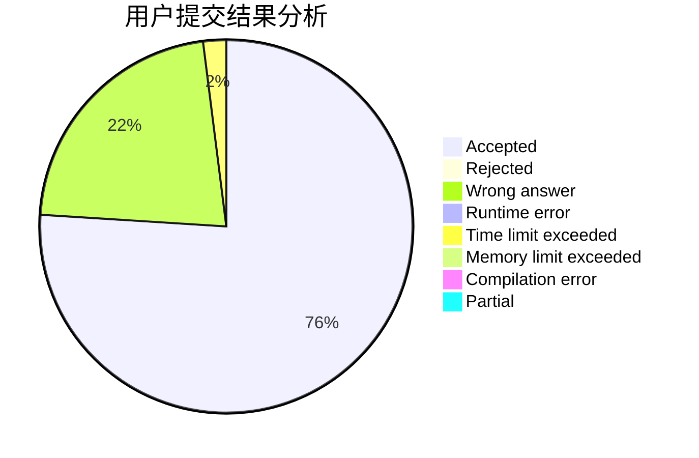
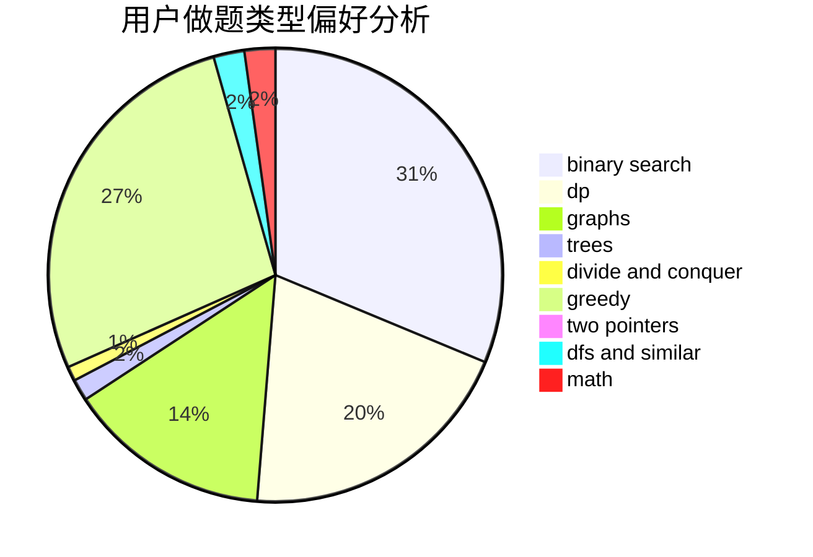

# S_test

<!-- tabs:start -->

#### **用户提交结果分析**

#### **用户做题类型偏好分析**

<!-- tabs:end -->
# 推荐题目
[1485C](https://codeforces.com/contest/1485/problem/C)
[1170E](https://codeforces.com/contest/1170/problem/E)
[1446E](https://codeforces.com/contest/1446/problem/E)
[266A](https://codeforces.com/contest/266/problem/A)
[1295C](https://codeforces.com/contest/1295/problem/C)
[442B](https://codeforces.com/contest/442/problem/B)
[909A](https://codeforces.com/contest/909/problem/A)
[1149E](https://codeforces.com/contest/1149/problem/E)
[1360H](https://codeforces.com/contest/1360/problem/H)
[1004B](https://codeforces.com/contest/1004/problem/B)
