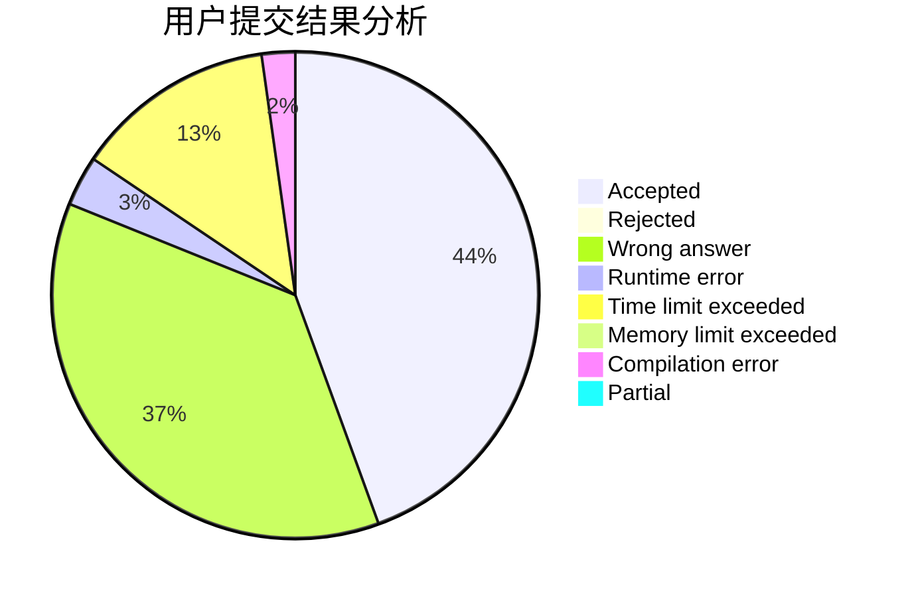
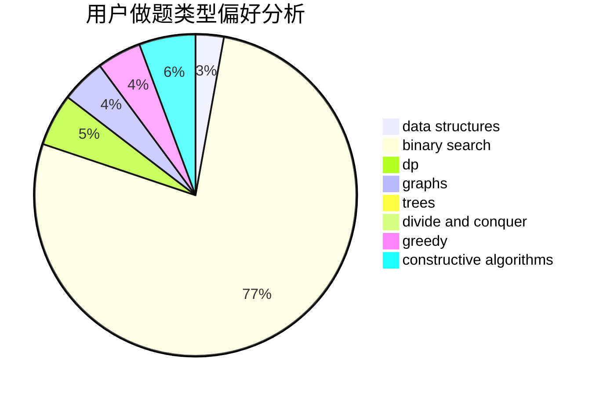
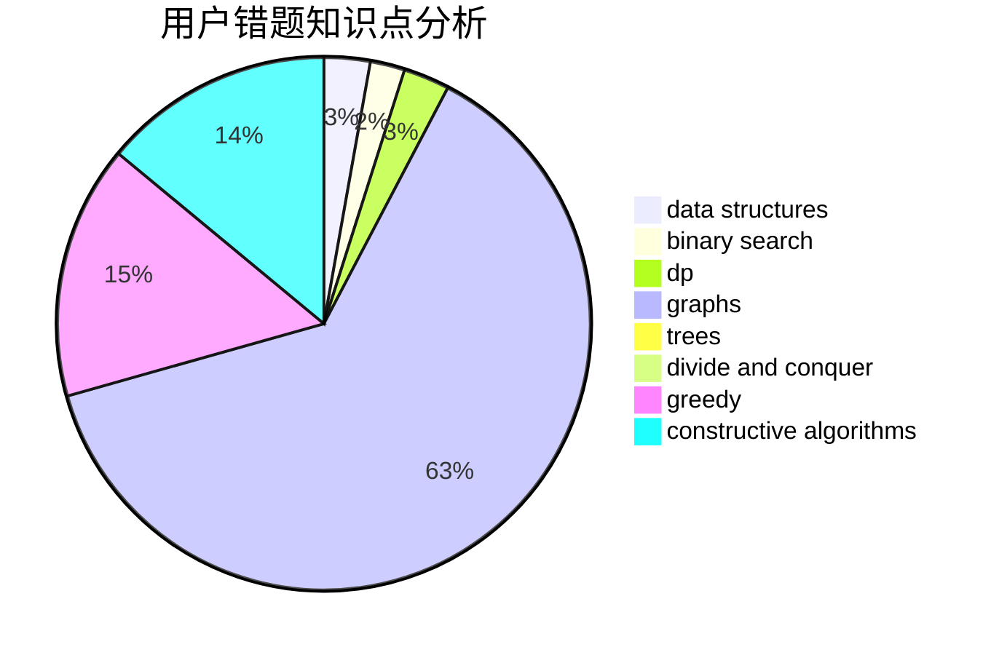

# Sa1Lmc

<!-- tabs:start -->

#### **用户提交结果分析**

#### **用户做题类型偏好分析**

#### **用户错题知识点分析**

<!-- tabs:end -->
# 推荐题目
[13771](https://codeforces.com/contest/1377/problem/1)		dsu,graphs,sortings,trees		  
[1350E](https://codeforces.com/contest/1350/problem/E)		dsu,graphs,sortings,trees		  
[911D](https://codeforces.com/contest/911/problem/D)		brute force,
                        math		  
[280B](https://codeforces.com/contest/280/problem/B)		data structures,
                        implementation,
                        two pointers		  
[813E](https://codeforces.com/contest/813/problem/E)		binary search,
                        data structures		  
[350B](https://codeforces.com/contest/350/problem/B)		graphs		  
[962C](https://codeforces.com/contest/962/problem/C)		brute force,
                        implementation,
                        math		  
[1138F](https://codeforces.com/contest/1138/problem/F)		dsu,graphs,sortings,trees		  
[616E](https://codeforces.com/contest/616/problem/E)		implementation,
                        math,
                        number theory		  
[545A](https://codeforces.com/contest/545/problem/A)		implementation		  
