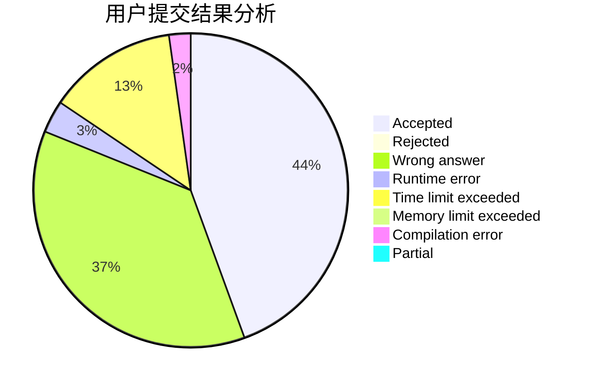
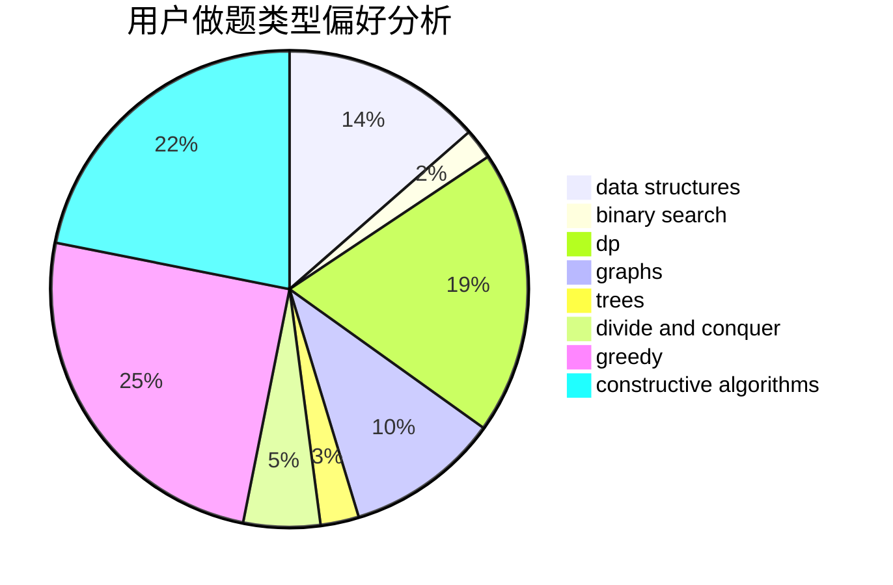
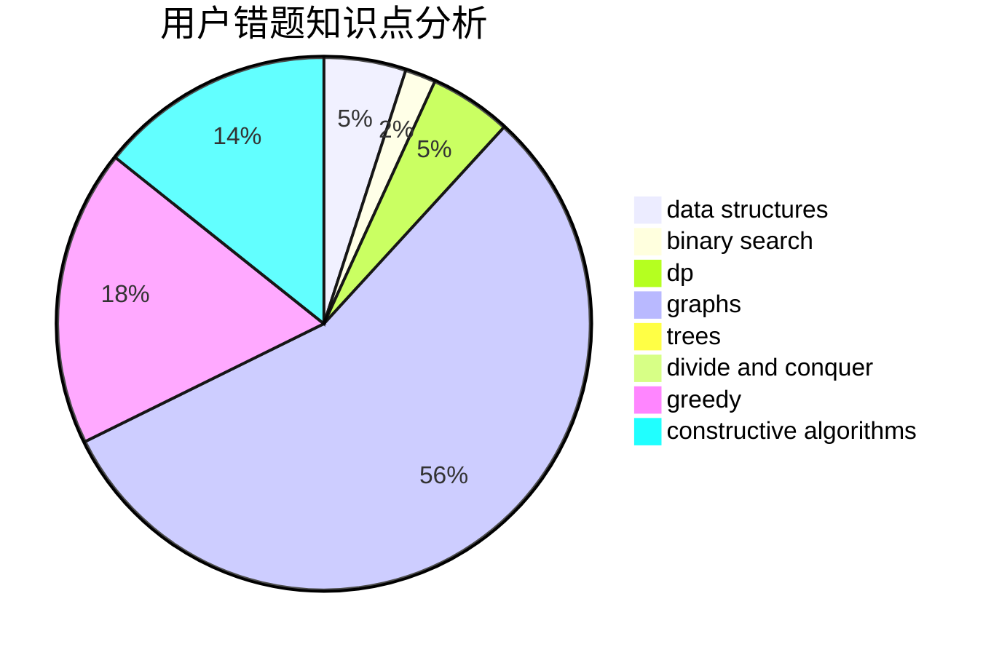

# Sa1Lmc

<!-- tabs:start -->

#### **用户提交结果分析**

#### **用户做题类型偏好分析**

#### **用户错题知识点分析**

<!-- tabs:end -->
# 推荐题目
[1369F](https://codeforces.com/contest/1369/problem/F)		dfs and similar,
                        dp,
                        games		  
[1344A](https://codeforces.com/contest/1344/problem/A)		math,
                        number theory,
                        sortings		  
[893D](https://codeforces.com/contest/893/problem/D)		data structures,
                        dp,
                        greedy,
                        implementation		  
[264B](https://codeforces.com/contest/264/problem/B)		dp,
                        number theory		  
[799E](https://codeforces.com/contest/799/problem/E)		data structures,
                        greedy,
                        two pointers		  
[319E](https://codeforces.com/contest/319/problem/E)		data structures		  
[940F](https://codeforces.com/contest/940/problem/F)		brute force,
                        data structures		  
[1136D](https://codeforces.com/contest/1136/problem/D)		greedy		  
[598F](https://codeforces.com/contest/598/problem/F)		geometry		  
[519E](https://codeforces.com/contest/519/problem/E)		binary search,
                        data structures,
                        dfs and similar,
                        dp,
                        trees		  
