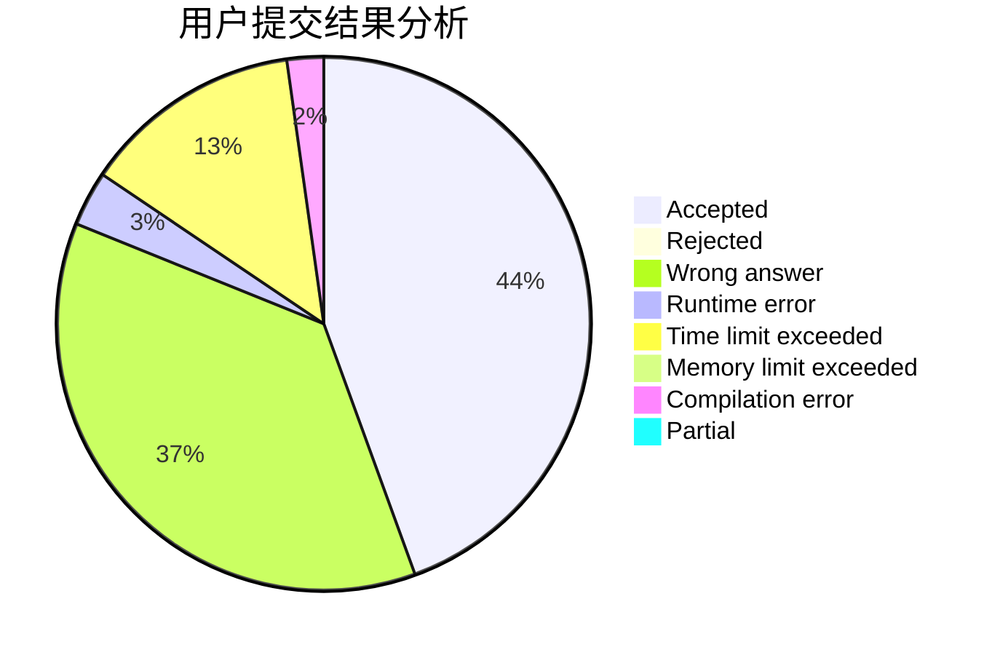
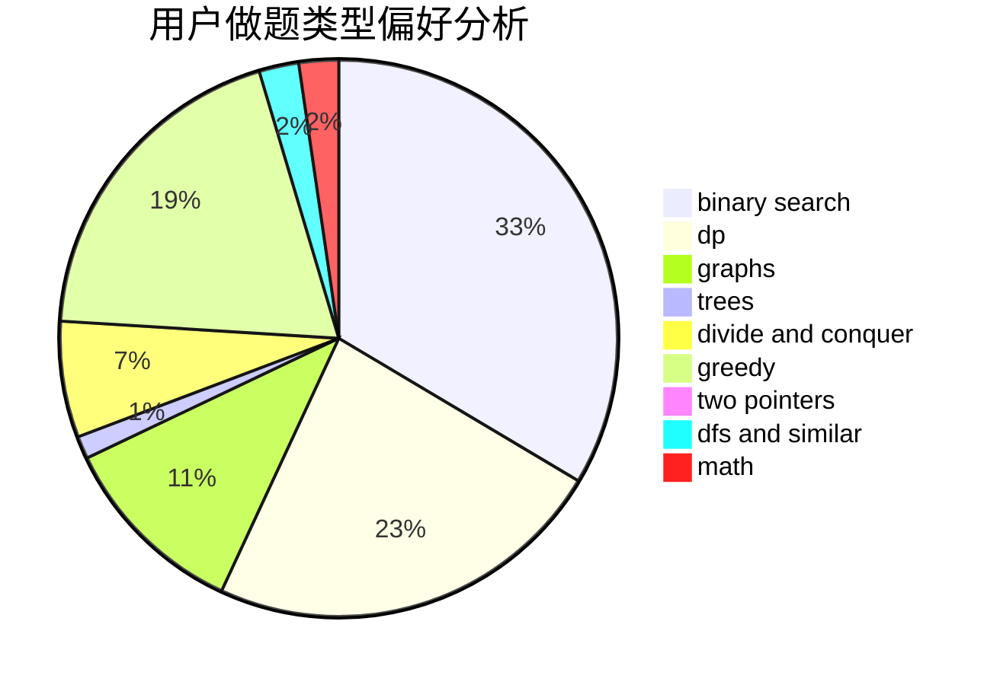

# Sa1Lmc

<!-- tabs:start -->

#### **用户提交结果分析**

#### **用户做题类型偏好分析**

<!-- tabs:end -->
# 推荐题目
[13771](https://codeforces.com/contest/1377/problem/1)
[1350E](https://codeforces.com/contest/1350/problem/E)
[911D](https://codeforces.com/contest/911/problem/D)
[280B](https://codeforces.com/contest/280/problem/B)
[813E](https://codeforces.com/contest/813/problem/E)
[350B](https://codeforces.com/contest/350/problem/B)
[962C](https://codeforces.com/contest/962/problem/C)
[1138F](https://codeforces.com/contest/1138/problem/F)
[616E](https://codeforces.com/contest/616/problem/E)
[545A](https://codeforces.com/contest/545/problem/A)
