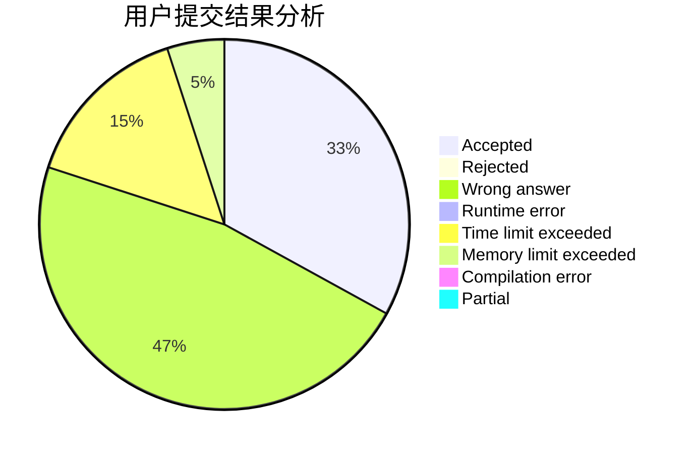
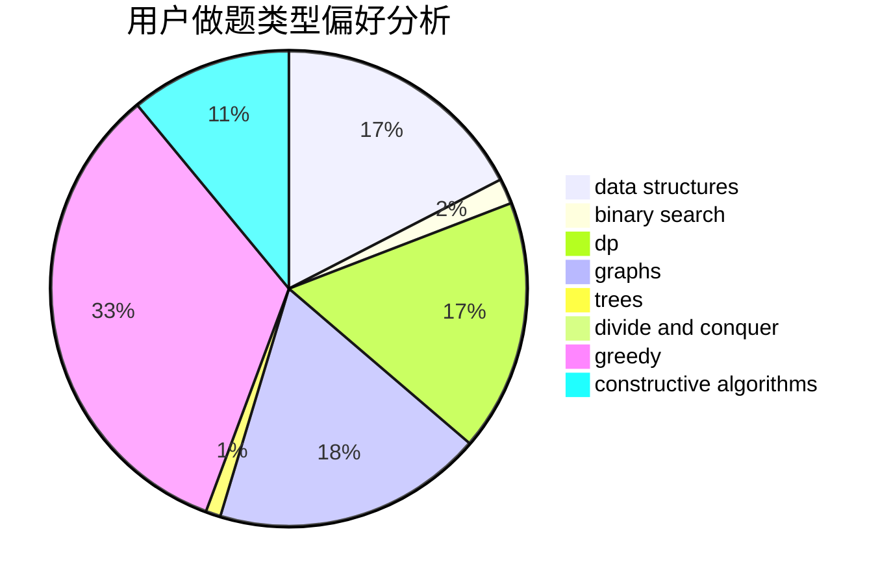
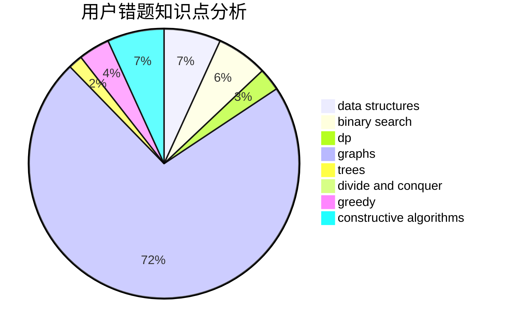

# SaInT7

<!-- tabs:start -->

#### **用户提交结果分析**

#### **用户做题类型偏好分析**

#### **用户错题知识点分析**

<!-- tabs:end -->
# 推荐题目
[706A](https://codeforces.com/contest/706/problem/A)		brute force,
                        geometry,
                        implementation		  
[1106B](https://codeforces.com/contest/1106/problem/B)		data structures,
                        implementation		  
[1146B](https://codeforces.com/contest/1146/problem/B)		implementation,
                        strings		  
[1339A](https://codeforces.com/contest/1339/problem/A)		brute force,
                        dp,
                        implementation,
                        math		  
[1415E](https://codeforces.com/contest/1415/problem/E)		constructive algorithms,
                        greedy,
                        math		  
[525B](https://codeforces.com/contest/525/problem/B)		constructive algorithms,
                        greedy,
                        math,
                        strings		  
[1292F](https://codeforces.com/contest/1292/problem/F)		bitmasks,
                        combinatorics,
                        dp		  
[1141F2](https://codeforces.com/contest/1141F/problem/2)		data structures,
                        greedy		  
[1183E](https://codeforces.com/contest/1183/problem/E)		dp,
                        graphs,
                        implementation,
                        shortest paths		  
[599E](https://codeforces.com/contest/599/problem/E)		bitmasks,
                        dp,
                        trees		  
