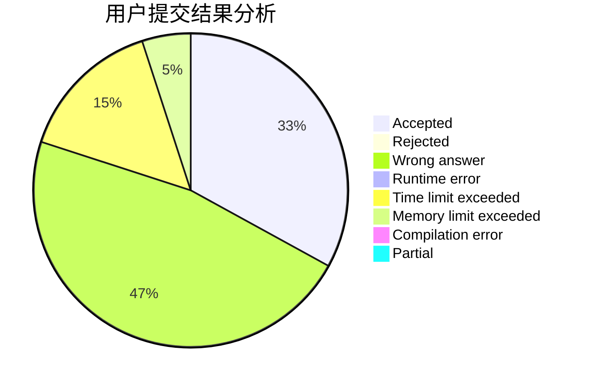
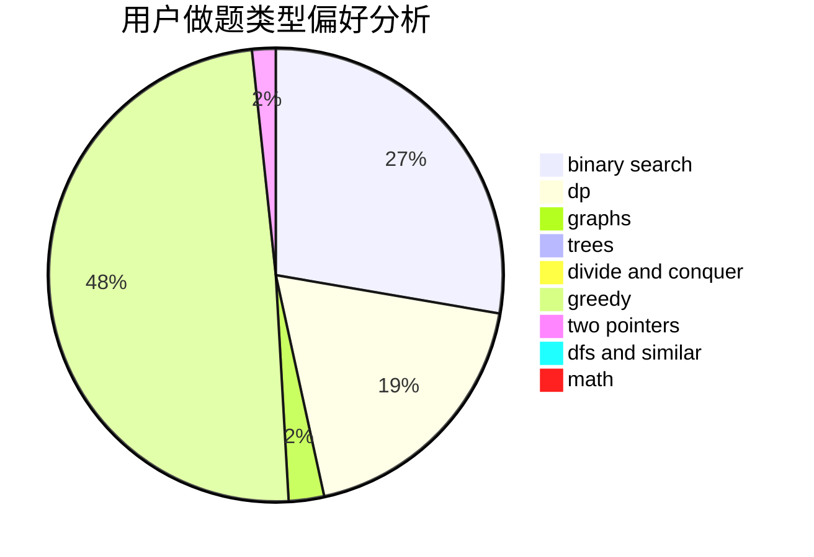

# SaInT7

<!-- tabs:start -->

#### **用户提交结果分析**

#### **用户做题类型偏好分析**

<!-- tabs:end -->
# 推荐题目
[724F](https://codeforces.com/contest/724/problem/F)
[1106E](https://codeforces.com/contest/1106/problem/E)
[1148B](https://codeforces.com/contest/1148/problem/B)
[1346A](https://codeforces.com/contest/1346/problem/A)
[1423I](https://codeforces.com/contest/1423/problem/I)
[549E](https://codeforces.com/contest/549/problem/E)
[12A](https://codeforces.com/contest/12/problem/A)
[1144A](https://codeforces.com/contest/1144/problem/A)
[1186C](https://codeforces.com/contest/1186/problem/C)
[618A](https://codeforces.com/contest/618/problem/A)
