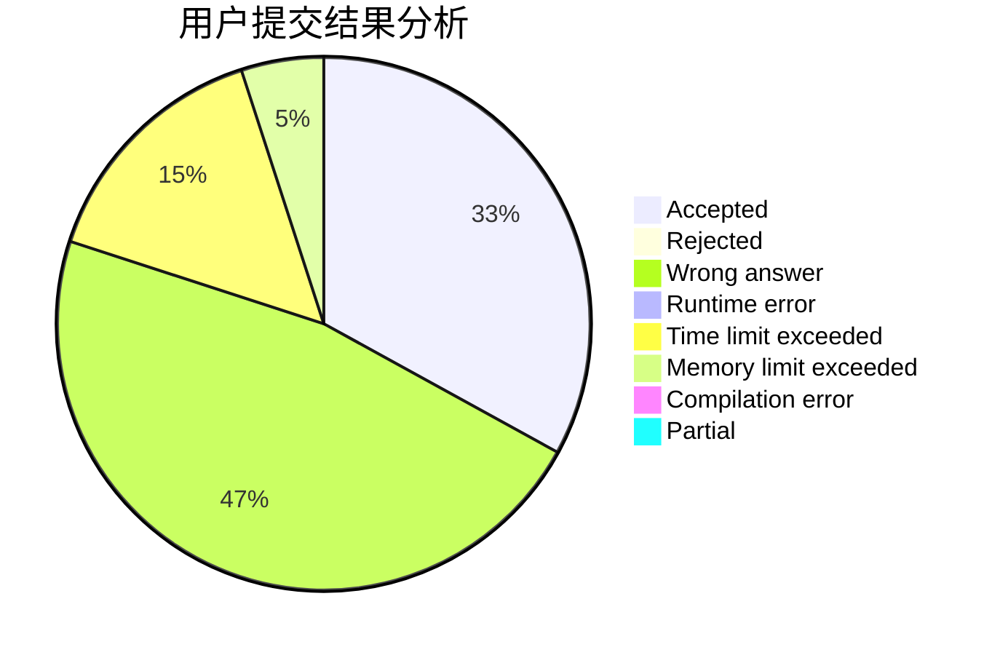
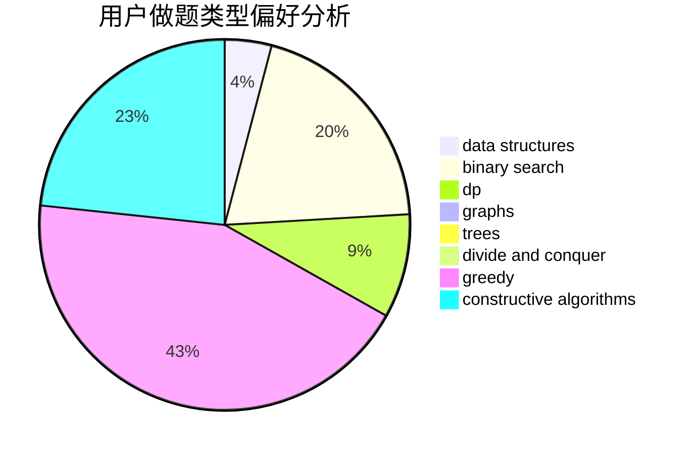
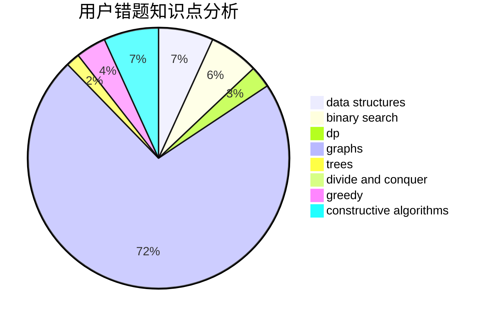

# SaInT7

<!-- tabs:start -->

#### **用户提交结果分析**

#### **用户做题类型偏好分析**

#### **用户错题知识点分析**

<!-- tabs:end -->
# 推荐题目
[724F](https://codeforces.com/contest/724/problem/F)		combinatorics,
                        dp,
                        trees		  
[1106E](https://codeforces.com/contest/1106/problem/E)		data structures,
                        dp		  
[1148B](https://codeforces.com/contest/1148/problem/B)		binary search,
                        brute force,
                        two pointers		  
[1346A](https://codeforces.com/contest/1346/problem/A)		*special problem,
                        math		  
[1423I](https://codeforces.com/contest/1423/problem/I)		bitmasks		  
[549E](https://codeforces.com/contest/549/problem/E)		geometry,
                        math		  
[12A](https://codeforces.com/contest/12/problem/A)		implementation		  
[1144A](https://codeforces.com/contest/1144/problem/A)		implementation,
                        strings		  
[1186C](https://codeforces.com/contest/1186/problem/C)		implementation,
                        math		  
[618A](https://codeforces.com/contest/618/problem/A)		implementation		  
