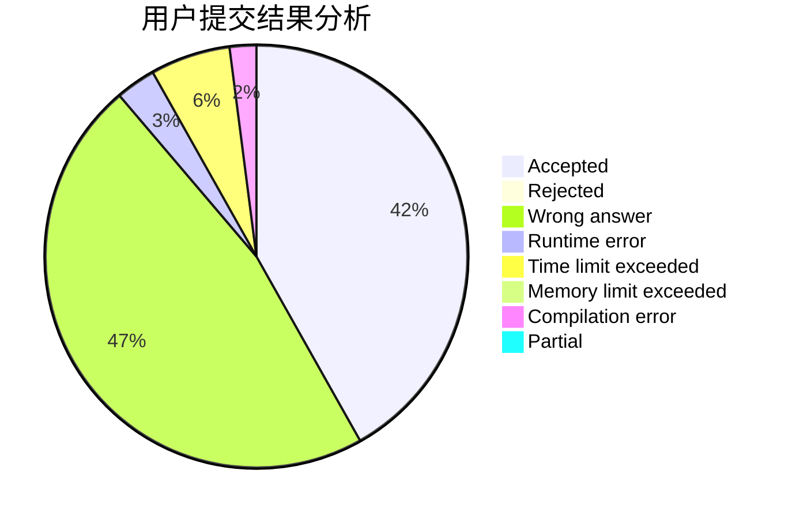
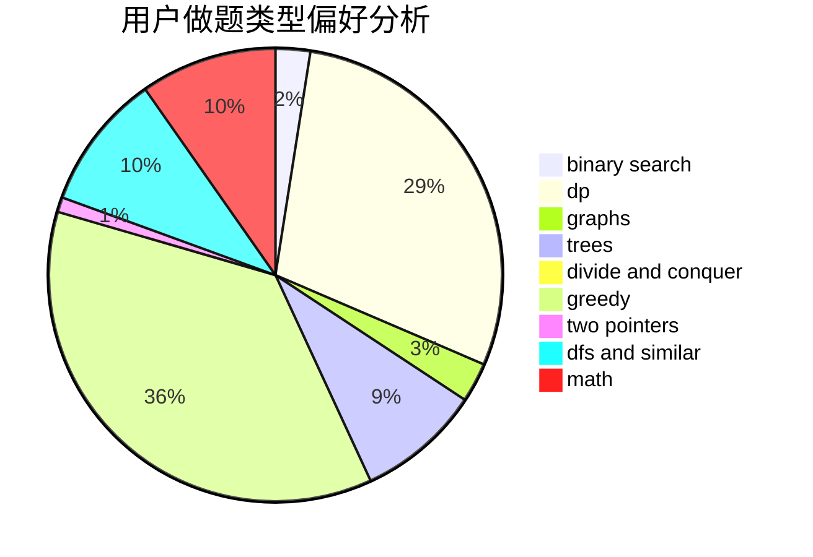

# Saber

<!-- tabs:start -->

#### **用户提交结果分析**

#### **用户做题类型偏好分析**

<!-- tabs:end -->
# 推荐题目
[1324F](https://codeforces.com/contest/1324/problem/F)
[911E](https://codeforces.com/contest/911/problem/E)
[176D](https://codeforces.com/contest/176/problem/D)
[260A](https://codeforces.com/contest/260/problem/A)
[754D](https://codeforces.com/contest/754/problem/D)
[730B](https://codeforces.com/contest/730/problem/B)
[686D](https://codeforces.com/contest/686/problem/D)
[846F](https://codeforces.com/contest/846/problem/F)
[14A](https://codeforces.com/contest/14/problem/A)
[862E](https://codeforces.com/contest/862/problem/E)
