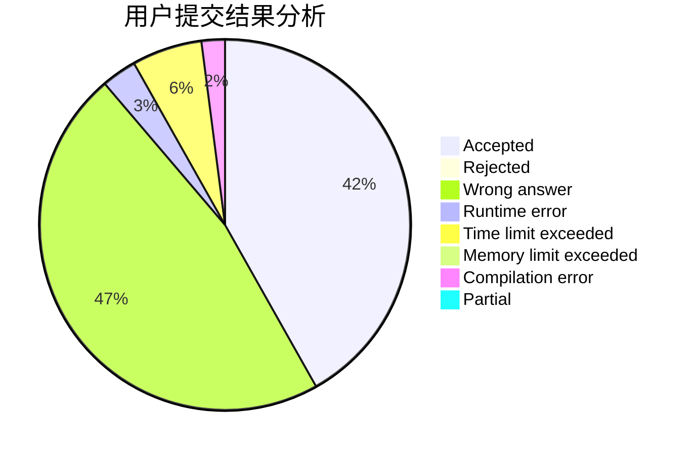
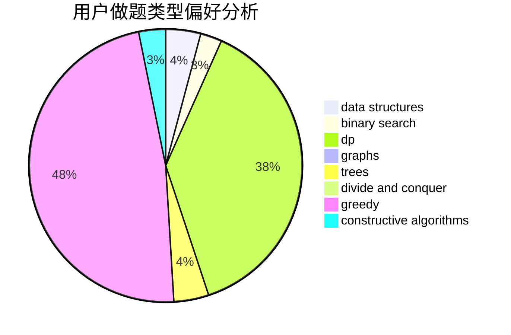

# Saber

<!-- tabs:start -->

#### **用户提交结果分析**

#### **用户做题类型偏好分析**

#### **用户错题知识点分析**

<!-- tabs:end -->
# 推荐题目
[1324F](https://codeforces.com/contest/1324/problem/F)		dfs and similar,
                        dp,
                        graphs,
                        trees		  
[911E](https://codeforces.com/contest/911/problem/E)		constructive algorithms,
                        data structures,
                        greedy,
                        implementation		  
[176D](https://codeforces.com/contest/176/problem/D)		dp		  
[260A](https://codeforces.com/contest/260/problem/A)		implementation,
                        math		  
[754D](https://codeforces.com/contest/754/problem/D)		binary search,
                        data structures,
                        greedy,
                        sortings		  
[730B](https://codeforces.com/contest/730/problem/B)		constructive algorithms,
                        interactive		  
[686D](https://codeforces.com/contest/686/problem/D)		dsu,graphs,sortings,trees		  
[846F](https://codeforces.com/contest/846/problem/F)		data structures,
                        math,
                        probabilities,
                        two pointers		  
[14A](https://codeforces.com/contest/14/problem/A)		implementation		  
[862E](https://codeforces.com/contest/862/problem/E)		binary search,
                        data structures,
                        sortings		  
