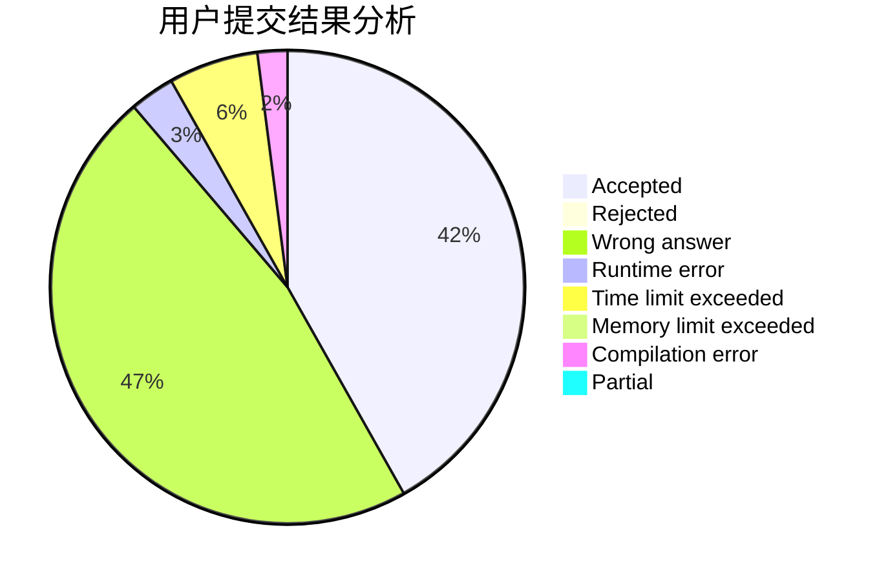
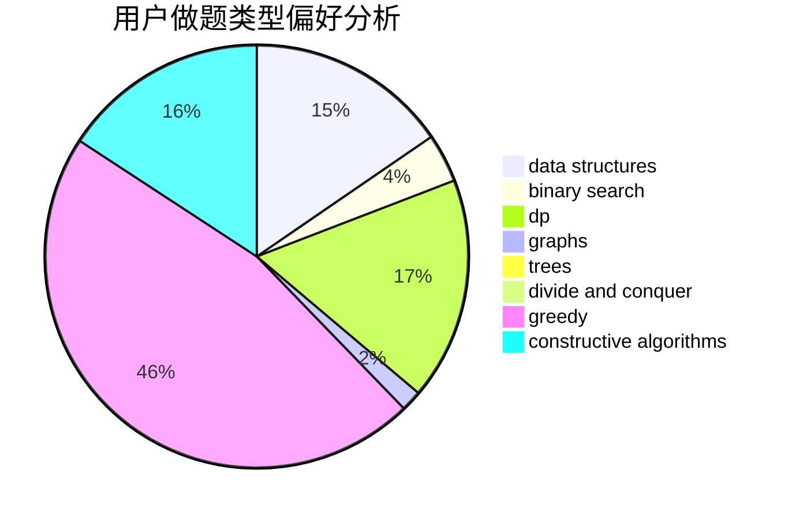
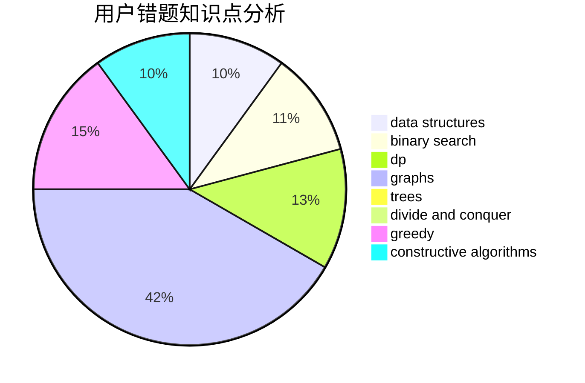

# Saber

<!-- tabs:start -->

#### **用户提交结果分析**

#### **用户做题类型偏好分析**

#### **用户错题知识点分析**

<!-- tabs:end -->
# 推荐题目
[1315A](https://codeforces.com/contest/1315/problem/A)		implementation		  
[893E](https://codeforces.com/contest/893/problem/E)		combinatorics,
                        dp,
                        math,
                        number theory		  
[155A](https://codeforces.com/contest/155/problem/A)		brute force		  
[238D](https://codeforces.com/contest/238/problem/D)		data structures,
                        implementation		  
[734B](https://codeforces.com/contest/734/problem/B)		brute force,
                        greedy,
                        implementation,
                        math		  
[70D](https://codeforces.com/contest/70/problem/D)		data structures,
                        geometry		  
[665F](https://codeforces.com/contest/665/problem/F)		data structures,
                        dp,
                        math,
                        number theory,
                        sortings,
                        two pointers		  
[828C](https://codeforces.com/contest/828/problem/C)		dsu,graphs,sortings,trees		  
[1491D](https://codeforces.com/contest/1491/problem/D)		bitmasks,
                        constructive algorithms,
                        dp,
                        greedy,
                        math		  
[843D](https://codeforces.com/contest/843/problem/D)		graphs,
                        shortest paths		  
