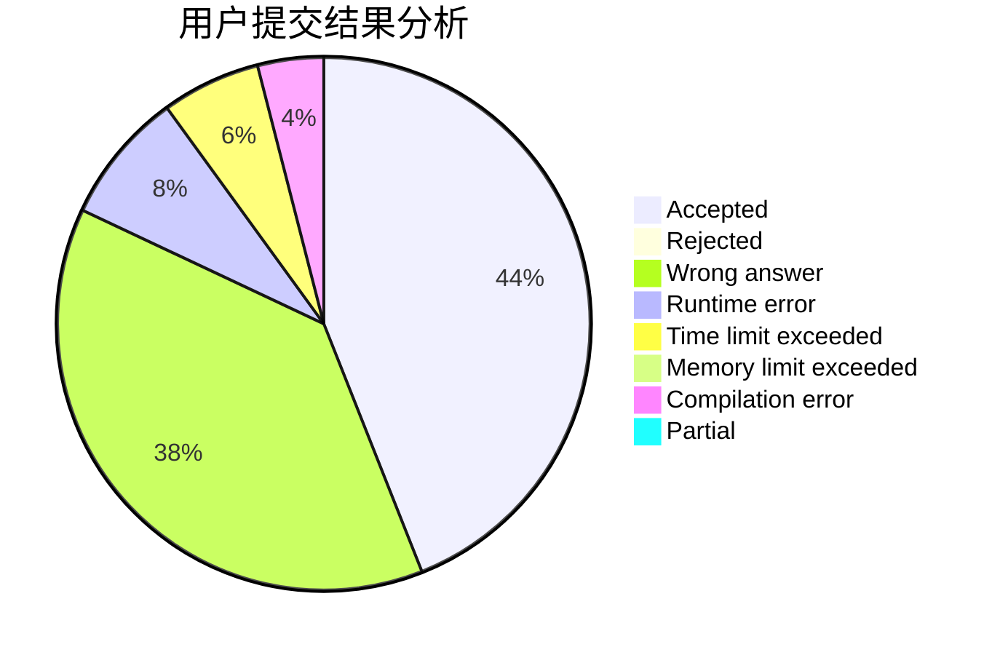
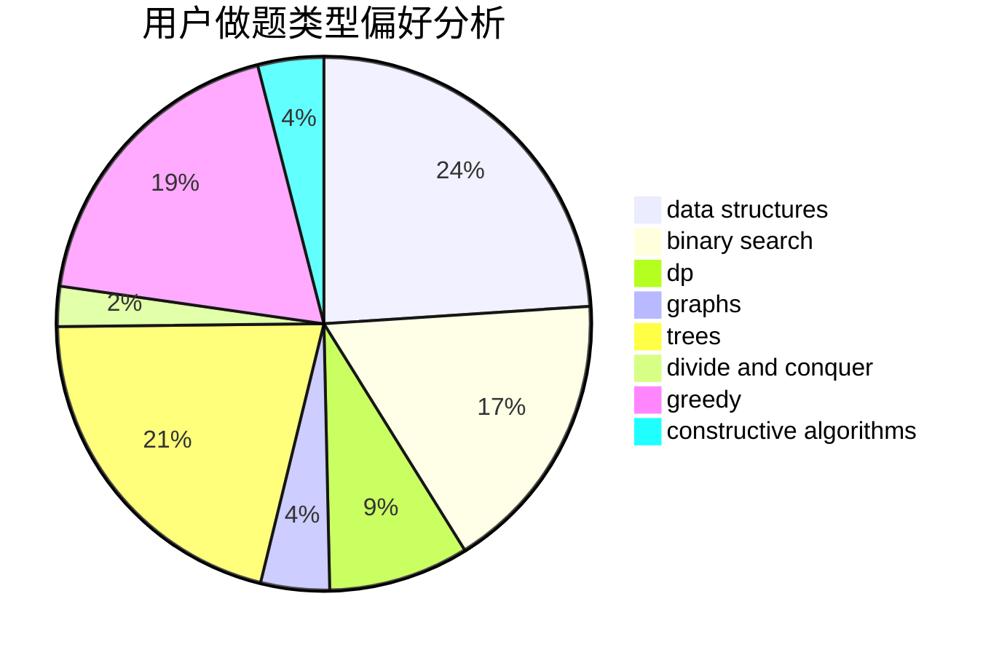
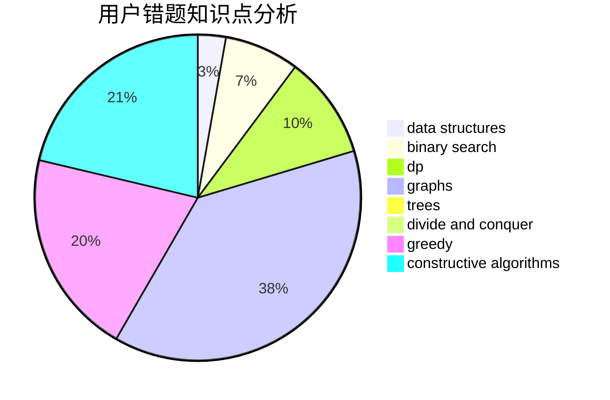

# Sagacity

<!-- tabs:start -->

#### **用户提交结果分析**

#### **用户做题类型偏好分析**

#### **用户错题知识点分析**

<!-- tabs:end -->
# 推荐题目
[938A](https://codeforces.com/contest/938/problem/A)		implementation		  
[319E](https://codeforces.com/contest/319/problem/E)		data structures		  
[393C](https://codeforces.com/contest/393/problem/C)		dsu,graphs,sortings,trees		  
[468A](https://codeforces.com/contest/468/problem/A)		constructive algorithms,
                        greedy,
                        math		  
[1250L](https://codeforces.com/contest/1250/problem/L)		binary search,
                        greedy,
                        math		  
[277D](https://codeforces.com/contest/277/problem/D)		dp,
                        probabilities		  
[1020E](https://codeforces.com/contest/1020/problem/E)		dsu,graphs,sortings,trees		  
[496E](https://codeforces.com/contest/496/problem/E)		greedy,
                        sortings		  
[962C](https://codeforces.com/contest/962/problem/C)		brute force,
                        implementation,
                        math		  
[533B](https://codeforces.com/contest/533/problem/B)		dfs and similar,
                        dp,
                        graphs,
                        strings,
                        trees		  
