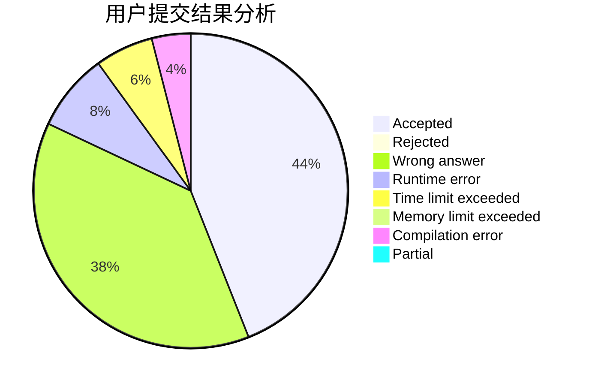
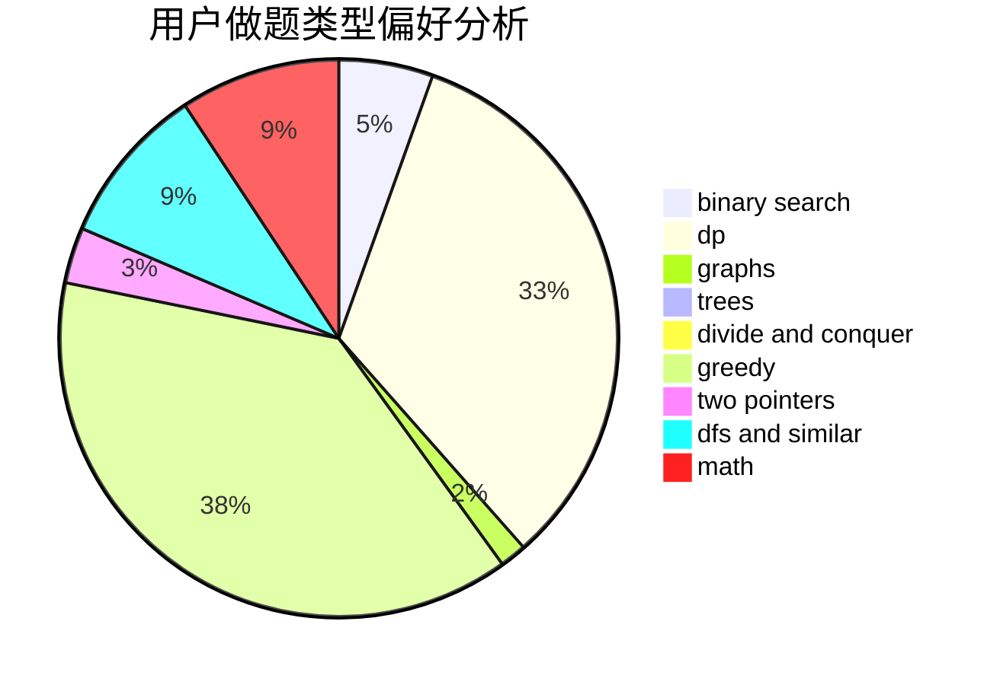

# Sagacity

<!-- tabs:start -->

#### **用户提交结果分析**

#### **用户做题类型偏好分析**

<!-- tabs:end -->
# 推荐题目
[959F](https://codeforces.com/contest/959/problem/F)
[350B](https://codeforces.com/contest/350/problem/B)
[421B](https://codeforces.com/contest/421/problem/B)
[487B](https://codeforces.com/contest/487/problem/B)
[1255C](https://codeforces.com/contest/1255/problem/C)
[292E](https://codeforces.com/contest/292/problem/E)
[1023C](https://codeforces.com/contest/1023/problem/C)
[516A](https://codeforces.com/contest/516/problem/A)
[985B](https://codeforces.com/contest/985/problem/B)
[554A](https://codeforces.com/contest/554/problem/A)
