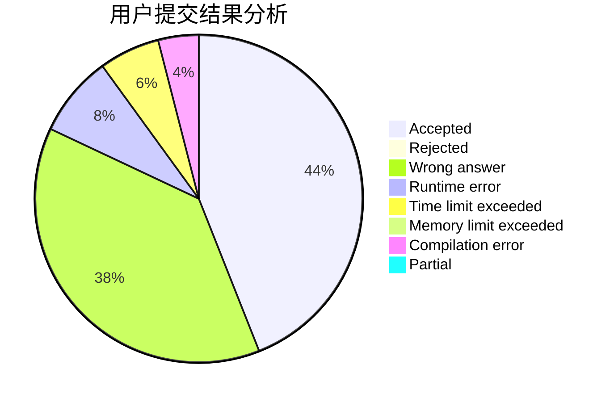
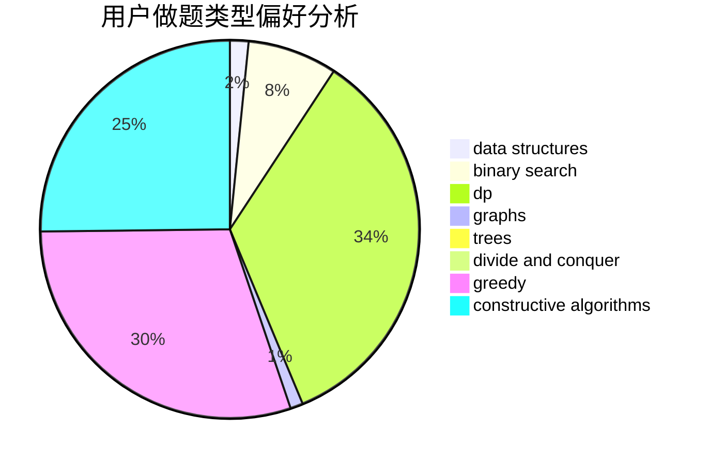
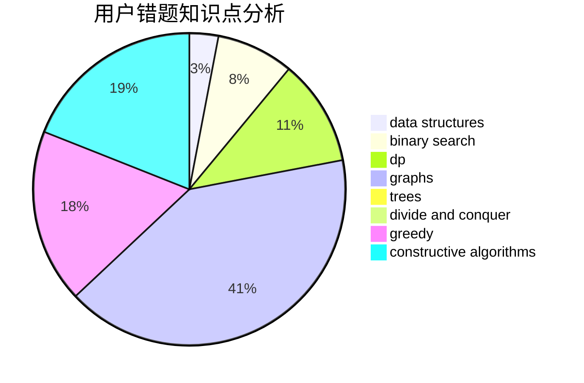

# Sagacity

<!-- tabs:start -->

#### **用户提交结果分析**

#### **用户做题类型偏好分析**

#### **用户错题知识点分析**

<!-- tabs:end -->
# 推荐题目
[959F](https://codeforces.com/contest/959/problem/F)		bitmasks,
                        dp,
                        math,
                        matrices		  
[350B](https://codeforces.com/contest/350/problem/B)		graphs		  
[421B](https://codeforces.com/contest/421/problem/B)		dsu,graphs,sortings,trees		  
[487B](https://codeforces.com/contest/487/problem/B)		binary search,
                        data structures,
                        dp,
                        two pointers		  
[1255C](https://codeforces.com/contest/1255/problem/C)		constructive algorithms,
                        implementation		  
[292E](https://codeforces.com/contest/292/problem/E)		data structures		  
[1023C](https://codeforces.com/contest/1023/problem/C)		greedy		  
[516A](https://codeforces.com/contest/516/problem/A)		dsu,graphs,sortings,trees		  
[985B](https://codeforces.com/contest/985/problem/B)		implementation		  
[554A](https://codeforces.com/contest/554/problem/A)		brute force,
                        math,
                        strings		  
