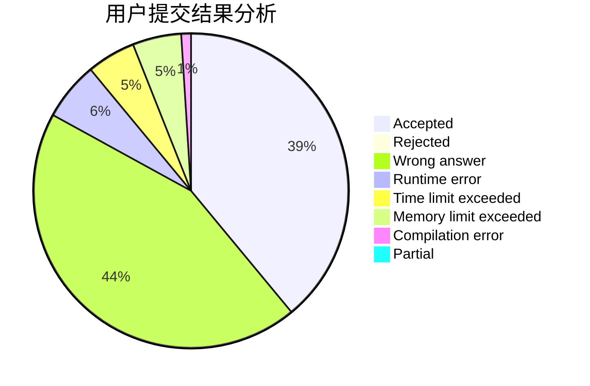
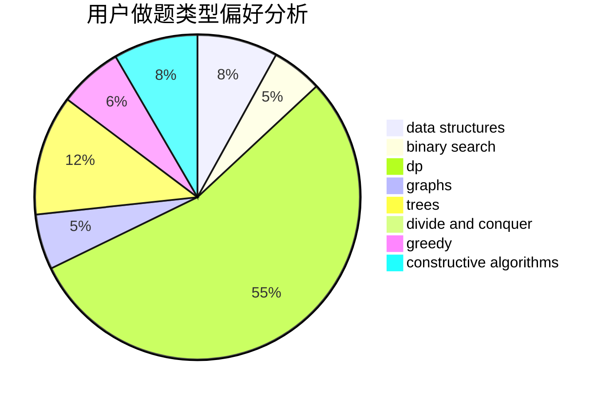

# Sakura-hero

<!-- tabs:start -->

#### **用户提交结果分析**

#### **用户做题类型偏好分析**

#### **用户错题知识点分析**

<!-- tabs:end -->
# 推荐题目
[1433F](https://codeforces.com/contest/1433/problem/F)		dp		  
[329B](https://codeforces.com/contest/329/problem/B)		dfs and similar,
                        shortest paths		  
[681A](https://codeforces.com/contest/681/problem/A)		implementation		  
[900B](https://codeforces.com/contest/900/problem/B)		math,
                        number theory		  
[243C](https://codeforces.com/contest/243/problem/C)		dfs and similar,
                        implementation		  
[1250N](https://codeforces.com/contest/1250/problem/N)		dfs and similar,
                        graphs,
                        greedy		  
[524E](https://codeforces.com/contest/524/problem/E)		data structures,
                        sortings		  
[189B](https://codeforces.com/contest/189/problem/B)		brute force,
                        math		  
[725A](https://codeforces.com/contest/725/problem/A)		implementation		  
[476E](https://codeforces.com/contest/476/problem/E)		dp,
                        strings		  
