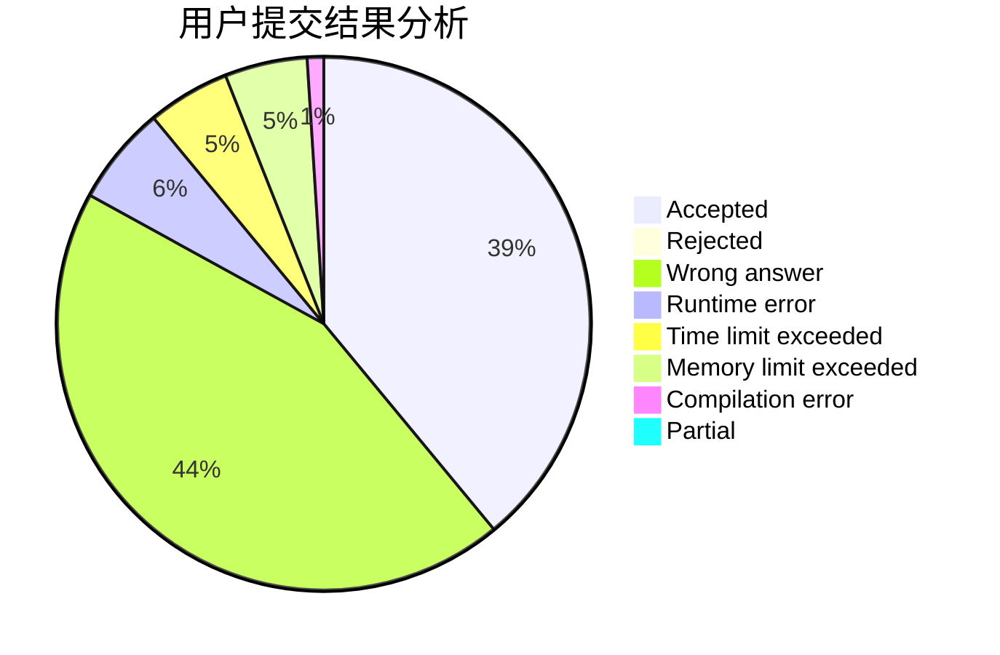
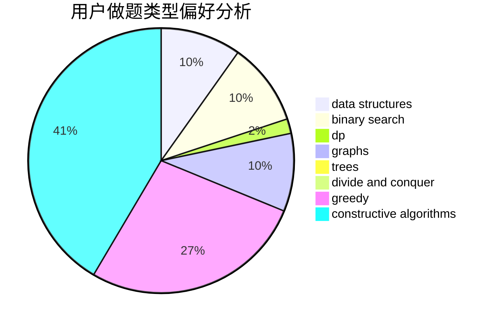

# Sakura-hero

<!-- tabs:start -->

#### **用户提交结果分析**

#### **用户做题类型偏好分析**

#### **用户错题知识点分析**

<!-- tabs:end -->
# 推荐题目
[1425D](https://codeforces.com/contest/1425/problem/D)		combinatorics,
                        dp,
                        math		  
[306D](https://codeforces.com/contest/306/problem/D)		constructive algorithms,
                        geometry		  
[660C](https://codeforces.com/contest/660/problem/C)		binary search,
                        dp,
                        two pointers		  
[883C](https://codeforces.com/contest/883/problem/C)		binary search,
                        implementation		  
[225C](https://codeforces.com/contest/225/problem/C)		dp,
                        matrices		  
[1246F](https://codeforces.com/contest/1246/problem/F)		nan		  
[504A](https://codeforces.com/contest/504/problem/A)		dsu,graphs,sortings,trees		  
[163D](https://codeforces.com/contest/163/problem/D)		brute force		  
[706D](https://codeforces.com/contest/706/problem/D)		binary search,
                        bitmasks,
                        data structures,
                        trees		  
[455D](https://codeforces.com/contest/455/problem/D)		data structures		  
