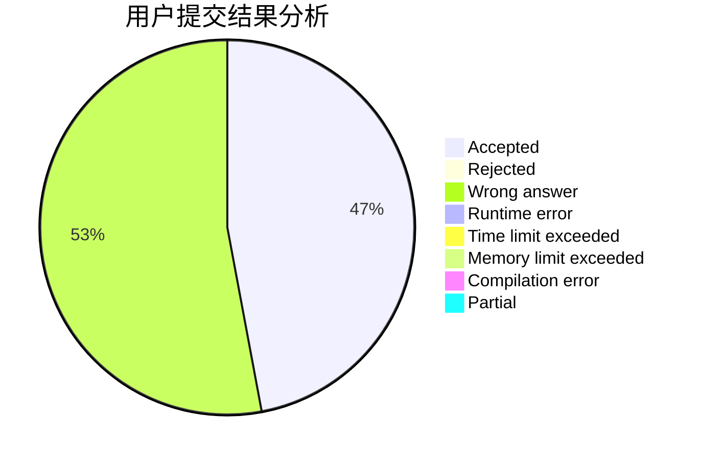
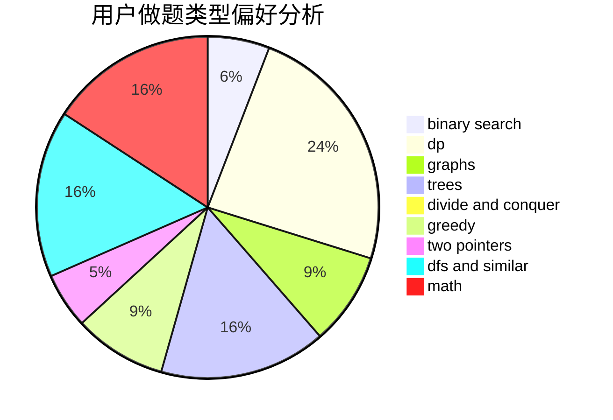

# Salt_Acid

<!-- tabs:start -->

#### **用户提交结果分析**

#### **用户做题类型偏好分析**

<!-- tabs:end -->
# 推荐题目
[246D](https://codeforces.com/contest/246/problem/D)
[362C](https://codeforces.com/contest/362/problem/C)
[889E](https://codeforces.com/contest/889/problem/E)
[631A](https://codeforces.com/contest/631/problem/A)
[540A](https://codeforces.com/contest/540/problem/A)
[543D](https://codeforces.com/contest/543/problem/D)
[960A](https://codeforces.com/contest/960/problem/A)
[963A](https://codeforces.com/contest/963/problem/A)
[831B](https://codeforces.com/contest/831/problem/B)
[813C](https://codeforces.com/contest/813/problem/C)
