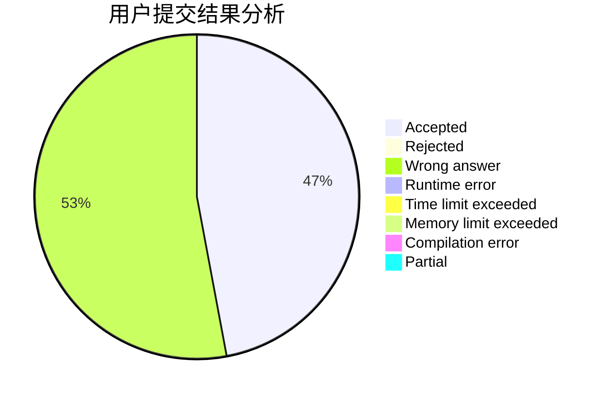
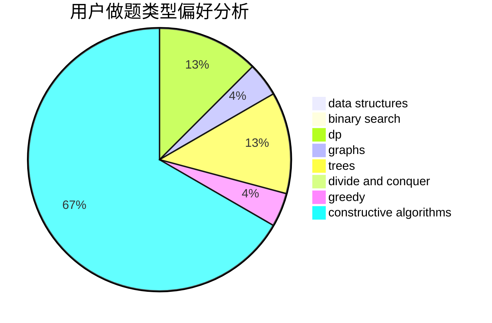
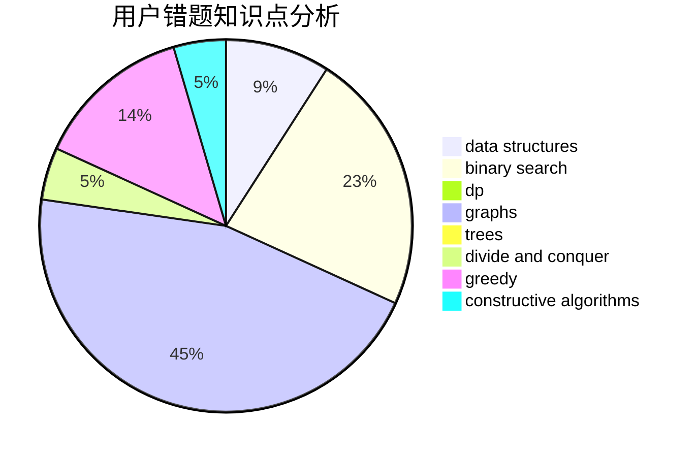

# Salt_Acid

<!-- tabs:start -->

#### **用户提交结果分析**

#### **用户做题类型偏好分析**

#### **用户错题知识点分析**

<!-- tabs:end -->
# 推荐题目
[246D](https://codeforces.com/contest/246/problem/D)		brute force,
                        dfs and similar,
                        graphs		  
[362C](https://codeforces.com/contest/362/problem/C)		data structures,
                        dp,
                        implementation,
                        math		  
[889E](https://codeforces.com/contest/889/problem/E)		binary search,
                        dp,
                        math		  
[631A](https://codeforces.com/contest/631/problem/A)		brute force,
                        implementation		  
[540A](https://codeforces.com/contest/540/problem/A)		implementation		  
[543D](https://codeforces.com/contest/543/problem/D)		dp,
                        trees		  
[960A](https://codeforces.com/contest/960/problem/A)		implementation		  
[963A](https://codeforces.com/contest/963/problem/A)		math,
                        number theory		  
[831B](https://codeforces.com/contest/831/problem/B)		implementation,
                        strings		  
[813C](https://codeforces.com/contest/813/problem/C)		dfs and similar,
                        graphs		  
