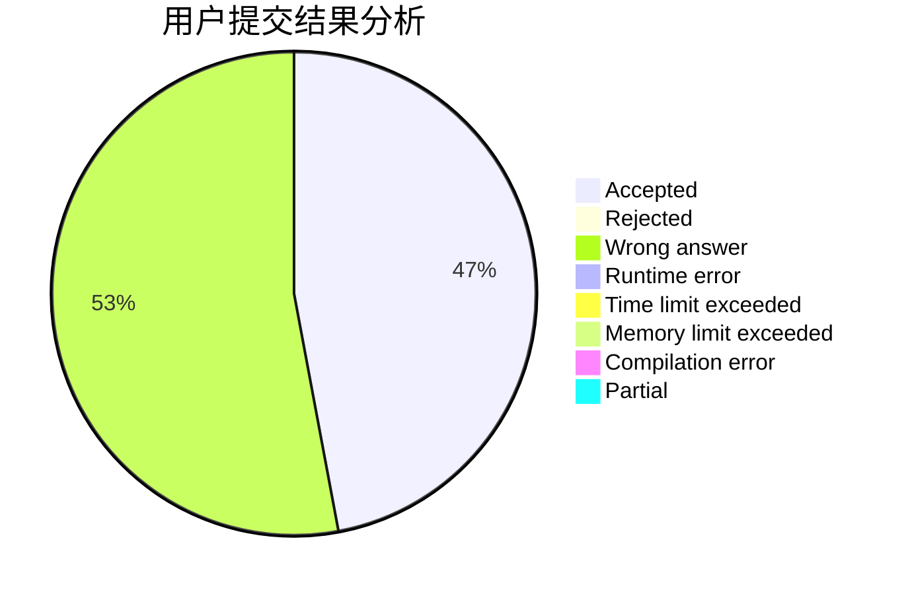
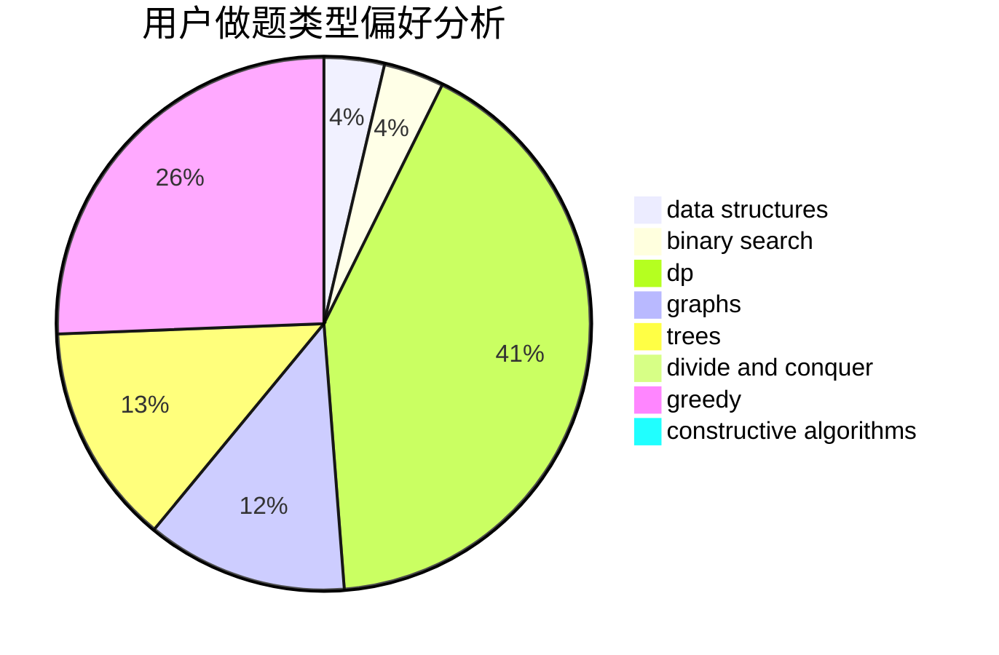
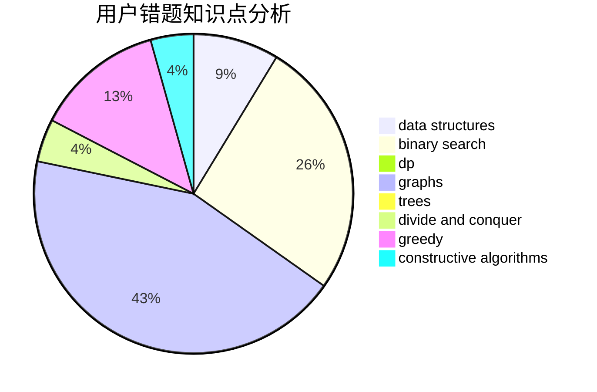

# Salt_Acid

<!-- tabs:start -->

#### **用户提交结果分析**

#### **用户做题类型偏好分析**

#### **用户错题知识点分析**

<!-- tabs:end -->
# 推荐题目
[228D](https://codeforces.com/contest/228/problem/D)		data structures		  
[335D](https://codeforces.com/contest/335/problem/D)		brute force,
                        dp		  
[86B](https://codeforces.com/contest/86/problem/B)		constructive algorithms,
                        graph matchings,
                        greedy,
                        math		  
[611H](https://codeforces.com/contest/611/problem/H)		constructive algorithms,
                        flows,
                        graphs		  
[514C](https://codeforces.com/contest/514/problem/C)		binary search,
                        data structures,
                        hashing,
                        string suffix structures,
                        strings		  
[516D](https://codeforces.com/contest/516/problem/D)		dfs and similar,
                        dp,
                        dsu,
                        trees,
                        two pointers		  
[938E](https://codeforces.com/contest/938/problem/E)		combinatorics,
                        math		  
[946D](https://codeforces.com/contest/946/problem/D)		dp		  
[812E](https://codeforces.com/contest/812/problem/E)		games,
                        trees		  
[799B](https://codeforces.com/contest/799/problem/B)		data structures,
                        implementation		  
