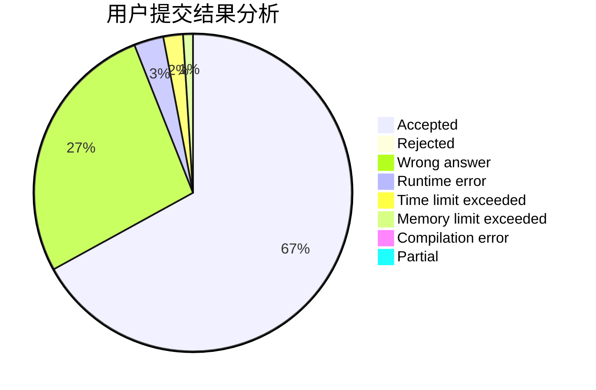
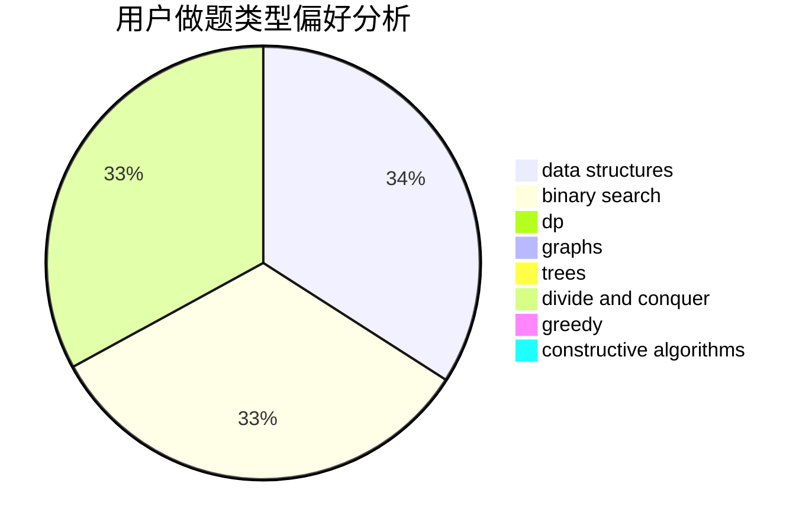
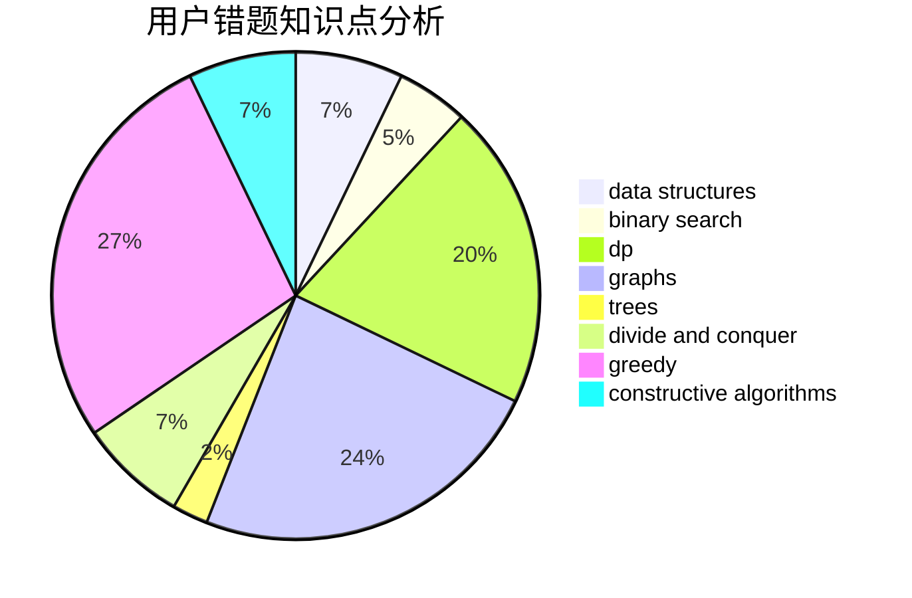

# Samui

<!-- tabs:start -->

#### **用户提交结果分析**

#### **用户做题类型偏好分析**

#### **用户错题知识点分析**

<!-- tabs:end -->
# 推荐题目
[691A](https://codeforces.com/contest/691/problem/A)		implementation		  
[652F](https://codeforces.com/contest/652/problem/F)		constructive algorithms,
                        math		  
[1004E](https://codeforces.com/contest/1004/problem/E)		binary search,
                        data structures,
                        dp,
                        greedy,
                        shortest paths,
                        trees		  
[899A](https://codeforces.com/contest/899/problem/A)		constructive algorithms,
                        greedy,
                        math		  
[57A](https://codeforces.com/contest/57/problem/A)		dfs and similar,
                        greedy,
                        implementation		  
[414C](https://codeforces.com/contest/414/problem/C)		combinatorics,
                        divide and conquer		  
[1482E](https://codeforces.com/contest/1482/problem/E)		data structures,
                        divide and conquer,
                        dp		  
[1489D](https://codeforces.com/contest/1489/problem/D)		dsu,graphs,sortings,trees		  
[1483E](https://codeforces.com/contest/1483/problem/E)		dsu,graphs,sortings,trees		  
[1475F](https://codeforces.com/contest/1475/problem/F)		2-sat,
                        brute force,
                        constructive algorithms		  
