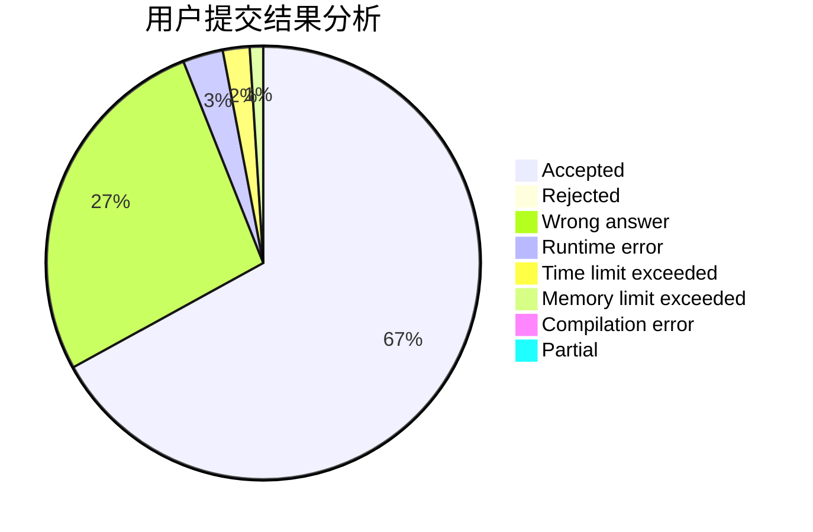
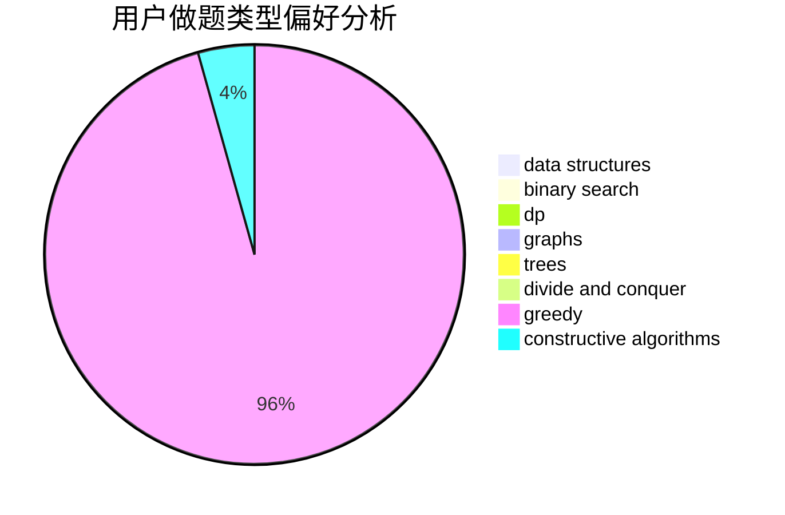

# Samui

<!-- tabs:start -->

#### **用户提交结果分析**

#### **用户做题类型偏好分析**

#### **用户错题知识点分析**

<!-- tabs:end -->
# 推荐题目
[710E](https://codeforces.com/contest/710/problem/E)		dfs and similar,
                        dp		  
[676E](https://codeforces.com/contest/676/problem/E)		math		  
[10052](https://codeforces.com/contest/1005/problem/2)		dsu,graphs,sortings,trees		  
[915A](https://codeforces.com/contest/915/problem/A)		implementation		  
[5E](https://codeforces.com/contest/5/problem/E)		data structures		  
[439E](https://codeforces.com/contest/439/problem/E)		combinatorics,
                        dp,
                        math		  
[1490C](https://codeforces.com/contest/1490/problem/C)		binary search,
                        brute force,
                        brute force,
                        math		  
[1497B](https://codeforces.com/contest/1497/problem/B)		constructive algorithms,
                        greedy,
                        math		  
[1491C](https://codeforces.com/contest/1491/problem/C)		brute force,
                        data structures,
                        dp,
                        greedy,
                        implementation		  
[1484C](https://codeforces.com/contest/1484/problem/C)		dsu,graphs,sortings,trees		  
