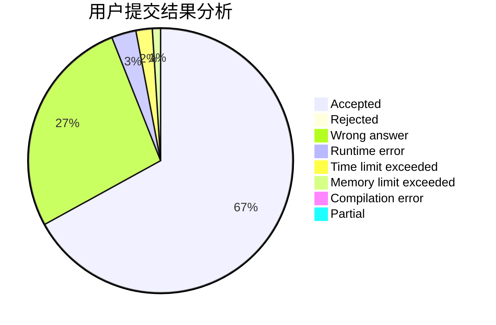
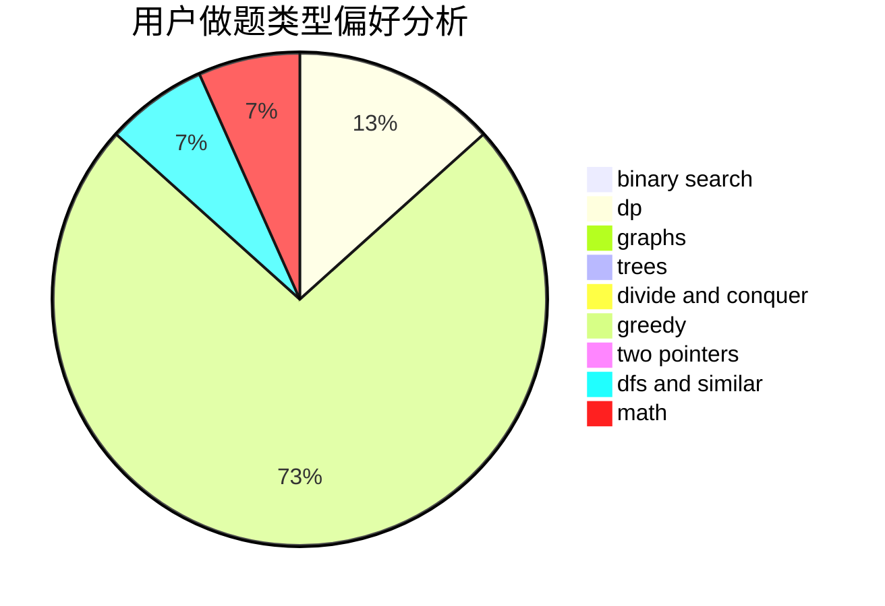

# Samui

<!-- tabs:start -->

#### **用户提交结果分析**

#### **用户做题类型偏好分析**

<!-- tabs:end -->
# 推荐题目
[710E](https://codeforces.com/contest/710/problem/E)
[676E](https://codeforces.com/contest/676/problem/E)
[10052](https://codeforces.com/contest/1005/problem/2)
[915A](https://codeforces.com/contest/915/problem/A)
[5E](https://codeforces.com/contest/5/problem/E)
[439E](https://codeforces.com/contest/439/problem/E)
[1490C](https://codeforces.com/contest/1490/problem/C)
[1497B](https://codeforces.com/contest/1497/problem/B)
[1491C](https://codeforces.com/contest/1491/problem/C)
[1484C](https://codeforces.com/contest/1484/problem/C)
