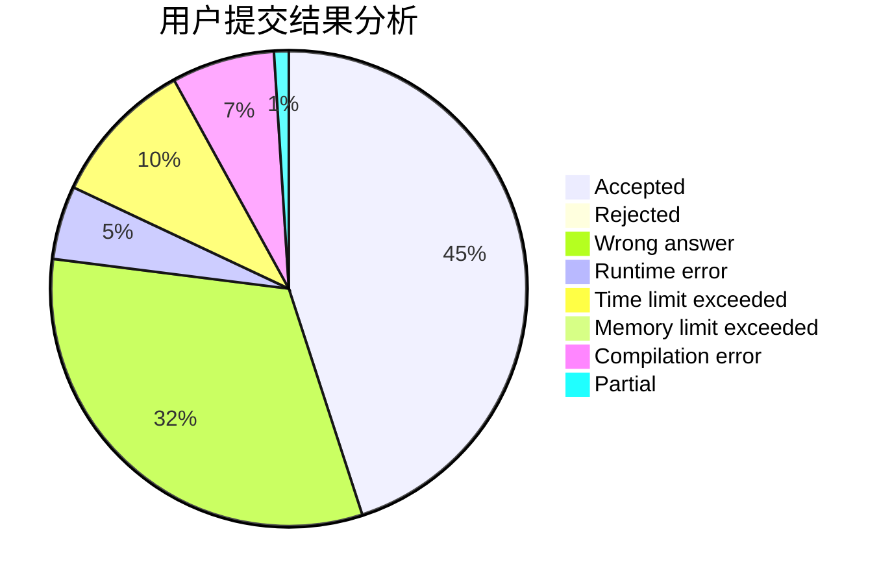
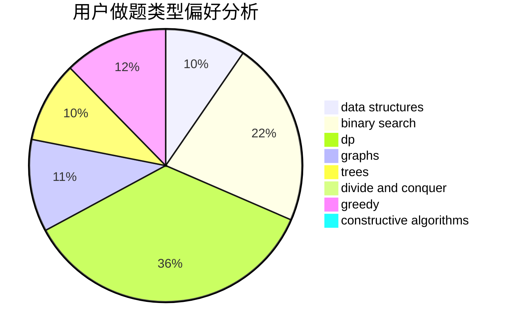

# AThousandMoon

<!-- tabs:start -->

#### **用户提交结果分析**

#### **用户做题类型偏好分析**

#### **用户错题知识点分析**

<!-- tabs:end -->
# 推荐题目
[1062E](https://codeforces.com/contest/1062/problem/E)		binary search,
                        data structures,
                        dfs and similar,
                        greedy,
                        trees		  
[1062A](https://codeforces.com/contest/1062/problem/A)		greedy,
                        implementation		  
[1063C](https://codeforces.com/contest/1063/problem/C)		binary search,
                        constructive algorithms,
                        geometry,
                        interactive		  
[1063E](https://codeforces.com/contest/1063/problem/E)		constructive algorithms,
                        math		  
[1062C](https://codeforces.com/contest/1062/problem/C)		greedy,
                        implementation,
                        math		  
[1500B](https://codeforces.com/contest/1500/problem/B)		binary search,
                        brute force,
                        chinese remainder theorem,
                        math,
                        number theory		  
[1240C](https://codeforces.com/contest/1240/problem/C)		dsu,graphs,sortings,trees		  
[1064A](https://codeforces.com/contest/1064/problem/A)		brute force,
                        geometry,
                        math		  
[1064B](https://codeforces.com/contest/1064/problem/B)		math		  
[1500D](https://codeforces.com/contest/1500/problem/D)		data structures,
                        sortings,
                        two pointers		  
