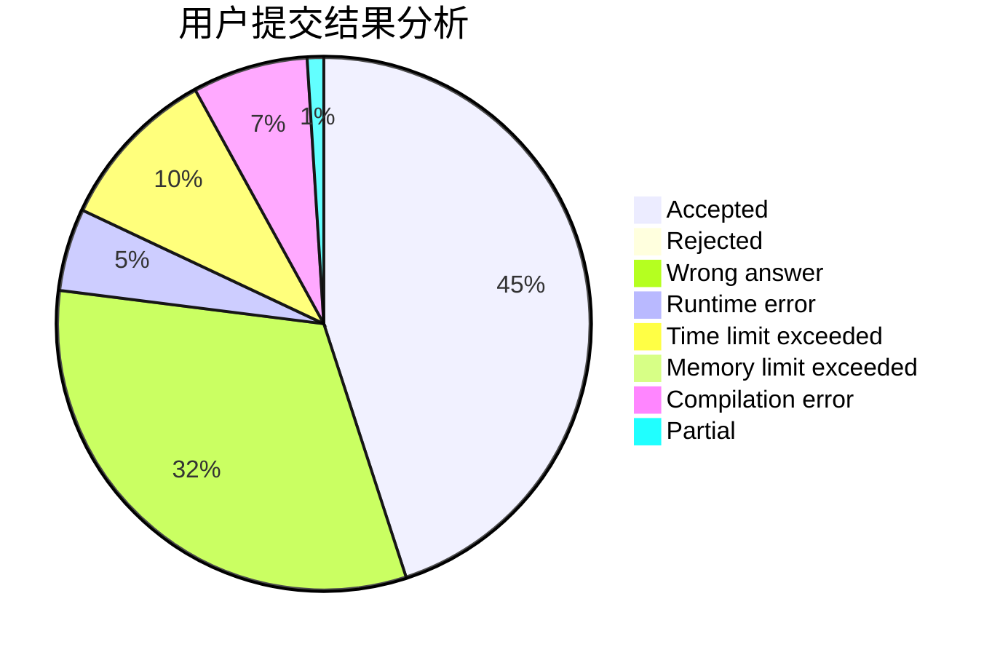
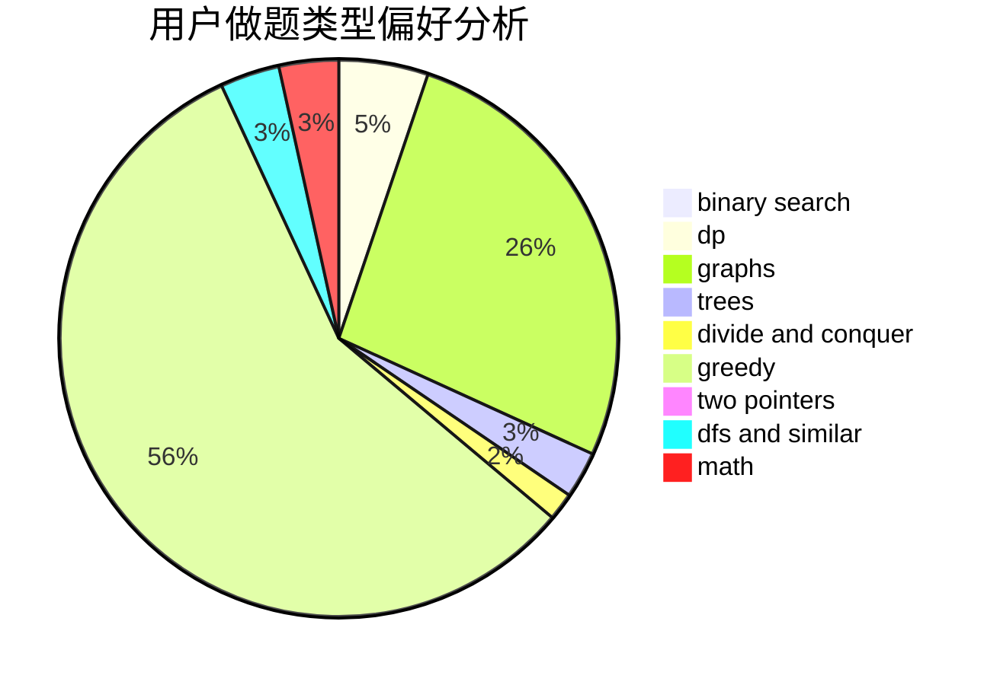

# AThousandMoon

<!-- tabs:start -->

#### **用户提交结果分析**

#### **用户做题类型偏好分析**

<!-- tabs:end -->
# 推荐题目
[1063B](https://codeforces.com/contest/1063/problem/B)
[1062D](https://codeforces.com/contest/1062/problem/D)
[1063F](https://codeforces.com/contest/1063/problem/F)
[1064B](https://codeforces.com/contest/1064/problem/B)
[1062F](https://codeforces.com/contest/1062/problem/F)
[1510H](https://codeforces.com/contest/1510/problem/H)
[1245F](https://codeforces.com/contest/1245/problem/F)
[1064D](https://codeforces.com/contest/1064/problem/D)
[1064E](https://codeforces.com/contest/1064/problem/E)
[1510J](https://codeforces.com/contest/1510/problem/J)
